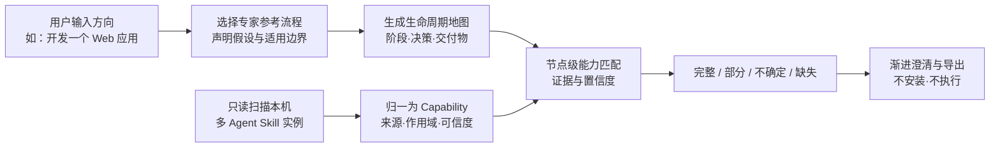

# 本地 Agent Skill 盘点与工作流地图：市场与可行性决策报告

> 研究截止：2026-08-03。结论面向产品立项，不把公开条目数、论文指标或营销案例等同于真实付费需求。

## 一句话结论

**有条件继续，但不要开发‘又一个 Skill 扫描器’。** 建议把项目收窄为本地、跨 Agent、面向人的“结果规划层”：用户只给一个方向，系统调用版本化的专家参考流程，形成可解释的生命周期地图，再把本机能力映射为完整、部分、不确定、缺失四种状态。先做 7–10 天只读原型；在重复使用与匹配质量得到验证前，不投入通用执行器、市场、安装器或完整安全扫描。

## 决策门

| 决策门 | 判断 | 依据 |
|---|---|---|
| 问题是否存在 | **通过** | 多个独立 GitHub issue/discussion 与第一人称帖子反复出现目录分散、重复、作用域漂移、不会选、装了却不可发现等问题。 |
| 是否存在市场空白 | **部分通过** | 扫描、图谱、语义关系与多 Skill 编排已有强竞品；尚未找到把“非技术方向 → 专家生命周期 → 本机跨 Agent 四态覆盖/缺口”完整产品化的方案。 |
| 技术切入口是否成立 | **通过** | Agent Skills 标准及 Codex、Claude、Cursor 等生态可由只读适配器归一；差异主要在目录、作用域、扩展字段与加载语义。 |
| 用户是否会持续使用/付费 | **未验证** | 公开证据证明问题与替代行为，但不能替代真实用户的二次使用率、匹配纠错率与付费意愿。 |

**立项判断：Conditional GO。** 可以做验证型原型，暂不批准完整产品开发。

另一个立即动作：**不要继续把 `SkillsMap` 当对外产品名。** `skill-map.ai` 与 `@skill-map/cli` 已公开使用高度近似名称和相邻定位；当前仓库名可保留为内部代号，但在发布、域名或品牌投入前应更名并做商标/域名复核。

## 为什么必须改定位

截至研究截止日，三个方向已被明显占位：

- [skill-map.ai](https://skill-map.ai/) 已提供 MIT 开源的本地 Web/CLI、Claude/Codex 等 Provider、关系图、冲突/孤儿/断链/重复/质量诊断、MCP 与实时活动。它直接覆盖扫描和现有 harness 地图；但其地图以已有文件和调用边为中心，未发现从模糊方向构建专家生命周期和四态缺口的功能。
- [SkillNet](https://github.com/zjunlp/SkillNet) 已能分析本地 Skill 目录的 `compose_with` / `depend_on` / 场景交接关系，并按自然语言任务选择 Skill、生成下游执行提示；但当前编排依赖预设场景和远程模型能力，未形成跨 Agent 本机实例治理与面向人的通用专家流程。
- [AgentSkillOS](https://arxiv.org/abs/2603.02176) 等研究已证明 capability tree、任务分解与 DAG 编排是活跃路线，因此“能力树/Skill 图/AI 编排”本身不是可主张的空白。
- Cursor、GitHub `gh skill` 与 JetBrains 已把跨目录发现和分层管理基础设施化；WorkBuddy Expert Team 与 QoderWork Expert Kit/Workbench 则已覆盖强目标拆解与执行。‘能扫多个目录’和‘AI 会拆任务’都不能单独成立为差异。

因此，真正可测试的差异不是一个新图数据库，而是下面这条用户价值链：

## 核心竞合矩阵

说明：✓ 明确覆盖；△ 部分或需组合；— 未见。这里比较产品表面，不代表质量等价。

| 方案 | 本地/跨 Agent 盘点 | 关系或依赖图 | 目标驱动编排 | 专家生命周期模板 | 本机节点匹配 | 显式四态缺口 | 默认只读、本地 |
|---|---:|---:|---:|---:|---:|---:|---:|
| skill-map.ai | ✓ | ✓ | △ | — | △ | — | △ |
| SkillNet | △ | ✓ | ✓（场景受限） | △ | △ | — | — |
| AgentSkillOS | —（公共池） | ✓ | ✓ | — | △ | — | —（执行导向） |
| gh skill / Cursor / JetBrains | ✓ | — | △（Agent 自身） | — | △ | — | △ |
| npx skills / 其他管理器 | ✓ | — | — | — | — | — | △ |
| **建议中的 SkillsMap** | ✓ | △（复用上游） | **规划，不执行** | **✓** | **✓** | **✓** | **✓** |

## 建议的 V0 原型

只做一个黄金路径：**“从想法到上线 Web 应用”**。输入允许只有方向，不要求用户先给技术栈或程序员式任务清单。

原型包含：

1. 只读发现 Codex、Claude、Cursor 三个生态的 `SKILL.md`，保留实例路径、作用域、真实路径、内容哈希、名称和描述；inventory 接口允许接入 `gh skill list --json`、skill-map JSON/MCP 或直接文件扫描。
2. 一份由人策划并版本化的 Web 产品生命周期参考图；AI 只能在边界内裁剪、排序、提出假设和澄清问题。
3. 每个流程节点输出能力要求、候选本机 Skill、匹配理由、来源和置信度；用户可以确认或否决。
4. 覆盖状态严格分为完整、部分、不确定、缺失；“文件存在”不自动等于“能力已验证”。
5. 浏览器界面 + 最小 CLI；导出 Markdown/JSON。没有安装、写回、自动执行、市场或收费。

优先复用而不是重造：评估把 `gh skill list --json` 和 `skill-map.ai` 的 JSON/MCP 图作为 inventory adapter；将 SkillNet/Graph of Skills 的依赖扩展思路作为匹配参考。上游均应通过可替换接口接入，避免把 preview CLI、年轻项目或第三方论文指标变成产品硬依赖与承诺。

## 7–10 天验证计划

| 天数 | 产物 | 验证问题 |
|---|---|---|
| 1–2 | 统一实例清单与去重规则 | 三个生态能否无执行地稳定扫描，并解释软链接、缓存和同名不同内容？ |
| 3–4 | Web 应用专家参考流程 v0 | 方向级输入能否得到用户看得懂、可纠正的阶段/决策/交付物？ |
| 5–6 | 节点匹配与四态缺口 | 候选是否有可复核证据；用户否决后能否保留纠正？ |
| 7 | 高层地图 + 逐层展开 + Markdown 导出 | 用户是否能在 10 分钟内理解“已有、缺什么、下一步是什么”？ |
| 8–10 | 3–5 个 AI 模拟案例 + 本机 dogfood | 相同方向不同约束是否产生合理差异；第二次使用是否仍有价值？ |

没有访谈条件时，AI 可继续承担资料归纳、竞品试走、公开问题编码和合成场景压力测试；但 AI 不能证明真实需求。下一阶段至少要收集行为证据：是否完成第二张图、人工改了多少匹配、哪些缺口促成了真实行动。

## 成功指标与停止条件

北极星：同一用户在首次生成后 14 天内，为第二个真实方向生成并使用另一张工作流地图。原型期可先用代理指标：

- 3 个本机生态扫描成功率 ≥ 95%，且不执行任何 Skill 内容。
- 前 3 个候选中出现可接受匹配的节点比例 ≥ 80%；每个接受/否决都有可解释理由。
- 70% 以上关键节点的覆盖状态可由用户在 10 分钟内确认。
- 至少 3 个不同真实方向中，有 2 个让使用者认为地图改变了下一步行动。

停止或转为上游插件的条件：

- 目标用户只需要目录搜索/去重，专家流程与缺口视图没有改变决策。
- 候选匹配长期依赖用户逐项重做，无法优于文件搜索。
- skill-map.ai、SkillNet 或平台原生能力在原型期补齐同一闭环，且本项目没有独有流程资产或用户分发。
- 用户不会生成第二张真实地图，说明它更像一次性审计报告而非产品。

## 本机只读可行性快照

在当前电脑可访问的 `.agents`、`.codex`、`.claude`、`.cursor` 根上做了一次探索性只读解析：共观察到 276 个可达 `SKILL.md` 路径、263 个唯一内容、6 组跨生态相同内容和 13 组同名不同内容，另有 10 个缺少 `name` 的文件。这个单机样本不代表市场比例，且计数会受软链接、插件缓存和遍历策略影响；它只证明统一实例层必须先定义真实路径、逻辑来源、作用域和内容身份，不能按名称粗暴合并。

## 方法与证据边界

本报告按已确认大纲研究 13 个对象，汇总 182 个去重来源链接。技术结论优先使用规范、官方文档、官方仓库和论文；痛点使用第一人称 issue/discussion/post，并避免把营销转述重复计数。所有资料截止 2026-08-03。

主要限制：

- 尚未访谈 8–10 位目标用户，不能推断付费意愿或长期留存。
- GitHub star、下载量和公开 Skill 数量不是独立活跃用户数。
- 2026 年论文很多仍是预印本或小型 benchmark，精确指标不应跨模型和真实环境外推。
- 中国 Agent 产品的公开文档可能不完整；文件路径和兼容边界需在真实安装环境复核。
- 竞品演进极快，正式开发前应再次核查 skill-map.ai 与 SkillNet 的路线图。

# 研究对象目录

目录摘要字段由本轮自主选择为“分类 + 证据强度”，便于先判断对象类型与结论可靠度。

1. [Agent Skills 标准与 SKILL.md 数据模型](#item-agent_skills_standard) — 开放标准 | 证据：强：格式、路径和实现建议来自官方规范与官方实现指南；中：采用度由 GitHub 指标代理；弱到中：公开 RFC 只能证明部分高级用户存在分发与依赖痛点。
2. [OpenAI Codex Skills 生态](#item-codex_ecosystem) — Agent 生态 | 证据：强：产品行为、路径、作用域、列表预算和权限来自 OpenAI 官方文档；强但局部：本机目录和内容指纹来自只读实测；中：官方没有公开完整的桌面 Skills 侧栏功能边界，因此不能推断其没有尚未文档化的分类能力。
3. [Anthropic Claude Code Skills 与插件生态](#item-claude_code_ecosystem) — Agent 生态 | 证据：强。路径、优先级、调用、插件组件、缓存、权限和验证均来自 Anthropic 官方文档与官方仓库；痛点来自官方 issue/discussion 的第一人称报告；本机数量为只读实测。仓库指标和本机状态会变，部分关闭 issue 只证明历史需求，不证明当前版本仍复现。
4. [Cursor Agent Skills、Rules 与插件生态](#item-cursor_ecosystem) — Agent 生态 | 证据：强：根目录、递归/作用域、格式、插件和市场治理来自 Cursor 官方文档与 changelog；中强：问题来自官方社区并含工作人员回应；强但局部：本机数量与版本来自只读检查。公开资料没有完整披露冲突优先级或 normalization 算法。
5. [中国 Agent 工作生态代表：腾讯 WorkBuddy 与 QoderWork（Global / CN）](#item-china_agent_ecosystems) — Agent 生态（中国市场代表组） | 证据：中强。核心功能、安全、计费与格式来自腾讯、Qoder 和阿里云官方文档；本机目录、清单和哈希是强但单机的只读证据。采用量口径、WorkBuddy Desktop 稳定原始路径、QoderWork CN 路径和独立用户抱怨证据较弱，因此明确降级而未用营销数字补齐。
6. [Hermes Agent / Skills Hub 生态](#item-hermes_ecosystem) — Agent 生态与 Skills 包管理 | 证据：强：目录、优先级、Hub 源、锁、审批、Bundle、/learn 与安全边界均来自 Nous Research 官方文档/仓库；强但动态：发布与仓库指标来自 2026-08-03 GitHub API；中：用户痛点来自公开 issue，代表真实个案但不代表全部用户；低到中：未文档化能力只能表述为“未发现”，不能断言内部不存在。
7. [OpenClaw / ClawHub Skills 生态](#item-openclaw_ecosystem) — Agent 生态与公共 Skills Registry | 证据：强：路径优先级、发现、allowlist、安装/更新/pin、扫描与治理来自 OpenClaw/ClawHub 官方文档和仓库；强但动态：版本与仓库指标来自 2026-08-03 官方 API；中：用户 issue 是真实个案且时间明确，但后续已快速演进；中：没有公开能力只能保守表述为“未发现”。
8. [跨 Agent Skill 包管理器与目录聚合器横向研究](#item-skill_package_managers) — Skills 包管理、Registry、目录与 IDE 管理面 | 证据：强：CLI 命令、路径、版本、锁、扫描字段、JetBrains 导入/分层管理来自各自官方文档/仓库；强但动态：版本与仓库指标为 2026-08-03 官方 API/npm 快照；中：AgentSkill/SkillsMP 的 corpus 与扫描覆盖为厂商自报；中低：LobeHub 跨 Agent 本地包管理能力证据不足，因此只给保守结论；issue 只代表具体用户。
9. [本地 Skill 扫描与管理工具](#item-local_skill_managers) — 直接竞品（产品组，含研究型相邻项） | 证据：强：核心能力、路径、许可和安全边界来自官方文档、官方仓库、Marketplace 与 npm 元数据；中：采用量以 stars/downloads/installs 近似且口径不同；弱至中：产品组是否没有未公开的实验性目标拆解功能只能表述为“所查公开资料未发现”，不能证明绝对不存在。
10. [AI 工作流设计、Skill 图检索与编排系统](#item-workflow_orchestration) — 相邻竞品（产品组 + 研究系统，分层结论） | 证据：强：平台能力来自官方文档/仓库，研究结论来自arXiv论文与官方实现；中：Langflow Assistant文档位于next分支，具体稳定版可用范围可能变化；中：论文benchmark、LLM judge和作者维护的Skill数量需独立复现，不能直接外推真实个人库。
11. [MCP、Skill 与软件能力目录](#item-capability_catalogs) — 相邻竞品（产品组，三种不同对象模型） | 证据：强：对象类型、API字段、CLI、方法论和Backstage实体/关系来自官方资料；中：Smithery/Glama规模是厂商自报且变化快；中低：Smithery qualityScore/verified具体计算与复核流程在本次官方文档中未找到充分解释。
12. [公开用户痛点与行为证据](#item-public_pain_evidence) — 需求证据 | 证据：问题存在：中高；跨 Agent 资产治理：高；语义路由/去重：中高；专家工作流地图：中；模糊目标拆解：低到中；用户愿意安装或持续使用独立产品：尚未验证。
13. [Skill 质量、可复用性与供应链安全研究](#item-quality_security_research) — 风险与有效性证据 | 证据：高：‘存在质量异质性、路由问题和供应链风险’由多个独立数据集和实验支持；中：具体百分比受语料、规则和模型影响；中低：把这些研究信号组合成 SkillsMap 是否改善真实决策尚待原型验证。

# 分对象研究明细

## 1. Agent Skills 标准与 SKILL.md 数据模型

- 大纲分类：`standard`
- 研究文件：`results/agent_skills_standard.json`
- 证据强度：强：格式、路径和实现建议来自官方规范与官方实现指南；中：采用度由 GitHub 指标代理；弱到中：公开 RFC 只能证明部分高级用户存在分发与依赖痛点。
- 结论置信度：技术结论高；标准未来是否正式纳入版本、依赖或编排为中等不确定，因此扩展字段应采用命名空间或独立数据库而非修改原文件。

### 对象身份与定位

**当前正式名称及历史名称**

Agent Skills 标准与 SKILL.md 数据模型

**标准、Agent 生态、直接竞品、相邻竞品或需求/风险证据**

开放标准

**维护公司、组织或主要仓库**

Agent Skills 开放项目；格式最初由 Anthropic 开发，当前规范仓库声明由 Anthropic 维护并接受社区贡献。

**截至 2026-08-03 的活跃状态与最近更新证据**

截至 2026-08-03，规范、实现指南和参考校验器均可用；官方 GitHub 仓库近期仍有更新，属于活跃演进中的年轻标准。

### 格式、路径与跨 Agent 兼容性

**SKILL.md、plugin、command、rule、MCP 或其他能力载体**

> 一个 Skill 是至少含 SKILL.md 的目录。SKILL.md 由 YAML frontmatter 与 Markdown 指令正文组成；可附带 scripts/、references/、assets/。规范字段包括必需的 name、description，以及可选的 license、compatibility、metadata、allowed-tools（实验性）。

**全局、项目、工作区、插件缓存等目录与优先级**

> 规范不规定安装路径。官方客户端实现指南建议同时扫描项目级与用户级目录，包括 <project>/.agents/skills/、~/.agents/skills/，并可兼容客户端原生目录及 .claude/skills/；项目级同名 Skill 通常覆盖用户级。

**已知目录、配置清单、文件系统搜索、注册表或 API**

从用户授权的若干根目录寻找直接子目录中的精确文件名 SKILL.md；官方指南建议跳过 .git、node_modules，限制深度与目录数量，并记录解析和名称冲突诊断。

**归一到 Capability 模型所需适配器及主要障碍**

> 高。name、description、正文、位置和可选兼容性字段可直接归一；但来源、全局唯一身份、版本、依赖、验证记录和工作流关系并非稳定必填字段，需要 SkillsMap 自建补充层。解析器应宽容读取、严格记录诊断。

### 本地资产管理能力

**是否盘点已安装 Skill，是否跨 Agent**

标准只定义格式，不提供跨 Agent 本地清单产品。实现指南明确说明本地 Agent 可以扫描文件系统并构建 Skill catalog，因此只读盘点技术上直接可行。

**是否识别软链接、同源副本、名称冲突或内容重复**

只给出同名冲突与作用域优先级建议，没有内容指纹、软链接归并、同源副本识别或语义重复模型。

**分类、摘要、标签、全文或语义搜索能力**

发现阶段主要依靠 name 和 description 形成 catalog，并由模型判断相关性；标准没有分类法、标签体系、全文索引或语义搜索协议。

**格式、依赖、损坏链接、风险或质量检查**

官方提供 skills-ref validate 校验 frontmatter 与命名约束；规范也给出正文长度和渐进披露建议。但格式通过不代表任务执行质量、安全性或可复用性已验证。

### 目标、工作流与能力缺口

**能否把模糊方向渐进拆解为阶段、决策和交付物**

不提供。Skill 可以封装某一流程，但标准没有把模糊方向拆成阶段、决策、交付物的上层规划模型。

**是否生成可视化或结构化的依赖流程**

不提供跨 Skill 的工作流图、节点依赖或完成门槛。社区分发 RFC 甚至明确把编排排除在其范围之外。

**是否将工作流节点匹配到本机已有 Skill**

部分提供：客户端把 name 与 description 暴露给模型，由模型判断任务是否匹配并激活 Skill；没有标准化评分、证据或跨 Skill 能力覆盖计算。

**是否区分完整、部分、不确定和缺失覆盖**

不提供。标准不会判断某个目标所需能力是否完整、部分覆盖、不确定或缺失。

**是否展示匹配证据、假设、来源和置信度**

有限。description 是触发依据，location 可作为来源线索，但标准没有要求展示为什么匹配、置信度、假设或替代 Skill。

**只规划、导出，还是自动执行和恢复**

标准同时允许纯指令与带脚本的可执行 Skill；是否只规划、是否执行工具及如何授权完全由客户端决定。

### 隐私、安全与验证

**索引和分析是否可完全保留在本机**

天然适合本地优先：Skill 是文件系统目录，本地客户端可直接扫描；但标准也允许云端、注册表或打包资源等发现方式，并不强制数据留在本机。

**扫描授权、上传内容、执行权限与默认行为**

allowed-tools 仍是实验性字段且客户端支持可能不同。官方实现指南建议对不可信项目目录增加信任检查，也可在专用激活工具中要求用户授权；标准本身不定义统一权限协议。

**作者、仓库、版本、许可证与变更历史**

> license 与 metadata 可选，author/version 仅作为 metadata 示例；缺少强制来源 URL、提交哈希、签名和全局身份。单靠 SKILL.md 无法可靠判断两个副本是否同源。

**是否区分未验证、人工确认和运行验证**

只定义结构校验，没有未验证、人工确认、运行验证等能力成熟度状态。

**恶意指令、依赖、脚本与供应链风险控制**

提供最小的 trust 建议和实验性工具白名单，但 Skill 正文可影响模型且 scripts/ 可执行代码；供应链、恶意指令、依赖完整性和运行隔离不由核心规范解决。

### 需求、采用与商业证据

**近期第一人称问题、时间、来源及替代做法**

> 官方定位直接回应重复传授流程和跨产品复用问题。2026 年 skills.json RFC 的作者及关联议题还描述了依赖复制、上游漂移、手工安装和缺少版本约束等实际摩擦；这是资产治理痛点的中等证据，但不是工作流地图需求的直接证明。

**免费、开源、订阅、企业版及许可证**

规范代码 Apache-2.0，文档 CC-BY-4.0；作为开放格式免费使用。

**对目标用户已解决得较好的问题**

格式简单、文件可读、跨客户端、适合版本控制；三层渐进披露降低上下文成本；官方实现指南已经给出扫描路径、冲突、宽容解析和信任边界等实用模式。

**与本地跨 Agent 工作流地图闭环相比的缺口**

没有跨 Agent 实例盘点、真实路径与内容去重、统一来源追踪、能力分类、模糊目标拆解、工作流图、覆盖/缺口判断或运行验证状态。

**强、中、弱，并说明判断理由**

强：格式、路径和实现建议来自官方规范与官方实现指南；中：采用度由 GitHub 指标代理；弱到中：公开 RFC 只能证明部分高级用户存在分发与依赖痛点。

### 对 SkillsMap 的决策影响

**可以借鉴的交互、数据模型、治理或分发机制**

> 采用标准 frontmatter 与渐进披露；同时扫描 .agents/skills 与客户端原生作用域；项目级覆盖用户级但保留 shadowed 实例；宽容解析并输出诊断；把 Skill 定义与来源/版本/验证等治理元数据分层。

**功能重合、被平台吸收和替代的风险**

中等。官方实现指南和包管理器很容易覆盖基础扫描、冲突和安装功能，单纯清单产品会快速同质化；目标驱动的专家工作流、可解释覆盖图和本地能力治理仍不属于标准核心。

**继续、调整、集成或停止，以及证据依据**

> 继续。以 Agent Skills 规范作为首个适配器和最小公共模型，但不要直接把 SKILL.md 当作完整 Capability。V1 应额外保存物理实例、逻辑身份、来源、作用域、内容指纹、静态诊断、匹配证据和验证状态。

**结论置信度与尚未验证的假设**

技术结论高；标准未来是否正式纳入版本、依赖或编排为中等不确定，因此扩展字段应采用命名空间或独立数据库而非修改原文件。

### 尚未确认

- supported_agents：官方客户端展示会持续变化，未在本条目逐个验证所有客户端
- adoption_signals：GitHub stars 与 forks 是动态值且不是活跃使用量
- lifecycle_management：skills.json RFC 截至调研时仍是提案，不能当作已通过标准

### 该对象的一手与主要来源

- [agentskills.io · specification](https://agentskills.io/specification)
- [agentskills.io · adding-skills-support](https://agentskills.io/client-implementation/adding-skills-support)
- [github.com · agentskills](https://github.com/agentskills/agentskills)
- [github.com · 210](https://github.com/agentskills/agentskills/discussions/210)

## 2. OpenAI Codex Skills 生态

- 大纲分类：`agent_ecosystem`
- 研究文件：`results/codex_ecosystem.json`
- 证据强度：强：产品行为、路径、作用域、列表预算和权限来自 OpenAI 官方文档；强但局部：本机目录和内容指纹来自只读实测；中：官方没有公开完整的桌面 Skills 侧栏功能边界，因此不能推断其没有尚未文档化的分类能力。
- 结论置信度：官方公开能力与路径结论高；ChatGPT 桌面端 Skills 侧栏未来范围、Plugin 缓存稳定性和跨版本行为为中等不确定。

### 对象身份与定位

**当前正式名称及历史名称**

OpenAI Codex Skills 生态

**标准、Agent 生态、直接竞品、相邻竞品或需求/风险证据**

Agent 生态

**维护公司、组织或主要仓库**

OpenAI

**截至 2026-08-03 的活跃状态与最近更新证据**

> 截至 2026-08-03，OpenAI 官方文档把 Skill 定义为 ChatGPT 与 Codex 的可复用工作流创作格式，并以 Plugin 作为跨用户分发 Skill 与连接器的主要载体。Codex CLI、IDE 扩展和 ChatGPT 桌面端均有相关支持。

### 格式、路径与跨 Agent 兼容性

**明确支持或可推断兼容的 Agent**

> 独立文件系统 Skill 可用于 ChatGPT 桌面端、Codex CLI 与 Codex IDE 扩展；Plugin 中的 Skill 可用于 ChatGPT Work 网页端、ChatGPT 桌面端及 Codex CLI，但官方管理文档说明 Plugin 当前不适用于 IDE 扩展和移动端。

**SKILL.md、plugin、command、rule、MCP 或其他能力载体**

> 核心仍是符合开放 Agent Skills 标准的 SKILL.md 目录，可包含 scripts、references、assets；OpenAI 额外支持 agents/openai.yaml，用于界面元数据、隐式调用策略和 MCP 等工具依赖。Plugin 可进一步打包多个 Skill、MCP/connector、hook 和展示资源。

**已知目录、配置清单、文件系统搜索、注册表或 API**

> Codex 会从当前工作目录向仓库根逐级扫描 .agents/skills，并读取用户、管理员和系统来源；内容变化通常自动发现。用户可通过 /skills 或 $ 显式选择，也可由模型依据 description 隐式选择。Plugin 则通过共享目录与插件浏览器分发。

**归一到 Capability 模型所需适配器及主要障碍**

> 高。文件系统 Skill 可直接使用通用 SKILL.md 适配器；OpenAI 专有增强可从 agents/openai.yaml 提取展示、依赖和调用策略。必须把作用域、插件身份、缓存版本、启用状态与物理 Skill 分开建模，且不能把内部缓存路径当作长期 API。

### 本地资产管理能力

**是否盘点已安装 Skill，是否跨 Agent**

> 部分具备。Codex 的 /skills 选择器展示当前可用 Skill；ChatGPT 桌面端提供 Skills 侧栏，可查看和探索跨项目创建的 Skill。但官方资料没有显示一个可导出的、跨 Agent 的本机统一清单。

**是否识别软链接、同源副本、名称冲突或内容重复**

不足。官方明确说明同名 Skill 不会合并，二者都可能出现在选择器中；支持符号链接但没有公开的内容指纹、同源副本或语义重复归并能力。本机指纹统计也显示多个根目录并存。

**安装、更新、锁定、迁移、卸载与来源追踪**

> 可用 $skill-creator 创建、$skill-installer 安装本地 Skill；可在 ~/.codex/config.toml 以 path 精确禁用而不删除；Plugin 负责可安装分发。文件系统 Skill 与工作区 Skill、Plugin 各有独立生命周期和管理边界。

**格式、依赖、损坏链接、风险或质量检查**

> 创作者流程强调短主指令、明确输入输出和触发测试，并建立在 Agent Skills 规范之上；但公开文档未显示 Codex 本地选择器会对所有已安装 Skill 输出统一质量评分、损坏引用检查或跨来源健康报告。

### 目标、工作流与能力缺口

**能否把模糊方向渐进拆解为阶段、决策和交付物**

> 有限。Skill Creator 会询问用途、触发条件和是否需要脚本；Record & Replay 可从已演示流程草拟 Skill。二者更适合把已知或已成功的流程固化，不等同于从‘开发一个 Web 应用’这类模糊方向生成完整专家生命周期。

**是否生成可视化或结构化的依赖流程**

未发现跨多个本地 Skill 的阶段图、依赖图、交付物门槛或可视化能力地图。Plugin 能打包多个 Skill，但打包关系不等同于任务工作流。

**是否将工作流节点匹配到本机已有 Skill**

部分具备。显式调用通过 /skills 或 $；隐式调用依赖 description。Codex 初始列表还包含路径，但当 Skill 很多时会缩短描述甚至省略部分 Skill。

**是否区分完整、部分、不确定和缺失覆盖**

未发现。Codex 会选择已有 Skill，但不会基于参考工作流说明哪些阶段已覆盖、部分覆盖、不确定或缺失。

**是否展示匹配证据、假设、来源和置信度**

有限。路径和 description 可提供来源线索，但没有发现统一展示匹配理由、替代方案、覆盖比例或置信度的能力。

**只规划、导出，还是自动执行和恢复**

两者均支持。Skill 可只包含指令，也可包含脚本并依赖 MCP 等工具；实际执行受到 Codex 的权限、沙箱和相关工具授权控制。

### 隐私、安全与验证

**索引和分析是否可完全保留在本机**

文件系统 Skill 的发现和内容读取天然本地；但 Plugin、共享目录、ChatGPT 工作区 Skill 和远程连接器属于不同的数据与生命周期边界，不能一概视为完全本地。

**扫描授权、上传内容、执行权限与默认行为**

> agents/openai.yaml 可禁止隐式调用并声明工具依赖；本地 Skill 可逐项禁用。官方管理文档强调本地文件、工作区 Skill 和 Plugin 各有独立控制面，安装 Plugin 不会自动授予连接器或 MCP 权限。

**作者、仓库、版本、许可证与变更历史**

Plugin 分发能够携带包和版本上下文；本地裸 Skill 仍主要依赖路径与可选元数据。本机插件缓存路径中可观察到提供方与版本，但内部缓存结构稳定性未获官方承诺。

**是否区分未验证、人工确认和运行验证**

没有发现面向用户的未验证、人工确认、运行验证三级状态。一个 Skill 被发现或由官方/Plugin 分发，不等于其对特定任务已被结果验证。

**恶意指令、依赖、脚本与供应链风险控制**

> Codex 提供沙箱、审批、管理员位置、逐 Skill 禁用、隐式调用策略及 Plugin/连接器独立授权。风险仍取决于 Skill 指令、脚本和工具依赖；SkillsMap 的只读扫描不应继承或触发这些执行权限。

### 需求、采用与商业证据

**近期第一人称问题、时间、来源及替代做法**

> 强烈的技术侧信号：官方文档明确提示 Skill 很多时，Codex 为控制初始列表占用，会先缩短 description，之后可能省略部分 Skill并发出警告。这直接证明‘已安装但不一定进入 Agent 可见目录’的问题。官方还专门提供‘保存工作流为 Skill’用例，说明复用工作流是产品认可的需求。本机样本中 ~/.agents 下有 86 个、~/.codex 下有 89 个 SKILL.md，后者 80 个来自插件缓存；两根目录只有 5 个相同内容指纹，显示来源与作用域已经复杂化，但这只是单机证据。

**免费、开源、订阅、企业版及许可证**

> Skill 格式本身基于开放标准；本机安装的 @openai/codex 0.129.0 包声明 Apache-2.0。ChatGPT/Codex 产品及 Plugin 可用性受具体计划和表面限制，未在本条目将动态套餐价格作为核心竞争依据。

**对目标用户已解决得较好的问题**

多作用域发现、显式与隐式调用、符号链接支持、内置创建与安装、Plugin 分发、OpenAI 专有依赖元数据和成熟权限体系；官方 Skills 侧栏已经开始解决可见性问题。

**与本地跨 Agent 工作流地图闭环相比的缺口**

没有跨 Codex、Claude、Cursor 等产品的统一物理实例视图；不做内容与来源去重、语义分类、专家参考流程、跨 Skill 依赖地图、可解释覆盖/缺口或验证成熟度。

**强、中、弱，并说明判断理由**

> 强：产品行为、路径、作用域、列表预算和权限来自 OpenAI 官方文档；强但局部：本机目录和内容指纹来自只读实测；中：官方没有公开完整的桌面 Skills 侧栏功能边界，因此不能推断其没有尚未文档化的分类能力。

### 对 SkillsMap 的决策影响

**可以借鉴的交互、数据模型、治理或分发机制**

> Provider 适配器应保留 REPO/USER/ADMIN/SYSTEM/PLUGIN 五类作用域；解析 agents/openai.yaml；把同名项视为独立实例而非立即合并；记录 enabled 与 implicit invocation；跟随符号链接但保存原路径和真实路径；对插件缓存标记为衍生且只读。

**功能重合、被平台吸收和替代的风险**

> 中高。OpenAI 已提供 Skills 侧栏、Plugin 目录、创建器、安装器和 Record & Replay，基础清单及工作流固化很可能继续增强。真正可持续的差异必须放在跨 Agent 中立视图、专家参考工作流、可解释缺口和验证状态，而不是复制 /skills 或插件市场。

**继续、调整、集成或停止，以及证据依据**

> 继续，但调整扫描设计：默认优先使用官方稳定位置；允许高级用户选择兼容扫描 ~/.codex/skills 与插件缓存，并清楚标注内部/衍生来源。原型应展示‘Codex 运行时可能省略但 SkillsMap 已索引’的 Skill，同时绝不承诺能改变 Codex 的加载预算。

**结论置信度与尚未验证的假设**

官方公开能力与路径结论高；ChatGPT 桌面端 Skills 侧栏未来范围、Plugin 缓存稳定性和跨版本行为为中等不确定。

### 尚未确认

- local_paths_and_scopes：~/.codex/skills 与 ~/.codex/plugins/cache 为本机观察，当前公开文档未把它们列为稳定创作位置
- classification_and_search：公开文档未完整展示 ChatGPT 桌面端 Skills 侧栏全部能力
- adoption_signals：本机缓存数量不可外推为市场使用量

### 该对象的一手与主要来源

- [learn.chatgpt.com · build-skills](https://learn.chatgpt.com/docs/build-skills)
- [learn.chatgpt.com · skills](https://learn.chatgpt.com/docs/enterprise/skills)
- [learn.chatgpt.com · reusable-codex-skills](https://learn.chatgpt.com/use-cases/reusable-codex-skills)
- 本机只读检查：/Users/mz/.agents、/Users/mz/.codex 与 @openai/codex 0.129.0 package.json

## 3. Anthropic Claude Code Skills 与插件生态

- 大纲分类：`agent_ecosystem`
- 研究文件：`results/claude_code_ecosystem.json`
- 证据强度：强。路径、优先级、调用、插件组件、缓存、权限和验证均来自 Anthropic 官方文档与官方仓库；痛点来自官方 issue/discussion 的第一人称报告；本机数量为只读实测。仓库指标和本机状态会变，部分关闭 issue 只证明历史需求，不证明当前版本仍复现。
- 结论置信度：总体高。官方格式和路径结论高；插件缓存内部细节、本机样本外推、关闭 issue 在 2026-08 的复现率为中等；企业托管设置的实际物理位置和未公开的未来能力仍不确定。

### 对象身份与定位

**当前正式名称及历史名称**

Anthropic Claude Code Skills 与插件生态

**标准、Agent 生态、直接竞品、相邻竞品或需求/风险证据**

Agent 生态

**维护公司、组织或主要仓库**

Anthropic；核心产品与官方仓库包括 Claude Code、anthropics/skills 和 anthropics/claude-plugins-official

**截至 2026-08-03 的活跃状态与最近更新证据**

> 截至 2026-08-03，Claude Code 的 Skills、插件市场、子 Agent、Hooks、MCP 与 LSP 均处于正式文档支持状态。官方 Skills 和插件市场仓库在 2026 年 7—8 月仍有提交，生态持续活跃。

### 格式、路径与跨 Agent 兼容性

**明确支持或可推断兼容的 Agent**

> SKILL.md 主要由 Claude Code 使用；Anthropic 官方 skills 仓库说明同一 Agent Skills 格式也用于 Claude.ai 与 Claude API。插件是 Claude Code 的扩展包，插件内 Skill 以命名空间调用。兼容其他 Agent 只能以开放格式为依据，不能把 Claude 专有 frontmatter、Hooks、插件或权限语义直接视为跨 Agent 等价。

**SKILL.md、plugin、command、rule、MCP 或其他能力载体**

> Agent Skills 目录以 SKILL.md 为入口，可带 scripts、references、assets 与任意辅助文件；Claude 扩展支持 allowed-tools、disable-model-invocation、user-invocable、context: fork、agent、hooks 和 !command 动态上下文。插件可打包 skills、commands、agents、hooks、MCP、LSP、monitors 与输出样式，清单为 .claude-plugin/plugin.json；旧式 .claude/commands/*.md 仍兼容。

**全局、项目、工作区、插件缓存等目录与优先级**

> 个人 Skill 位于 ~/.claude/skills/<name>/SKILL.md，项目 Skill 位于 .claude/skills/<name>/SKILL.md；启动目录至仓库根的各级项目根会被扫描，子目录中的 .claude/skills 按工作目录范围发现，--add-dir 也会引入对应项目 Skill。插件 Skill 位于 <plugin>/skills/<name>/SKILL.md，市场插件通常被复制到 ~/.claude/plugins/cache；安装状态分别落在用户 ~/.claude/settings.json、项目 .claude/settings.json、仅本机 .claude/settings.local.json 或托管设置。官方同名优先级为 enterprise > personal > project，插件用 plugin-name:skill-name 避免与裸 Skill 冲突。

**已知目录、配置清单、文件系统搜索、注册表或 API**

> Claude Code 从已知根目录和已添加目录发现 Skill，运行时向模型提供名称与 description，用户可用 /skills 或 /name 显式调用，也可由模型自动调用。已有 Skill 根内的修改会动态感知；会话启动时若整个顶层 skills 目录不存在、之后才新建，官方建议重启。插件通过 /plugin、marketplace 配置和 CLI 的 plugin list/details/install/update/uninstall 管理；/doctor 可暴露 Skill 列表截断。

**归一到 Capability 模型所需适配器及主要障碍**

> 高但需保留 Claude 方言。通用适配器可解析 SKILL.md、支持文件与标准元数据；Claude 适配器还需保存调用可见性、预授权工具、fork/subagent、Hooks、动态命令和插件命名空间。数据模型必须区分逻辑路径与符号链接真实路径、个人/项目/企业/插件作用域、市场来源与缓存版本，并把 .claude/commands 作为兼容命令而非伪装成完全等价的 Skill。

### 本地资产管理能力

**是否盘点已安装 Skill，是否跨 Agent**

> Claude Code 内部具备当前运行时清单：/skills 查看可用 Skill，/plugin 查看、筛选、启停和卸载插件，plugin list --json 与 plugin details 可给出版本、来源、组件和大致 token 成本，/doctor 可显示列表被截断。它没有公开的跨 Claude、Codex、Cursor 等 Agent 的统一本机资产清单。本机只读观察到 2 个个人入口（其中一个为符号链接）和 3 个已安装插件缓存 Skill；市场目录不能等同于已安装资产。

**是否识别软链接、同源副本、名称冲突或内容重复**

> 弱。Claude 以名称优先级和插件命名空间解决选择冲突，不是内容去重；官方 issue #919 记录官方市场的两个插件把同一组 17 个 Skill 重复载入，造成上下文浪费与路由混乱。公开能力没有显示内容指纹、软链接同源归并、跨市场副本识别或语义重复聚类。本机同名跨根检查只发现一个内容完全相同的顶层 Skill，说明同名与同内容必须分开判断。

**分类、摘要、标签、全文或语义搜索能力**

> Skill 发现主要依赖 name、description、插件元数据、/skills 和 /plugin 的界面筛选；市场承担浏览与分发。Skill 很多时，Claude 会缩短 description，并可能折叠较少使用项。没有发现针对本机全部能力的用户可编辑分类体系、全文/语义聚类或跨 Agent 搜索。

**安装、更新、锁定、迁移、卸载与来源追踪**

> 插件 CLI 与 /plugin 支持安装、启用、禁用、更新、卸载、重载、查看详情以及用户/项目/本机/托管作用域；市场配置支持添加、更新、移除和版本/source/sha。市场插件复制到版本化缓存，旧版本成为孤儿后约 7 天清理；持久数据可写 ${CLAUDE_PLUGIN_DATA}。裸 Skill 主要由文件系统或版本控制管理，skillOverrides 可设 on、name-only、user-invocable-only、off，但没有统一跨来源锁文件。

**格式、依赖、损坏链接、风险或质量检查**

> claude plugin validate 可检查插件清单、frontmatter 与 Hooks 配置；加载错误、依赖和组件信息会在插件界面暴露，/doctor 可发现列表预算问题。检查偏结构与加载，不等于对指令质量、引用完整性、脚本安全性、语义重复或实际任务效果做统一评分。

### 目标、工作流与能力缺口

**能否把模糊方向渐进拆解为阶段、决策和交付物**

> Claude Code 自身能规划并执行复杂目标，Skill 可用 context: fork 和 agent 把任务交给隔离子 Agent，插件还可组合多个 Agent、命令与 Hooks。它能在对话中渐进拆解任务，但公开产品没有把一个模糊业务方向先转成可审阅的专家生命周期基线，再用本机资产逐节点核对。

**是否生成可视化或结构化的依赖流程**

未发现面向用户生成阶段、决策、依赖、输入输出和验收门槛的结构化或可视化跨 Skill 工作流地图。插件组件清单、子 Agent 编排和执行计划表达运行结构，但不等价于可导出、可比较的参考工作流图。

**是否将工作流节点匹配到本机已有 Skill**

> 部分具备。模型依据 Skill description 自动选择，用户也可显式调用，插件详情可显示所含组件；但匹配面向当前 Claude 会话，并受 Skill 列表预算与启用状态影响。没有发现它把任意参考流程节点系统匹配到多个本地来源、给出候选排序和作用域冲突。

**是否区分完整、部分、不确定和缺失覆盖**

未发现对参考工作流逐节点标注完整覆盖、部分覆盖、不确定和缺失的能力。Claude 能在执行时选择其他通用工具或自行完成任务，但这会掩盖资产缺口，不能替代静态覆盖分析。

**是否展示匹配证据、假设、来源和置信度**

中低。用户可看到 Skill 名称、description、路径/插件命名空间、版本和组件，执行过程也能显示工具行为；但没有统一输出匹配证据、未匹配理由、冲突来源、覆盖状态与置信度。

**只规划、导出，还是自动执行和恢复**

> 以执行为中心，同时支持计划。Skill 可仅提供知识，也可运行脚本、调用 MCP、派生子 Agent 并受 Hooks 约束；SkillsMap 可定位为执行前的中立盘点和决策层，而非替代 Claude 执行器。

### 隐私、安全与验证

**索引和分析是否可完全保留在本机**

> 裸 Skill 的文件发现和插件缓存读取可在本地完成，但 Claude 的模型推理、插件市场更新、MCP 服务以及部分动态命令涉及外部边界。SkillsMap 可以只读本地索引，但不能据此宣称 Claude 任务执行完全离线。

**扫描授权、上传内容、执行权限与默认行为**

> 项目 Skill 属于仓库信任边界；allowed-tools 是预授权而非对其他工具的绝对限制，Skill、Hooks 与插件可能执行用户权限下的代码。插件市场与插件可执行任意代码，官方要求只安装可信来源。扫描器应默认不执行 !command、脚本、Hook、MCP 或安装动作，只解析清单和文本，并把项目/个人/企业权限分开。

**作者、仓库、版本、许可证与变更历史**

> 插件清单与市场配置可保留名称、版本、作者、source/sha、主页、仓库和许可证，版本化缓存也提供来源线索；裸 Skill 的来源通常只能从文件路径、Git 仓库和可选 frontmatter 推断。官方 anthropics/skills 仓库许可证混合：多数示例 Apache-2.0，文档类 Skill 使用单独的 source-available 条款，因此不能给整个生态统一标注 Apache-2.0。

**是否区分未验证、人工确认和运行验证**

> 存在结构验证、市场来源和运行加载状态，但没有统一的‘未验证—人工确认—运行验证’任务级成熟度模型。官方发布、plugin validate 通过、成功加载和对某个目标有效是四种不同证据，SkillsMap 应分别记录。

**恶意指令、依赖、脚本与供应链风险控制**

> Claude 提供项目信任、设置优先级、托管策略、插件来源/版本、Skill 调用开关、工具审批及缓存隔离等控制。主要风险仍是恶意指令、动态 shell、Hooks、MCP、依赖和供应链更新；官方明确警告插件可以用户权限运行代码。只读索引必须把可疑指令当数据，不让模型遵循被扫描内容。

### 需求、采用与商业证据

**近期第一人称问题、时间、来源及替代做法**

> 一手问题证据明确：2026-04 的 anthropics/skills #919 报告官方市场重复加载同一组 17 个 Skill，带来上下文浪费与路由混乱；2026-01 的 claude-code #21428 报告用户 Skill 未发现或旧内容被缓存；2026-02 的 #28266 报告嵌套 Skill 未发现并以手工符号链接绕过；2026-04 的官方 skills Discussions #1030 用户称相关仓库分散、缺少聚合搜索。官方文档本身还承认大量 Skill 会触发 description 压缩和折叠。个别 issue 已关闭或行为可能随版本变化，不能当作当前必现缺陷。

**安装量、下载量、活跃贡献、仓库指标或社区规模**

> 截至核验日，GitHub API 显示 anthropics/skills 约 165,847 stars/19,734 forks，anthropics/claude-code 约 140,039/22,475，anthropics/claude-plugins-official 约 32,981/3,722，并在 2026-07 至 2026-08 有推送；这些是强生态关注信号但不是活跃用户数。官方市场、插件文档和多作用域治理也表明能力已经产品化。

**免费、开源、订阅、企业版及许可证**

> Claude Code 属于 Anthropic 商业订阅/API 产品。Agent Skills 格式开放；anthropics/claude-plugins-official 为 Apache-2.0，anthropics/skills 内许可证按具体目录而异，不能把产品、格式和每个 Skill 的许可混为一谈。

**对目标用户已解决得较好的问题**

成熟的多作用域 Skill 发现、显式/自动调用、插件命名空间、丰富组件打包、CLI/UI 生命周期、企业治理、子 Agent 执行和结构校验；开放 SKILL.md 使基础解析成本低。

**与本地跨 Agent 工作流地图闭环相比的缺口**

> 缺少跨 Claude/Codex/Cursor/中国 Agent 的中立资产图；不公开提供内容指纹与同源副本归并；没有把模糊目标转换为专家参考工作流，再对本地 Skill 逐节点输出完整/部分/不确定/缺失、证据与置信度；运行时清单还可能因上下文预算折叠。

**强、中、弱，并说明判断理由**

> 强。路径、优先级、调用、插件组件、缓存、权限和验证均来自 Anthropic 官方文档与官方仓库；痛点来自官方 issue/discussion 的第一人称报告；本机数量为只读实测。仓库指标和本机状态会变，部分关闭 issue 只证明历史需求，不证明当前版本仍复现。

### 对 SkillsMap 的决策影响

**可以借鉴的交互、数据模型、治理或分发机制**

> 借鉴作用域优先级和插件命名空间；按组件保存 Skill/Agent/Command/Hook/MCP，而非压成一个文本；展示来源、版本、启用状态和 token/上下文成本；支持逻辑路径与真实路径；用静态 validator 与运行验证分层；大量资产时渐进披露而不静默丢失。

**功能重合、被平台吸收和替代的风险**

> 中高。Claude 已经覆盖基础发现、插件清单、市场、生命周期与强执行，继续增强本地管理很可能。若 SkillsMap 只做‘列出 Claude Skills’很容易被吸收；跨 Agent 归一、内容/来源去重、专家工作流基线、可解释缺口和独立验证状态更难被单一平台替代。

**继续、调整、集成或停止，以及证据依据**

> 继续并优先做 Claude 适配器，但把定位收窄为执行前的跨 Agent 能力审计。首版应扫描官方个人/项目根和已安装插件状态，市场 checkout 默认标成候选而非已安装；保留 Claude 专有字段；只读解析；用内容哈希、来源和作用域解释重复；以一个真实目标演示参考流程与覆盖缺口，而不是复刻 /skills 或 /plugin。

**结论置信度与尚未验证的假设**

总体高。官方格式和路径结论高；插件缓存内部细节、本机样本外推、关闭 issue 在 2026-08 的复现率为中等；企业托管设置的实际物理位置和未公开的未来能力仍不确定。

### 尚未确认

- enterprise Skill 的托管下发语义有官方文档，但不同操作系统和部署方式下的物理存储位置未统一公开，因此未臆测路径。
- GitHub stars、forks 与 pushed_at 是 2026-08-03 附近的动态快照，不代表活跃用户或付费采用。
- 已关闭的发现/缓存 issue 证明历史痛点，但没有在本机对当前版本逐项复现。
- 插件缓存清理和目录结构来自当前官方文档/本机版本，未来可能改变，不应作为唯一稳定扫描接口。

### 该对象的一手与主要来源

- [code.claude.com · slash-commands](https://code.claude.com/docs/en/slash-commands)
- [code.claude.com · plugins-reference](https://code.claude.com/docs/en/plugins-reference)
- [code.claude.com · discover-plugins](https://code.claude.com/docs/en/discover-plugins)
- [code.claude.com · plugin-marketplaces](https://code.claude.com/docs/en/plugin-marketplaces)
- [code.claude.com · settings](https://code.claude.com/docs/en/settings)
- [code.claude.com · features-overview](https://code.claude.com/docs/en/features-overview)
- [github.com · skills](https://github.com/anthropics/skills)
- [github.com · claude-code](https://github.com/anthropics/claude-code)
- [github.com · claude-plugins-official](https://github.com/anthropics/claude-plugins-official)
- [github.com · 919](https://github.com/anthropics/skills/issues/919)
- [github.com · 21428](https://github.com/anthropics/claude-code/issues/21428)
- [github.com · 28266](https://github.com/anthropics/claude-code/issues/28266)
- [github.com · 1030](https://github.com/anthropics/skills/discussions/1030)
- 本机只读核验：Claude Code 2.1.142；/Users/mz/.claude/settings.json、/Users/mz/.claude/skills、/Users/mz/.claude/plugins/known_marketplaces.json、installed_plugins.json 与 cache

## 4. Cursor Agent Skills、Rules 与插件生态

- 大纲分类：`agent_ecosystem`
- 研究文件：`results/cursor_ecosystem.json`
- 证据强度：强：根目录、递归/作用域、格式、插件和市场治理来自 Cursor 官方文档与 changelog；中强：问题来自官方社区并含工作人员回应；强但局部：本机数量与版本来自只读检查。公开资料没有完整披露冲突优先级或 normalization 算法。
- 结论置信度：总体高。官方 2026 支持边界明确；冲突优先级、工作人员提到的 normalization 具体范围、内部内置 Skill 路径稳定性和论坛问题在最新版本的复现率为中等不确定。

### 对象身份与定位

**当前正式名称及历史名称**

Cursor Agent Skills、Rules 与插件生态

**标准、Agent 生态、直接竞品、相邻竞品或需求/风险证据**

Agent 生态

**维护公司、组织或主要仓库**

Anysphere（Cursor）

**截至 2026-08-03 的活跃状态与最近更新证据**

> 截至 2026-08-03，Cursor 2.4 已于 2026-01-22 正式引入 Agent Skills，2.5 于 2026-02-17 推出插件市场，后续 2.6 与团队市场更新继续扩展插件治理；当前官方文档同时覆盖编辑器和 Cursor CLI。

### 格式、路径与跨 Agent 兼容性

**明确支持或可推断兼容的 Agent**

> Cursor 编辑器 Agent 与 Cursor CLI 原生支持开放 Agent Skills。其扫描器明确兼容 Agent、Cursor、Claude Code 与 Codex 的常用 Skill 根，因此可以消费这些目录中的标准 SKILL.md；这只表示发现兼容，Claude/Codex 专有 frontmatter、Hook、插件清单或权限语义仍需单独适配，不能视为完全互操作。

**SKILL.md、plugin、command、rule、MCP 或其他能力载体**

> Skill 以 SKILL.md 为入口，可带 scripts、references、assets，支持 name、description、paths、disable-model-invocation 与任意 metadata；Rules 包括 .cursor/rules/*.mdc、User Rules、Team Rules 和根 AGENTS.md，另有 slash commands、subagents、MCP 与 Hooks。插件以 .cursor-plugin/plugin.json 打包 rules、skills、agents、commands、MCP 和 hooks，并可声明版本、作者、仓库、许可证、关键词和变量。

**全局、项目、工作区、插件缓存等目录与优先级**

> 项目根支持 .agents/skills、.cursor/skills、.claude/skills、.codex/skills，用户根支持 ~/.agents/skills、~/.cursor/skills、~/.claude/skills、~/.codex/skills；Cursor 会递归查找 Skill。项目任意子目录的 Skill 根按所在目录自动限定文件范围。规则位于 .cursor/rules、嵌套目录或用户/团队设置。开发中插件位于 ~/.cursor/plugins/local/<plugin>，并支持符号链接；已安装插件可按 user/workspace/team 范围查看。本机还观察到 ~/.cursor/skills-cursor 的内置 Skill，但该内部路径不是公开稳定创作接口。

**已知目录、配置清单、文件系统搜索、注册表或 API**

> Cursor 启动时从所有兼容根递归发现 SKILL.md，并向 Agent 提供可用清单；模型可按 description 自动选择，用户可用 / 显式调用，Customize > Skills 可查看。远程 Rule/Skill 可从 GitHub 导入；插件通过公开或团队 Marketplace 安装。新增内容通常需要重新索引，官方社区仍有既有聊天不刷新和某些 .agents/skills 注入异常的报告。

**归一到 Capability 模型所需适配器及主要障碍**

> 很高，但冲突语义是关键。统一适配器可解析开放 SKILL.md 与支持文件；Cursor 适配器需保存根类型、用户/项目/嵌套作用域、paths、自动调用开关、插件身份及 Rules/Commands 与 Skill 的差别。递归扫描意味着分类父目录与真实 Skill 根要分开，多个兼容根中的同名项必须依赖内容哈希、Git 来源和物理路径归一，而不能仅按名称覆盖。

### 本地资产管理能力

**是否盘点已安装 Skill，是否跨 Agent**

> 部分具备且比多数单一 Agent 更接近跨生态盘点。Customize > Skills 能显示 Cursor 原生、项目和插件 Skill，扫描器还读取 Claude/Codex/Agent 根；但它仍是 Cursor 的运行时可用清单，没有公开的完整导出、物理实例/来源视图或面向其他 Agent 的反向兼容审计。本机兼容根中至少观察到 .agents 86 个直接 Skill、.codex 15 个直接 Skill、.claude 的入口及 19 个 Cursor 内置 Skill，说明规模与重叠已真实存在，但仅是单机样本。

**是否识别软链接、同源副本、名称冲突或内容重复**

> 有限。官方社区工作人员在 2026-05 的回复称 ~/.claude 与 ~/.cursor 之间存在 normalization，但同一讨论仍报告多根重复自动载入和上下文膨胀；公开文档没有给出内容指纹、符号链接同源、同仓库版本、名称冲突或语义重复的明确算法和用户界面。应把工作人员回复视为实现线索，而不是完整保证。

**分类、摘要、标签、全文或语义搜索能力**

> Skill 的父目录可用于组织，但官方说明它只是分类结构；发现依赖 name/description，Customize 与 Marketplace 提供浏览和筛选，团队市场可按组织分发。没有发现本机全部兼容根上的全文索引、语义聚类、用户能力本体或跨 Agent 分类导出。

**安装、更新、锁定、迁移、卸载与来源追踪**

> 可从 GitHub 导入 Remote Rule/Skill，插件市场支持安装、启用、禁用与团队强制策略；本地插件支持开发、重载和符号链接。团队市场允许 Teams 方案最多 1 个、Enterprise 多个市场，并从 GitHub 自动刷新，安装模式有 Default Off、Default On、Required。公开资料没有显示裸 Skill 的统一锁定、跨根升级、来源追踪和批量迁移；/migrate-to-skills 可把动态 Rules 与 slash commands 转换为 Skill，但不会迁移静态 always/glob 规则和 User Rules。

**格式、依赖、损坏链接、风险或质量检查**

> 插件规范提供清单与目录结构约束；公开 Marketplace 声称每个插件和每次更新均人工审核、只收开源插件、不分发二进制，并受 MCP allow/block policy 控制。对本地裸 Skill 没有发现统一的引用完整性、依赖可用性、风险、重复或质量评分；市场审核也不等于本地任务结果验证。

### 目标、工作流与能力缺口

**能否把模糊方向渐进拆解为阶段、决策和交付物**

> Cursor Agent、Plan 模式、subagents 与内置 automate/babysit/loop 等 Skill 能把开发目标拆解并连续执行，也能创建 Skill、Rule、Hook 与 subagent。能力偏当前任务执行；没有发现先建立领域专家参考生命周期、再检查本机资产是否足以覆盖每个阶段的独立产品流程。

**是否生成可视化或结构化的依赖流程**

未发现把阶段、依赖、决策、输入输出与验收条件生成可视化/结构化能力地图的官方功能。Plan 和执行记录可以描述步骤，插件可打包多个组件，但两者都不是可复用的跨 Skill 工作流图。

**是否将工作流节点匹配到本机已有 Skill**

> 部分且直接相关。Cursor 会把多个生态根中的 Skill 汇入可选清单，并依 description 自动匹配当前请求；用户也可显式 / 调用。它没有公开显示一个工作流节点为何匹配某个物理实例、多个候选如何排序、同名异构如何取舍或缺少哪些能力。

**是否区分完整、部分、不确定和缺失覆盖**

未发现参考工作流覆盖矩阵，也没有完整、部分、不确定、缺失四态。Agent 可以临时用通用推理、终端或 MCP 补位，但自动完成不代表本机 Skill 资产已经覆盖。

**是否展示匹配证据、假设、来源和置信度**

> 有限。Customize 可显示 Skill 及作用域，Marketplace/插件清单可显示作者、版本和组件，执行时用户能看到调用；但跨根 normalization、候选排序、覆盖判断、来源证据和置信度没有形成统一可审阅输出。

**只规划、导出，还是自动执行和恢复**

计划和自动执行均强，且更偏开发执行器。SkillsMap 应作为执行前的本地能力审计、流程设计和导出层，可把选定 Skill 交给 Cursor，但不需要复制 Agent 的执行循环。

### 隐私、安全与验证

**索引和分析是否可完全保留在本机**

> 本地目录扫描、规则与插件文件可在设备上进行；Cursor 模型推理、远程 Rule/Marketplace、团队策略、MCP 与同步功能涉及服务端。独立扫描器可以完全本地做索引和哈希，但若调用模型做语义分析，应明确是否上传摘要或正文。

**扫描授权、上传内容、执行权限与默认行为**

> 项目 Skill、Rule 和插件属于仓库/组织信任边界，脚本、Hooks、MCP 可扩大权限。公开 Marketplace 采用开源、人工审核、无二进制和 MCP 策略降低供应链风险，但不能消除恶意指令。SkillsMap 只读扫描时应禁用执行与网络解析、忽略提示注入，并让用户明确选择扫描根和是否发送内容到模型。

**作者、仓库、版本、许可证与变更历史**

> 插件 manifest 可保存版本、author、homepage、repository、license、keywords 与组件；团队市场通过 GitHub 和组织策略提供较强来源线索。裸 Skill 的 provenance 多来自路径、Git remote、frontmatter 与文件哈希；兼容根中的 Claude/Codex Skill 不应被重新标为 Cursor 原生。

**是否区分未验证、人工确认和运行验证**

> Marketplace 有人工审核和更新复审，插件/Skill 被发现与显示也能证明结构可读；仍没有按资产区分未验证、静态通过、人工确认、运行成功和特定目标验收。SkillsMap 应将‘市场审核’作为来源信号，而非效果认证。

**恶意指令、依赖、脚本与供应链风险控制**

> 公开市场要求开源、人工审查并禁止随插件分发二进制，组织可通过团队市场、群组与 MCP allow/block 约束来源；本地项目内容仍可能含恶意命令、脚本、Hook 或 MCP。递归兼容扫描扩大了攻击面，索引器必须解析而不执行，并对外部符号链接和超大目录设边界。

### 需求、采用与商业证据

**近期第一人称问题、时间、来源及替代做法**

> Cursor 官方社区有近期第一人称证据：2026-05-14 用户报告同时扫描 Claude/Cursor 根导致重复 Skill 与上下文膨胀，工作人员给出兼容 normalization 说明和禁用第三方配置的绕法；2026-05-20 用户称 .agents/skills 在设置与 slash 菜单可见但未注入 available_skills，工作人员登记内部问题；2026-07-08 用户称新 Skill 不进入已有聊天，只能新建聊天或 reload；另有 2026-04 的‘看不到 Skill’最终由 disable-model-invocation 配置解释。这些显示可见性、刷新、冲突与可解释性需求，但论坛帖不等于所有版本都复现。

**安装量、下载量、活跃贡献、仓库指标或社区规模**

> 官方在 2026 年连续发布 Skills、公开插件市场和团队市场，2026-03 官方内容称新增超过 30 个插件，公开市场持续展示多类插件与内置 Skill。产品投入是强信号；官方未给出可审计的独立活跃用户、单 Skill 安装量或跨根使用率，因此不以目录条目数冒充采用量。

**免费、开源、订阅、企业版及许可证**

> Cursor 是含个人与团队/企业计划的商业产品；团队市场数量与治理能力随 Teams/Enterprise 方案变化。Agent Skills 格式开放，公开 Marketplace 插件要求开源，但具体插件许可证由各自 manifest 决定，Cursor 产品本身不是开源项目。

**对目标用户已解决得较好的问题**

> 原生扫描 Agent、Cursor、Claude 和 Codex 八类用户/项目根，递归与目录作用域清晰；编辑器/CLI 一体、自动与显式调用、内置迁移工具、插件组件模型、公开与团队市场以及较强市场安全治理。

**与本地跨 Agent 工作流地图闭环相比的缺口**

> Cursor 已覆盖‘让当前 Agent 看见多生态 Skill’，但没有面向人的全量物理资产与 provenance 图、可审计内容去重、跨 Agent 实际支持矩阵、专家参考工作流、节点匹配理由、四态能力缺口和验证成熟度。它的运行时可见性还受聊天刷新和兼容实现影响。

**强、中、弱，并说明判断理由**

> 强：根目录、递归/作用域、格式、插件和市场治理来自 Cursor 官方文档与 changelog；中强：问题来自官方社区并含工作人员回应；强但局部：本机数量与版本来自只读检查。公开资料没有完整披露冲突优先级或 normalization 算法。

### 对 SkillsMap 的决策影响

**可以借鉴的交互、数据模型、治理或分发机制**

> 优先借鉴多生态兼容根适配器、嵌套目录作用域、Rules 与 Skills 的语义分离、/migrate-to-skills 的可预览迁移、插件 manifest provenance、市场审核标识和团队安装策略。对递归结果同时保留发现根、相对 scope、逻辑路径、真实路径、哈希与提供方。

**功能重合、被平台吸收和替代的风险**

> 高。Cursor 已是最直接的跨 Claude/Codex/Agent 根扫描平台，基础清单和自动路由很容易被其原生界面继续吸收。防御性差异必须是 Agent 中立、可导出且不以执行器为中心的内容/来源归一，以及目标驱动的专家流程、证据化覆盖缺口与运行验证。

**继续、调整、集成或停止，以及证据依据**

> 继续，但不要把‘扫描多个 Skill 目录’单独作为卖点。将 Cursor 作为优先兼容和导出目标：复现其官方八类根与嵌套 scope，解析但不扁平化 Cursor/Claude/Codex 专有字段；用本机样本演示同名、同源和异构版本；产出 Cursor 当前不提供的工作流覆盖矩阵，并允许一键生成而非直接执行 Cursor 计划。

**结论置信度与尚未验证的假设**

总体高。官方 2026 支持边界明确；冲突优先级、工作人员提到的 normalization 具体范围、内部内置 Skill 路径稳定性和论坛问题在最新版本的复现率为中等不确定。

### 尚未确认

- 官方公开文档未说明八类兼容根发生同名冲突时的完整优先级与内容级 normalization 算法。
- /Users/mz/.cursor/skills-cursor 是本机观察到的内置实现目录，不是官方承诺的稳定用户接口。
- 官方社区问题证明真实用户痛点，但没有对 Cursor 3.10.20 逐帖复现，部分问题可能已修复或仅受配置影响。
- Marketplace 页面和官方发布能证明生态投入，不能推出真实活跃用户、留存或付费采用。

### 该对象的一手与主要来源

- [cursor.com · skills](https://cursor.com/docs/skills)
- [cursor.com · plugins](https://cursor.com/docs/plugins)
- [cursor.com · plugins](https://cursor.com/docs/reference/plugins)
- [cursor.com · rules](https://cursor.com/docs/rules)
- [cursor.com · marketplace-security](https://cursor.com/help/security-and-privacy/marketplace-security)
- [cursor.com · 2-4](https://cursor.com/changelog/2-4)
- [cursor.com · 2-5](https://cursor.com/changelog/2-5)
- [cursor.com · 2-6](https://cursor.com/changelog/2-6)
- [cursor.com · marketplace](https://cursor.com/marketplace)
- [forum.cursor.com · 160677](https://forum.cursor.com/t/excessive-token-usage-cursor-auto-loads-too-many-skills-from-claude-skills-at-conversation-start/160677)
- [forum.cursor.com · 161142](https://forum.cursor.com/t/cursor-agent-skills-in-agents-skills/161142)
- [forum.cursor.com · 165124](https://forum.cursor.com/t/newly-added-agent-skills-do-not-appear-in-existing-chats-no-in-chat-skill-reload/165124)
- [forum.cursor.com · 158131](https://forum.cursor.com/t/why-agents-can-not-see-my-skills-in-cursor-skills-folder/158131)
- 本机只读核验：Cursor 3.10.20；/Users/mz/.agents/skills、/Users/mz/.codex/skills、/Users/mz/.claude/skills 与 /Users/mz/.cursor/skills-cursor

## 5. 中国 Agent 工作生态代表：腾讯 WorkBuddy 与 QoderWork（Global / CN）

- 大纲分类：`agent_ecosystem`
- 研究文件：`results/china_agent_ecosystems.json`
- 证据强度：中强。核心功能、安全、计费与格式来自腾讯、Qoder 和阿里云官方文档；本机目录、清单和哈希是强但单机的只读证据。采用量口径、WorkBuddy Desktop 稳定原始路径、QoderWork CN 路径和独立用户抱怨证据较弱，因此明确降级而未用营销数字补齐。
- 结论置信度：功能与战略结论中高；QoderWork Global 官方路径高；WorkBuddy Desktop 与 QoderWork CN 的原始目录稳定性中低；市场数字口径、地区账号/同步关系和独立需求规模仍不确定。

### 对象身份与定位

**当前正式名称及历史名称**

中国 Agent 工作生态代表：腾讯 WorkBuddy 与 QoderWork（Global / CN）

**标准、Agent 生态、直接竞品、相邻竞品或需求/风险证据**

Agent 生态（中国市场代表组）

**维护公司、组织或主要仓库**

> WorkBuddy 由腾讯维护；QoderWork Global 官方站页脚主体为 BRIGHT ZENITH PRIVATE LIMITED；QoderWork CN 属于阿里云 Qoder 中国版/原通义灵码产品线，由通义云启（杭州）相关主体维护。三者不是同一产品或同一账号/数据边界。

**截至 2026-08-03 的活跃状态与最近更新证据**

> 截至 2026-08-03，腾讯 WorkBuddy 官方产品页与 2026 年更新日志持续发布 Skills、SkillHub、市场、专家团队和企业 Agent 能力；QoderWork 于 2026-02 公测，Global 文档、Marketplace 和 2026-07 changelog 仍活跃；QoderWork CN 在 2026-05 完成 Qoder 品牌调整，阿里云更新日志于 2026-06—07 继续发布专家套件、私有治理等能力。

### 格式、路径与跨 Agent 兼容性

**明确支持或可推断兼容的 Agent**

> WorkBuddy Skill 服务于 WorkBuddy Desktop，专家与专家团队由其 Agent 执行；同一腾讯文档站还包含 CodeBuddy 的 .codebuddy/skills 和企业 Agent 清单，但 CodeBuddy 是相邻编码产品，不能把其路径直接归给 WorkBuddy Desktop。WorkBuddy 可导入 OpenClaw/Vercel 等社区 Skill。QoderWork Global 与 QoderWork CN 分别服务各自桌面工作 Agent；Expert Kit 可接受 .qoder-plugin/plugin.json 或 .claude-plugin/plugin.json，表示包格式兼容，不代表与 Claude 运行时完全等价。Qoder IDE/CLI 的 .qoder/skills 是相邻产品边界，不与 QoderWork 根合并。

**SKILL.md、plugin、command、rule、MCP 或其他能力载体**

> WorkBuddy：SKILL.md Skill、内置/自建 Expert、Expert Team、Connector、插件及企业 Agent manifest；Connector 可采用 MCP+CLI 或 Skill+CLI。QoderWork：原子 SKILL.md（可带 scripts/references/assets）、Expert Kit/Plugin、Connector 与 Workbench；Expert Kit 把 Skills、数据连接、角色说明、标准和工作流装成完整解决方案，清单为 .qoder-plugin/plugin.json，也可导入 .claude-plugin/plugin.json，QoderWork CN 插件还可包含 agents、.mcp.json 与 qoder.md/兼容说明文件。

**全局、项目、工作区、插件缓存等目录与优先级**

> WorkBuddy Desktop 公开文档主要通过 UI 管理，没有正式承诺统一原始路径；本机只读观察到 ~/.workbuddy/skills、~/.workbuddy/plugins/cache、~/.workbuddy/connectors/skills，以及 marketplace/catalog checkout。腾讯公开的 .codebuddy/skills 属于 CodeBuddy 项目 Skill，不能冒充 WorkBuddy Desktop 稳定路径。QoderWork Global 官方明确用户 Skill 在 ~/.qoderwork/skills/<name>/SKILL.md；本机 QoderWork CN 使用 ~/.qoderworkcn/skills，并有 ~/.qoderworkcn/plugins/<kit>/.qoder-plugin/plugin.json，但 CN 路径为单机观察、公开文档未承诺稳定。Qoder IDE 的项目 .qoder/skills 与用户 ~/.qoder/skills 另算。

**已知目录、配置清单、文件系统搜索、注册表或 API**

> WorkBuddy 通过已安装 Skill 管理页、SkillHub/Marketplace、搜索、上传本地包、自然语言创建和启停发现能力，专家/团队还会组合 Skill 与 Connector；本地真实目录的公开扫描规则不完整。QoderWork 从 ~/.qoderwork/skills 读取 Skill，Marketplace 可浏览、分类、搜索，find-skills 可用自然语言检索后征得确认安装，也支持 GitHub 导入、本地上传、自动调用、/ 显式调用和对话共创；Expert Kit/Connector/Workbench 通过扩展市场安装。

**归一到 Capability 模型所需适配器及主要障碍**

> 中高。两者的 SKILL.md 可进入通用 Capability 模型，但必须用 provider + edition + scope + package_type 做强隔离。WorkBuddy 适配器需区分已安装 Skill、插件缓存、Connector 内嵌 Skill 与仅供浏览的市场 checkout，并把 Expert/Team 作为编排实体；QoderWork 适配器需区分 Global 与 CN 根、原子 Skill、Expert Kit、Connector、Workbench 和 Claude 兼容清单。同名不得直接合并：本机 Global/CN 有 5 个同名 Skill，但 SKILL.md 内容哈希全部不同。

### 本地资产管理能力

**是否盘点已安装 Skill，是否跨 Agent**

> WorkBuddy 已提供安装列表、搜索、创建、启停、上传与卸载/批量操作；QoderWork 也提供已安装管理、检查更新、卸载、文件系统编辑和市场浏览。两者都能盘点自身生态，但公开资料未显示跨 Claude、Codex、Cursor、WorkBuddy、QoderWork 的统一物理清单。本机 WorkBuddy 观察到 24 个 ~/.workbuddy/skills 下的 SKILL.md、6 个已安装插件缓存 Skill、4 个 Connector Skill，另有大量市场 checkout；QoderWork Global 7 个用户 Skill、CN 16 个，均不能把市场目录或本机数量外推为用户采用。

**是否识别软链接、同源副本、名称冲突或内容重复**

> 公开能力弱。WorkBuddy 更新日志曾修复 Skill 重复显示、插件 Skill 遗漏和更新不生效，证明产品在处理清单一致性，但未公开内容指纹或跨根同源归并；本机 WorkBuddy 与 ~/.agents 有 7 个同名，其中 6 个内容哈希一致。QoderWork Global/CN 的 5 个同名项却没有一个内容相同，说明按名称去重会误删地区/版本变体。两者均未显示软链接、同仓库版本、市场副本与语义重复的统一可审计算法。

**分类、摘要、标签、全文或语义搜索能力**

> WorkBuddy 的 SkillHub/Marketplace 和 Qoder Marketplace 都提供分类、搜索、推荐与卡片信息；Qoder 的 find-skills 还提供自然语言检索，Expert Kit 卡片展示作者、Skill 数、连接器、版本和更新时间。它们偏各自市场发现，没有面向本机跨 Agent 全文索引、语义能力聚类或用户可维护的领域本体。

**安装、更新、锁定、迁移、卸载与来源追踪**

> WorkBuddy 支持安装、上传、创建、启停、搜索、卸载、批量操作、版本与更新，官方日志也持续修复安装/更新/显示问题。QoderWork 支持 Marketplace/GitHub/本地上传、自然语言创建、检查更新、卸载、直接文件编辑与临时分享；QoderWork CN 市场有版本、更新复审、安装统计和下架规则，下架不会删除本地副本。两者没有公开跨 Agent 的统一锁定、来源迁移、冲突升级或回滚账本。

**格式、依赖、损坏链接、风险或质量检查**

> WorkBuddy 官方安全页要求用户审查第三方 Skill 的来源、权限、脚本和敏感数据行为，但公开资料没有显示所有本地资产的统一 lint/依赖/断链报告。QoderWork CN 市场对 Skill 做机器审查与人工抽检，对 Plugin 做结构预检和机器审查，对 Connector 还要求公司身份、OAuth/隐私、自测与人工终审；这些是发布门槛，不能替代本机内容完整性、语义质量或特定任务效果验证。

### 目标、工作流与能力缺口

**能否把模糊方向渐进拆解为阶段、决策和交付物**

> WorkBuddy 很强：官方描述从自然语言目标自动拆解、规划、执行和自检，Expert Team 由主专家分派并行专家再汇总。QoderWork 也可自然语言完成办公任务，并以 Expert Kit 把角色、标准、连接器和完整工作流打包，还能从成功对话共创 Skill/套件。两者已经逼近‘目标到专家流程’，尤其是 WorkBuddy 团队与 Qoder Expert Kit，是 SkillsMap 最重要的相邻竞争压力。

**是否生成可视化或结构化的依赖流程**

> 两者都能保存和执行流程结构：WorkBuddy Expert Team 表达主从分工，Qoder Expert Kit/Workbench 表达角色工作流、组件和垂直状态界面。但公开材料未显示面向用户输出可导出的阶段—决策—依赖—输入输出—验收门槛图，也未显示把多个任意本地 Agent 资产投影到同一参考图。

**是否将工作流节点匹配到本机已有 Skill**

> 部分。WorkBuddy 会在任务中调用已启用 Skill/Connector，并建议仅启用当前任务所需 Skill以减少干扰；QoderWork 可自动或显式调用 Skill，并可在一个会话组合多个 Expert Kit。匹配限于各自生态，未公开对跨产品本机资产做候选排名、路径冲突解释或逐节点证据匹配。

**是否区分完整、部分、不确定和缺失覆盖**

> 未发现公开的四态覆盖分析。WorkBuddy/QoderWork 倾向直接执行、推荐或安装更多扩展，不能回答一套专家参考流程中哪些环节由本机资产完整覆盖、部分覆盖、证据不确定或确实缺失，也不区分‘通用模型临时完成’和‘可复用 Skill 已存在’。

**是否展示匹配证据、假设、来源和置信度**

> 中等。WorkBuddy 展示任务计划、执行过程、专家分工和权限提示；Qoder Expert Kit 卡片展示作者、组件、连接器、版本并在任务中显示过程。它们没有统一公开匹配得分、来源链、冲突消解、缺口依据与置信度，跨 Global/CN 或跨 Agent 的同名异构尤其难解释。

**只规划、导出，还是自动执行和恢复**

> 两者均是强执行型工作 Agent，涵盖规划、工具调用、自检与结果交付；Expert Team、Expert Kit 和 Workbench 进一步固化执行。SkillsMap 的可行定位是执行前的中立规划/审计和可选导出，而非正面复制办公 Agent。

### 隐私、安全与验证

**索引和分析是否可完全保留在本机**

> WorkBuddy 在用户授权工作区内操作本地文件，但模型、市场、连接器和团队功能可能发生远端数据流。QoderWork 官方说明文件操作在本地，但与任务相关的文本会发送给 LLM API，Connector 也可能访问外部服务。两者都不能笼统称为完全本地；SkillsMap 的文件发现、哈希和基础分类可以默认留在本机，模型分析需单独告知上传范围。

**扫描授权、上传内容、执行权限与默认行为**

> WorkBuddy 默认围绕任务工作区，对敏感或工作区外操作请求确认，Full Access 会减少确认；官方明确 Skill 可能接触身份、联系人、输入、日志、凭据、本地文件、屏幕和输入设备，并把数据发给第三方。QoderWork 限定授权目录，删除支持恢复；Connector 在启用/授权前不活跃，但相关任务文本送往模型服务。扫描器应只读，不运行脚本、MCP/CLI、Connector 或插件，不读取凭据，并区分本地正文索引与上传摘要。

**作者、仓库、版本、许可证与变更历史**

> WorkBuddy 市场/插件与企业 Agent 有作者、版本、组件和分发上下文，但裸本地 Skill 来源仍可能只剩路径；本机缓存中的 .codebuddy-plugin 清单属于实现观察。Qoder Expert Kit 卡片和 .qoder-plugin manifest 可记录作者、版本、连接器、说明及更新，CN 市场保留版本/审核/下架生命周期；接受 .claude-plugin 时还应保留原格式和仓库。跨版本、跨地区同名项必须保存 provider、edition、来源 URL、许可证、Git commit、哈希和安装时间。

**是否区分未验证、人工确认和运行验证**

> WorkBuddy 有官方/第三方来源提示、权限确认、执行自检和产品更新修复；QoderWork CN 有机器审查、人工抽检、结构预检、Connector 自测/终审与更新复审。两者仍没有统一暴露‘未验证—静态通过—人工确认—本机运行成功—特定目标验收’层级。市场审核、执行完成和结果正确应分别建模。

**恶意指令、依赖、脚本与供应链风险控制**

> WorkBuddy 官方对非官方 Skill 的恶意提示、越权、后门、凭据与第三方传输给出明确警告，并指出脚本以用户权限运行；建议只启用当前任务所需 Skill。QoderWork CN 以市场审查、结构预检、OAuth/隐私要求和 Connector 人工终审治理供应链，Global 以目录授权和连接器显式授权约束数据。风险仍包括被扫描指令的提示注入、脚本/依赖、MCP/CLI、恶意更新和市场 checkout 误执行。

### 需求、采用与商业证据

**近期第一人称问题、时间、来源及替代做法**

> 一手需求主要由产品行为与官方修复记录证明：WorkBuddy 更新日志连续修复推荐 Skill 不可见、更新无效、重复显示、插件 Skill 遗漏和 Connector Skill 安装失败，说明清单一致性与生命周期确有问题；其安全文档还专门说明启用太多 Skill 会相互干扰或误调用。QoderWork 用 find-skills、自然语言创建、Expert Kit 和 CN 的市场审核直接回应‘不会找、不会组合、难治理’。本轮坚持技术事实只用官方/一手来源，未找到足够可核验且独立的近期第一人称公开投诉，因此用户痛点证据强度低于 Claude/Cursor。

**安装量、下载量、活跃贡献、仓库指标或社区规模**

> WorkBuddy 官方宣称提供 100+ 预置领域专家，并在 2026 年高频迭代 Skills/市场/团队能力；Qoder Marketplace 截至核验日展示数千级分类条目和热门项目数万级计数，Qoder CN 也提供安装统计与企业治理。Marketplace 数字的唯一性和计数口径未公开，不能相加或直接解释为活跃用户；本机目录数量也只证明真实安装形态。

**免费、开源、订阅、企业版及许可证**

> WorkBuddy 为腾讯商业产品，官方有个人试用、标准/高级/旗舰与 Credits、企业席位方案。QoderWork/Qoder CN 有免费与付费订阅/Credits 方案，具体权益随地区和版本变化。产品本身为专有软件；导入的 Skill/插件许可证按各来源分别记录，格式兼容不授予统一开源许可。

**对目标用户已解决得较好的问题**

> WorkBuddy 的目标自动拆解、自检、100+ 专家、Expert Team 和细粒度权限提示很强；QoderWork 的自然语言 Skill 发现/共创、Expert Kit、Connector、Workbench、Claude 包兼容与 CN 市场审核形成较完整的办公扩展闭环。两者都比单纯 Skill 列表更接近业务工作流。

**与本地跨 Agent 工作流地图闭环相比的缺口**

> 两者均为自身平台执行和市场分发优化，不是跨 Agent 中立扫描器；未公开统一处理物理路径、软链接、市场副本、同名异构与内容 provenance；也没有用外部专家基线逐节点给出完整/部分/不确定/缺失、匹配证据和验证层级。WorkBuddy Desktop 原始路径与 QoderWork Global/CN 边界的公开透明度也不足。

**强、中、弱，并说明判断理由**

> 中强。核心功能、安全、计费与格式来自腾讯、Qoder 和阿里云官方文档；本机目录、清单和哈希是强但单机的只读证据。采用量口径、WorkBuddy Desktop 稳定原始路径、QoderWork CN 路径和独立用户抱怨证据较弱，因此明确降级而未用营销数字补齐。

### 对 SkillsMap 的决策影响

**可以借鉴的交互、数据模型、治理或分发机制**

> 借鉴 WorkBuddy 的 Expert/Expert Team 分层、当前任务按需启用和风险告知；借鉴 Qoder 的 Skill—Expert Kit—Connector—Workbench 四级模型、自然语言 find/install/create、套件卡片、市场分层审核与下架不删本地。数据模型必须把 provider/edition/package/source_kind 设为一级字段，同名只作候选关系，内容哈希后再判重。

**功能重合、被平台吸收和替代的风险**

> 高。WorkBuddy Expert Team 和 Qoder Expert Kit/Workbench 已经覆盖目标拆解、专家流程、能力打包与执行，尤其可能吸收单一平台内的‘工作流地图’。风险低一些的空白是完全本地、跨 Agent、可审计的物理资产归一，以及不依赖某个执行器的专家参考流程、四态缺口、证据与验证历史。

**继续、调整、集成或停止，以及证据依据**

> 继续，但把中国生态作为产品边界与竞争假设的压力测试。首版应分别实现 workbuddy、qoderwork-global、qoderwork-cn provider，不默认扫描市场 checkout，不借用 CodeBuddy/Qoder IDE 路径；用本机同名异构样本验证去重；优先做一个办公目标的外部专家流程和覆盖矩阵，并允许导出为 Expert Team/Expert Kit 候选，而不要正面构建又一个办公执行 Agent。

**结论置信度与尚未验证的假设**

> 功能与战略结论中高；QoderWork Global 官方路径高；WorkBuddy Desktop 与 QoderWork CN 的原始目录稳定性中低；市场数字口径、地区账号/同步关系和独立需求规模仍不确定。

### 尚未确认

- 腾讯公开文档没有承诺 WorkBuddy Desktop 的统一原始 Skill 路径；~/.workbuddy 及其 cache/marketplace 子目录仅为当前 macOS 本机实现观察。
- ~/.qoderworkcn/skills 和 plugins 是本机中国版实现观察；Global 官方只明确公开 ~/.qoderwork/skills。
- QoderWork Global 与 QoderWork CN 的运营主体、账号、市场和数据同步关系可能继续调整，本条目只按当前官方站点与本机根分开建模。
- Qoder Marketplace 分类数与卡片数字未公开唯一性和统计口径，不能视为去重后的 Skill 总量或活跃用户。
- WorkBuddy 的 100+ 专家为官方产品宣称；缺少可审计的独立活跃用户、安装留存和跨企业采用数据。
- 本轮未以转载、营销测评或来源不明社区帖补足第一人称需求证据，因此中国生态的用户痛点独立性弱于 Claude/Cursor。

### 该对象的一手与主要来源

- [cloud.tencent.com · workbuddy](https://cloud.tencent.com/product/workbuddy)
- [cloud.tencent.com · 134432](https://cloud.tencent.com/document/product/1831/134432)
- [cloud.tencent.com · 134391](https://cloud.tencent.com/document/product/1831/134391)
- [cloud.tencent.com · 134393](https://cloud.tencent.com/document/product/1831/134393)
- [cloud.tencent.com · 134516](https://cloud.tencent.com/document/product/1831/134516)
- [cloud.tencent.com · 134324](https://cloud.tencent.com/document/product/1831/134324)
- [cloud.tencent.com · 134525](https://cloud.tencent.com/document/product/1831/134525)
- [cloud.tencent.com · 134401](https://cloud.tencent.com/document/product/1831/134401)
- [cloud.tencent.com · 134334](https://cloud.tencent.com/document/product/1831/134334)
- [cloud.tencent.com · 134527](https://cloud.tencent.com/document/product/1831/134527)
- [docs.qoder.com · skills](https://docs.qoder.com/zh/qoderwork/skills)
- [docs.qoder.com · expert-kits](https://docs.qoder.com/zh/qoderwork/expert-kits)
- [docs.qoder.com · connectors](https://docs.qoder.com/qoderwork/connectors)
- [docs.qoder.com · introduction](https://docs.qoder.com/qoderwork/introduction)
- [docs.qoder.com · pricing](https://docs.qoder.com/account/pricing)
- [docs.qoder.cn](https://docs.qoder.cn/qoderwork/user-guide/qoderwork-extension-release-guide-skill-plugin-connector)
- [qoder.com · qoder-work](https://qoder.com/blog/qoder-work)
- [qoder.com · marketplace](https://qoder.com/marketplace)
- [qoder.com · changelog](https://qoder.com/changelog)
- [alibabacloud.com · qoderwork-cn-update-log](https://www.alibabacloud.com/help/en/lingma/qoderwork-cn-update-log)
- [alibabacloud.com · billing-description](https://www.alibabacloud.com/help/en/lingma/product-overview/billing-description)
- 本机只读核验：/Applications/WorkBuddy.app、/Users/mz/.workbuddy、/Users/mz/.qoderwork、/Users/mz/.qoderworkcn；仅统计 SKILL.md、manifest、名称与 SHA-256，不执行脚本

## 6. Hermes Agent / Skills Hub 生态

- 大纲分类：`agent_ecosystem`
- 研究文件：`results/hermes_ecosystem.json`
- 证据强度：强：目录、优先级、Hub 源、锁、审批、Bundle、/learn 与安全边界均来自 Nous Research 官方文档/仓库；强但动态：发布与仓库指标来自 2026-08-03 GitHub API；中：用户痛点来自公开 issue，代表真实个案但不代表全部用户；低到中：未文档化能力只能表述为“未发现”，不能断言内部不存在。
- 结论置信度：整体高。正式文档覆盖面广且版本活跃；对缺少语义去重、专家流程图和缺口分析的判断为中高，因为公开材料和用户 issue 相互印证，但未来版本可能快速增加相邻能力。

### 对象身份与定位

**当前正式名称及历史名称**

Hermes Agent / Skills Hub 生态

**标准、Agent 生态、直接竞品、相邻竞品或需求/风险证据**

Agent 生态与 Skills 包管理

**维护公司、组织或主要仓库**

Nous Research；核心仓库为 NousResearch/hermes-agent

**截至 2026-08-03 的活跃状态与最近更新证据**

> 截至 2026-08-03，Hermes Agent 仍在高频开发：官方 GitHub 最新稳定发布为 v2026.7.30（2026-07-30），主分支当日仍有提交。Skills、Skills Hub、外部目录、Skill Bundle、/learn 和后台自我改进均已进入正式文档，而不是仅有路线图。

### 格式、路径与跨 Agent 兼容性

**SKILL.md、plugin、command、rule、MCP 或其他能力载体**

> 核心是 Agent Skills 兼容的 SKILL.md 目录，可带 references、templates、scripts、examples、assets 与版本、作者、许可证、平台、标签、环境要求等元数据；另有 ~/.hermes/skill-bundles/<slug>.yaml 的 Skill Bundle、插件只读 Skill、长期 memory，以及由 /learn 或后台复盘生成的 Agent-created Skill。Bundle 只组合名称和额外指令，不负责安装依赖 Skill。

**全局、项目、工作区、插件缓存等目录与优先级**

> 主来源为 ~/.hermes/skills；首次安装会复制内置 Skill，Hub 安装与 Agent 自建 Skill 也落在这里。~/.hermes/config.yaml 的 skills.external_dirs 可追加 ~/.agents/skills、团队共享目录或环境变量展开路径；同名时本地 ~/.hermes/skills 优先并遮蔽外部项。Hub 状态位于 ~/.hermes/skills/.hub/，包括 lock.json、quarantine、audit.log 与 bundled manifest；待审批写入暂存在 ~/.hermes/pending/skills；Bundle 位于 ~/.hermes/skill-bundles。插件 Skill 不在 ~/.hermes/skills 中且为只读。

**已知目录、配置清单、文件系统搜索、注册表或 API**

> Hermes 启动时构建 Skill 索引，并把本地与 external_dirs 中的可用项接入提示索引、skills_list、skill_view 与斜杠命令；不存在的外部路径会静默跳过。Hub 可搜索、浏览、inspect、多源安装；每个已安装 Skill 都可作为斜杠命令，最多叠加 5 个显式 Skill。平台元数据可隐藏不兼容项；外部同名项按来源优先级遮蔽，而不是合并。

**归一到 Capability 模型所需适配器及主要障碍**

> 高。SKILL.md 可直接归一化；Hermes 专有适配器还应解析 external_dirs、plugin 命名空间、Bundle YAML、.hub/lock.json、bundled manifest、pending/quarantine 与平台/信任元数据。LobeHub Agent 条目由 Hermes 转换为 Skill，需把“原始 Agent 配置”和“派生 Skill”分成两层，避免把格式转换误判为原生同构。

### 本地资产管理能力

**是否盘点已安装 Skill，是否跨 Agent**

> 较强但限于 Hermes 视角。官方 CLI 与 Agent 工具支持 list、view、pending、audit、snapshot export，运行时索引覆盖本地、外部和插件 Skill；锁文件还能列出 Hub 跟踪来源。但它没有公开宣称会主动扫描 Codex、Claude、Cursor 等所有默认目录并输出跨 Agent 物理实例总表，未配置为 external_dirs 的目录不会进入清单。

**是否识别软链接、同源副本、名称冲突或内容重复**

> 不足。已明确的冲突策略是同名本地项遮蔽外部项、Bundle 名称可优先于 Skill 名称；Bundle 中缺失成员会跳过。Hub 锁记录内容哈希有利于识别版本漂移，但公开能力未显示会用哈希归并本机不同路径的同内容副本，也没有同源、近似语义、名称冲突或描述重叠分析。官方 issue #13534 的生产用户直接报告 146+ Skills 下缺乏名称冲突、描述重叠和生态聚类。

**安装、更新、锁定、迁移、卸载与来源追踪**

> 很强。官方支持 search/browse/inspect/install/list/check/update/audit/uninstall/reset/publish/snapshot export 与 taps；锁文件跟踪来源、哈希和扫描结果，bundled manifest 防止升级覆盖已修改内置副本，reset 提供恢复路径。Agent 还能用 skill_manage create/patch/edit/delete/write/remove，并可经 /learn 或后台复盘创建与修订 Skill；write_approval=true 时改动进入 pending，由用户 diff/approve/reject。

### 目标、工作流与能力缺口

**能否把模糊方向渐进拆解为阶段、决策和交付物**

> 部分具备。/learn 可从本地 SDK/文档目录、URL、最近一次成功会话或粘贴流程提炼 Skill；后台复盘也会在复杂成功、错误/死路、用户纠正或新工作流后保存经验。这擅长把已有证据与已走通流程固化为程序性记忆，但没有发现它会先把“开发 Web 应用”等宽泛目标拆成独立、可比较的专家生命周期，再据此审计全部现有 Skill。

**是否生成可视化或结构化的依赖流程**

> 有限。Skill Bundle 能声明一组 Skill 和共同指令，/learn 能沉淀单条流程，Skill 自身可包含步骤；但 Bundle 没有阶段、依赖、入口/出口、交付物、质量门槛和覆盖状态语义。未发现面向本地全集自动生成端到端工作流图或能力地图。

**是否将工作流节点匹配到本机已有 Skill**

> 运行时匹配较强：模型可根据索引自动选择，用户也可经 /skill 或叠加最多 5 个 Skill 显式调用；platforms、env/config 与可见来源辅助资格过滤。它回答的是“此时 Hermes 应加载哪个 Skill”，不是“本机跨 Agent 哪些资产覆盖参考流程的哪些阶段”，且没有公开的匹配置信度或候选对比。

**是否区分完整、部分、不确定和缺失覆盖**

> 未发现参考工作流驱动的覆盖/部分覆盖/不确定/缺失矩阵。Hermes 可以指出依赖缺失、平台不兼容、Bundle 成员缺失或更新漂移，却不会基于目标生命周期说明缺少需求澄清、测试、发布、运营等哪一类能力，也不会把潜在冗余与缺口联合解释。

**是否展示匹配证据、假设、来源和置信度**

> 中等。用户可 inspect 内容，锁文件保留源 URL、精确内容哈希、扫描器版本、发现项、时间与缓存状态，信任等级和 quarantine 也可解释安装决策；写审批支持 diff。自动调用为什么选中某 Skill、多个近似 Skill 如何取舍，以及目标覆盖比例与缺口理由没有同等级的结构化解释。

**只规划、导出，还是自动执行和恢复**

> 两者都支持且边界容易混合。纯说明 Skill 与 Bundle 可用于计划，scripts、工具调用、插件和 skill_manage 会执行或改写本地状态；/learn 的资料收集使用正常工具。SkillsMap 若接入，应只读索引和分析默认开启，任何安装、更新、批准、重置或生成写入都必须作为独立执行动作。

### 隐私、安全与验证

**索引和分析是否可完全保留在本机**

> 较强。核心 Skill、外部目录、Bundle、锁、审计和待审批都在本机，支持私有 GitHub taps 与团队目录；但 Hub 搜索、远程 URL/GitHub 安装、第三方目录、发布和部分 /learn 资料获取依赖网络。后台自我改进虽可本地写入，默认 write_approval=false 表示并非默认人工确认。

**扫描授权、上传内容、执行权限与默认行为**

> skills.write_approval 控制 Agent 创建/修改 Skill 是否先进入待审批区；skills.guard_agent_created 控制内容扫描，两者彼此独立。外部目录若可写，现有 Skill 可被原地修改，不能把 external_dirs 当只读保护。安全文档明确说明 Skill/插件可执行任意代码、同进程组件可能读取相同凭据，建议对不可信输入使用 Docker/OpenShell 等整进程隔离。

**作者、仓库、版本、许可证与变更历史**

> 很强。Hub lock 记录 source URL/identifier、精确 content hash、scanner version、findings、timestamp 与 cache status；更新依据来源与哈希判断漂移，taps 记录仓库来源，bundled manifest 区分内置基线与本地修改。Agent-created 与外部手工目录的上游身份仍可能缺失，LobeHub 转换项还需保留原格式和转换器版本。

**是否区分未验证、人工确认和运行验证**

> 现有状态主要是安全与供应链状态：信任级别、扫描 finding、quarantine、pending approval、安装/缓存/更新状态。它们不能证明 Skill 在用户目标上实际成功。未发现“未验证—人工确认—运行结果验证”三层能力成熟度或以执行证据回写覆盖地图的统一模型。

**恶意指令、依赖、脚本与供应链风险控制**

> Hub 在安装前做多类静态扫描并记录审计，危险结论不可用 --force 绕过，警告/谨慎项才可强制；第三方 URL/GitHub 安装只纳入被引用且位于允许目录的支持文件。写入可选审批、Agent-created 可单独 guard、恶意项可 quarantine。官方同时明确扫描只是审查辅助而非安全边界，真正隔离需要对整个 Hermes 进程施加容器/沙箱。

### 需求、采用与商业证据

**近期第一人称问题、时间、来源及替代做法**

> 强。issue #13534 的一手使用者称其生产环境已有 146+ Skills，却没有使用追踪、创建前重叠检查、名称冲突/描述重叠/生态聚类，并观察到提示索引随数量线性增长，只能自建脚本治理；这与 SkillsMap 的去重、分类和可见性问题高度一致。issue #416 又把 YAML、引用、脚本和符号链接验证列为待补能力。需要注意 issue 是用户证据而非已确认路线图，且后续版本可能部分修复。

**免费、开源、订阅、企业版及许可证**

> hermes-agent 主仓库当前 LICENSE 为 MIT；本地运行与开源 CLI/Hub 代码未显示独立付费门槛。第三方 Skill、远程仓库和模型/API 的许可证与费用各自决定，不能因 Hermes 为 MIT 就推断所有导入资产均可自由再分发。

**对目标用户已解决得较好的问题**

> 多源 Hub、Agent Skills 兼容、可配置外部目录、完整来源哈希、更新/审计/隔离、私有 taps、Bundle、平台过滤、可选写审批，以及从会话/文档中持续学习。它同时覆盖“找—装—用—学—更—审”的闭环，是本批中功能最接近 SkillsMap 基础管理层的单一 Agent 生态。

**与本地跨 Agent 工作流地图闭环相比的缺口**

> 仍以 Hermes 运行时为中心；未提供跨所有 Agent 默认路径的中立物理实例视图、内容/来源/语义多层去重、专家目标分解、阶段依赖与交付物工作流图、可解释覆盖/缺口矩阵或执行验证成熟度。Bundle 和 /learn 是组合与固化，不是参考流程驱动的能力审计。

**强、中、弱，并说明判断理由**

> 强：目录、优先级、Hub 源、锁、审批、Bundle、/learn 与安全边界均来自 Nous Research 官方文档/仓库；强但动态：发布与仓库指标来自 2026-08-03 GitHub API；中：用户痛点来自公开 issue，代表真实个案但不代表全部用户；低到中：未文档化能力只能表述为“未发现”，不能断言内部不存在。

### 对 SkillsMap 的决策影响

**可以借鉴的交互、数据模型、治理或分发机制**

> 借鉴 source adapter + canonical instance 模型；保存逻辑路径与真实路径、作用域、来源优先级、source URL、hash、平台资格、trust、scan findings、quarantine/pending/modified 状态；把“安装安全”“格式有效”“人工认可”“运行验证”拆成不同维度；Bundle 可导入为用户声明的集合边，但不能自动当成流程依赖边。

**功能重合、被平台吸收和替代的风险**

> 高。Hermes 已把跨源安装、外部 .agents 目录、哈希来源、审计、Bundle 和自主学习做成产品能力，基础清单、安装器、更新器或自动生成 Skill 很难形成护城河。差异化必须集中在跨 Agent 中立扫描、语义/来源去重、专家参考工作流、可解释缺口和验证证据。

**继续、调整、集成或停止，以及证据依据**

> 继续并优先做 Hermes 只读适配器：读取 ~/.hermes/skills、external_dirs、plugin/Bundle/lock/pending/quarantine 元数据，展示遮蔽关系与潜在重复，但默认不调用 install/update/reset/skill_manage。把 issue #13534 的“146+ 后治理失效”作为规模测试场景；产品叙事应定位为 Hermes 的能力地图与治理层，而不是替代 Skills Hub。

**结论置信度与尚未验证的假设**

整体高。正式文档覆盖面广且版本活跃；对缺少语义去重、专家流程图和缺口分析的判断为中高，因为公开材料和用户 issue 相互印证，但未来版本可能快速增加相邻能力。

### 尚未确认

- classification_and_search：未发现语义聚类不等于内部或未来版本绝对不存在
- static_quality_checks：issue #416 反映提案时状态，2026-08-03 之后可能继续补齐
- adoption_signals：GitHub stars/forks 与单个 146+ Skills 个案不能换算成活跃用户或留存
- supported_agents：第三方源被转换/导入 Hermes 不代表 Hermes Hub 能反向管理这些 Agent 的运行时

### 该对象的一手与主要来源

- [hermes-agent.nousresearch.com · skills](https://hermes-agent.nousresearch.com/docs/user-guide/features/skills)
- [hermes-agent.nousresearch.com · memory](https://hermes-agent.nousresearch.com/docs/user-guide/features/memory/)
- [hermes-agent.nousresearch.com · creating-skills](https://hermes-agent.nousresearch.com/docs/developer-guide/creating-skills)
- [github.com · build-a-hermes-plugin.md](https://github.com/NousResearch/hermes-agent/blob/main/website/docs/guides/build-a-hermes-plugin.md)
- [github.com · security](https://github.com/NousResearch/hermes-agent/security)
- [github.com · v2026.7.30](https://github.com/NousResearch/hermes-agent/releases/tag/v2026.7.30)
- [github.com · LICENSE](https://github.com/NousResearch/hermes-agent/blob/main/LICENSE)
- [github.com · 13534](https://github.com/NousResearch/hermes-agent/issues/13534)
- [github.com · 416](https://github.com/NousResearch/hermes-agent/issues/416)
- [api.github.com · hermes-agent](https://api.github.com/repos/NousResearch/hermes-agent)

## 7. OpenClaw / ClawHub Skills 生态

- 大纲分类：`agent_ecosystem`
- 研究文件：`results/openclaw_ecosystem.json`
- 证据强度：强：路径优先级、发现、allowlist、安装/更新/pin、扫描与治理来自 OpenClaw/ClawHub 官方文档和仓库；强但动态：版本与仓库指标来自 2026-08-03 官方 API；中：用户 issue 是真实个案且时间明确，但后续已快速演进；中：没有公开能力只能保守表述为“未发现”。
- 结论置信度：整体高。官方文档对现有能力描述具体；对缺少跨 Agent 语义去重、目标工作流与缺口分析的结论为中高。Workshop 仍属实验功能，Registry 安全与治理变化快，需在产品实现时持续版本化。

### 对象身份与定位

**当前正式名称及历史名称**

OpenClaw / ClawHub Skills 生态

**标准、Agent 生态、直接竞品、相邻竞品或需求/风险证据**

Agent 生态与公共 Skills Registry

**维护公司、组织或主要仓库**

OpenClaw Foundation 与 openclaw GitHub 组织；ClawHub 仓库由同一生态维护

**截至 2026-08-03 的活跃状态与最近更新证据**

> 截至 2026-08-03，OpenClaw 与 ClawHub 均活跃维护。官方最新稳定发布分别为 OpenClaw v2026.7.1（2026-07-13）与 ClawHub v0.23.1（2026-06-30）；Skills 多根目录发现、跨 Agent 迁移、ClawHub 信任卡/扫描、安装来源追踪和实验性 Skill Workshop 已有正式文档。

### 格式、路径与跨 Agent 兼容性

**明确支持或可推断兼容的 Agent**

> 核心运行时是 OpenClaw Gateway、工作区 Agent 与可连接的 Node hosts。OpenClaw 能读取 Agent Skills 兼容目录，并提供从 Codex 技能目录迁移到自身目录的命令；ClawHub CLI 主要为 OpenClaw 工作区/全局目录安装，但其公开 Registry 和 ZIP 可被其他兼容工具消费。兼容与迁移不等于统一控制 Codex、Claude、Cursor 等外部 Agent。

**SKILL.md、plugin、command、rule、MCP 或其他能力载体**

> Agent Skills 兼容的 SKILL.md 目录及资源文件；OpenClaw bundled、state、workspace、.agents、extraDirs、plugin 与 Node-hosted Skill；ClawHub 版本化 Skill 包、插件/包、来源元数据与扫描报告；实验性 Skill Workshop 还生成 workspace Skill 草稿、评估结果、pending/quarantine 状态。

**全局、项目、工作区、插件缓存等目录与优先级**

> 优先级从高到低为 <workspace>/skills、<workspace>/.agents/skills、默认状态目录时的 ~/.agents/skills、<state-dir>/skills（默认 ~/.openclaw/skills）、bundled、skills.load.extraDirs 与 plugin skills。OPENCLAW_STATE_DIR 自定义后不会再自动纳入 home ~/.agents。ClawHub 默认安装到当前 workspace/skills，--global 安装到 ~/.openclaw/skills；来源跟踪位于工作区 .clawhub/lock.json 与每个 Skill 的 .clawhub/origin.json。

**已知目录、配置清单、文件系统搜索、注册表或 API**

> OpenClaw 在已知根目录递归发现 SKILL.md，最大深度 6；较浅项可遮蔽嵌套项，名称取 frontmatter 或目录。Agent allowlist 控制提示、斜杠发现、sandbox sync 与快照可见性；Node Skill 可动态出现/消失，冲突时本地/Gateway 优先，Node 项会加前缀。ClawHub 提供关键词/向量搜索、browse、inspect、版本/文件/变更日志/标签/星标/评论与策展。

**归一到 Capability 模型所需适配器及主要障碍**

> 高。SKILL.md 可直接归一化；OpenClaw 适配器需额外保存根目录优先级、state/workspace/agent、allowlist、Node/插件来源、origin/lock、pin、扫描卡、软删除/隐藏与 Workshop 状态。Node 动态项应标记为临时运行时能力，不能与持久本地目录混为一个实例。

### 本地资产管理能力

**是否盘点已安装 Skill，是否跨 Agent**

> 较强但仍是 OpenClaw 生态视角。官方 `openclaw skills` 提供可用项与 verify/cards，路径和 allowlist 参与实际可见清单；ClawHub CLI lock/origin 能列出由 Registry 跟踪的安装。它不会默认扫描所有外部 Agent 的完整用户级与项目级目录，Codex 仅提供迁移盘点/复制，且手工/Git/本地安装的追踪深度与 ClawHub 跟踪项不同。

**是否识别软链接、同源副本、名称冲突或内容重复**

> 有限。运行时按根目录优先级、浅层/嵌套关系和名称做遮蔽，Node 冲突加前缀；ClawHub 可将同一所有者的重复发布合并到 canonical 条目并保留重定向。它没有公开的本机跨路径内容哈希去重、同源副本归并或近似语义重复检测；Registry 的“merge owned duplicates”也不是对用户本机全部副本做去重。

**分类、摘要、标签、全文或语义搜索能力**

> ClawHub 很强：支持 token/精确相关性加小幅流行度先验、embedding 向量搜索、标签、版本、变更日志、星标、评论、审核员策展、owner/namespace 与来源文件浏览。OpenClaw 本地则偏名称、description、资格卡和 allowlist。尚未发现把本机所有 Skill 依据目标阶段、角色、输入输出与交付物自动分类成能力本体。

**安装、更新、锁定、迁移、卸载与来源追踪**

> 成熟。OpenClaw 可从 ClawHub、skills.sh ref、Git 或本地安装；ClawHub 支持 search/inspect/install/update/uninstall/publish/sync、版本、pin、fingerprint、origin/lock。更新会检查本地指纹，遇到未知修改默认拒绝；pin 跳过更新且不能被 force 覆盖。ClawHub 还支持软删除、隐藏/恢复、重命名重定向、所有权转移、重复项合并、审核原因与 scan snapshots。Git/本地源通常需重装而非 Registry 式更新。

**格式、依赖、损坏链接、风险或质量检查**

> 安全/发布治理强：ClawHub 存储 manifest、ClawScan、Skillspector、静态分析与 VirusTotal 等报告并展示信任卡，受阻或 held 版本不公开；OpenClaw `skills verify` 检查可用性。Skill Workshop 草稿可扫描并进入 pending/quarantine。格式、安全与依赖声明已有多个检查面，但未发现面向本地全集的统一工程质量分、引用可达性、脚本运行测试和目标有效性验证。

### 目标、工作流与能力缺口

**是否生成可视化或结构化的依赖流程**

未发现正式的跨 Skill 阶段图、依赖图、交付物门槛或覆盖热力图。插件、包和工作区可以组合多项能力，Workshop 可生成一条程序，但安装集合/插件关系不等同于目标工作流语义。

**是否将工作流节点匹配到本机已有 Skill**

> OpenClaw 根据实际可见 Skill、description、allowlist 与运行节点资格供模型自动使用，也可通过 `$` picker 或 slash 显式引用；picker 搜索 eligible skills 并限制引用数量。它解决运行时选择，不提供参考流程对照、覆盖比例、多个相似候选的语义解释或跨外部 Agent 的替代建议。

**是否区分完整、部分、不确定和缺失覆盖**

> 未发现。`verify`、卡片和依赖资格可指出不可用、缺少二进制/环境或受政策阻止的 Skill，ClawHub 可显示安全问题；但没有把“产品研发/研究/招聘”等目标映射到阶段并输出已有、部分、不确定和缺失能力。

**是否展示匹配证据、假设、来源和置信度**

> 中高。用户可 inspect 元数据、版本、文件树、变更日志、来源、origin、fingerprint、pin、信任卡和多扫描器报告；安装策略失败与本地修改冲突有明确理由。运行时为什么选中某 Skill、为什么另一个近似项被遮蔽，以及目标覆盖/缺口的推理链仍未形成统一用户界面。

**只规划、导出，还是自动执行和恢复**

> 两者兼有。说明型 Skill 和 Workshop 草稿可用于计划，scripts、安装器、插件与 Agent 工具可实际执行；Node skills 还可能在远端节点运行。SkillsMap 接入必须默认只读解析，不能因发现 Skill 就触发安装、更新、Workshop apply 或脚本执行。

### 隐私、安全与验证

**索引和分析是否可完全保留在本机**

> 较强但混合。工作区、state、.agents、extraDirs、lock/origin 和 allowlist 都在本地；Registry 搜索、下载、更新、发布、扫描卡和远端 Node 依赖网络。OpenClaw 可自托管且代码开源，但 ClawHub 公共目录治理与扫描结论是外部服务边界。

**扫描授权、上传内容、执行权限与默认行为**

> Agent allowlist 决定 Skill 可见性但不是 shell 授权；安装/更新可经过 `security.installPolicy` 本地 fail-closed hook，覆盖不同来源。官方强调第三方 Skill 是不可信代码，符号链接需经 realpath containment；秘密值在 host process 注入而不是自动隔离在 sandbox 内。Workshop 写入 workspace、pending 或 quarantine，且默认关闭，降低无意全局修改。

**作者、仓库、版本、许可证与变更历史**

> ClawHub 跟踪较强：lock/origin 保存安装版本与 registry，fingerprint 识别本地修改，pin 固定版本，scan snapshot 和审核记录支持治理；Registry 有版本、变更日志、作者、来源与重定向。手工复制、skills.sh、Git/本地重装及 Node 动态项的 provenance 不完全一致，跨来源统一身份仍是缺口。

**是否区分未验证、人工确认和运行验证**

> 现有状态可表达 eligible/ineligible、verify、scan verdict、held/blocked/hidden、pin、local modified、pending/quarantine。它们分别反映加载、安全、治理或变更状态，不等于任务执行成功。未发现跨 Skill 统一的未验证、人工确认、运行结果验证三级成熟度和证据链。

**恶意指令、依赖、脚本与供应链风险控制**

> 多层：第三方默认不可信、realpath containment、防越界链接、本地安装策略 hook fail-closed、ClawHub 多扫描器/静态分析/VirusTotal、信任卡、held/blocked 隐藏、举报自动隐藏与审核审计；Workshop 另有扫描/pending/quarantine。剩余风险包括 host process 中的 secrets、插件/Skill 任意执行面，以及 Registry 下架未必同步清除所有镜像。

### 需求、采用与商业证据

**对目标用户已解决得较好的问题**

> 清晰的多根目录/优先级、workspace 与 shared state、动态 Node、agent allowlist、跨源安装、稳健的版本/指纹/pin、丰富 Registry 搜索与治理、多扫描器信任卡、安装策略 hook 和实验性经验固化。对“单一生态内把 Skill 找到、装好、更新、安全使用”覆盖非常完整。

**与本地跨 Agent 工作流地图闭环相比的缺口**

> 仍以 OpenClaw/ClawHub 为中心；同名遮蔽和 Registry 重复项合并不等于跨 Agent、跨路径、跨来源、跨语义去重；没有专家目标拆解、阶段/依赖/交付物工作流图、跨本机 Agent 的覆盖矩阵、可解释缺口和运行验证成熟度。下架传播问题也表明 provenance 与撤销需跨 Registry/镜像追踪。

**强、中、弱，并说明判断理由**

> 强：路径优先级、发现、allowlist、安装/更新/pin、扫描与治理来自 OpenClaw/ClawHub 官方文档和仓库；强但动态：版本与仓库指标来自 2026-08-03 官方 API；中：用户 issue 是真实个案且时间明确，但后续已快速演进；中：没有公开能力只能保守表述为“未发现”。

### 对 SkillsMap 的决策影响

**可以借鉴的交互、数据模型、治理或分发机制**

> 复用“逻辑可见项—物理实例—Registry 版本—动态节点”四层模型；显式保存 root priority、shadowedBy、agent allowlist、scope、origin、fingerprint、pin、localModified、scan snapshots、moderation/revocation 状态；安装策略采用可插拔 fail-closed hook；镜像来源必须支持撤销传播和 tombstone，而不是只删除当前目录条目。

**功能重合、被平台吸收和替代的风险**

> 高。OpenClaw/ClawHub 已覆盖基础盘点、搜索、版本、来源、安全、治理与部分经验固化，复制 Skill 列表或市场没有意义。SkillsMap 的可持续空间是跨 Agent 中立资产图、内容/来源/语义去重、专家参考工作流、缺口解释和验证证据；若仅做 OpenClaw UI 包装，风险极高。

**继续、调整、集成或停止，以及证据依据**

> 继续并实现只读 OpenClaw 适配器：扫描 workspace/state/.agents/extraDirs/plugin 配置，读取 .clawhub lock/origin、allowlist、pin、fingerprint 与 scan 卡，展示实际可见、被遮蔽、动态和撤销风险。可把 ClawHub 当发现源，但不要复制 Registry；原型应专门展示跨镜像同源项及下架传播状态。

**结论置信度与尚未验证的假设**

整体高。官方文档对现有能力描述具体；对缺少跨 Agent 语义去重、目标工作流与缺口分析的结论为中高。Workshop 仍属实验功能，Registry 安全与治理变化快，需在产品实现时持续版本化。

### 尚未确认

- vague_goal_decomposition：Skill Workshop 为实验性且默认关闭，行为可能快速变化
- user_problem_evidence：issue #50090 的部分历史缺口已在后续版本缓解
- pricing_and_license：ClawHub 发布包固定 MIT-0 的适用边界应在真实发布时再次核对
- adoption_signals：GitHub stars/forks 不能换算为 ClawHub 或 OpenClaw 活跃用户数

### 该对象的一手与主要来源

- [docs.openclaw.ai · skills](https://docs.openclaw.ai/tools/skills)
- [github.com · skills.md](https://github.com/openclaw/openclaw/blob/main/docs/tools/skills.md)
- [github.com · clawhub](https://github.com/openclaw/clawhub)
- [github.com · cli.md](https://github.com/openclaw/clawhub/blob/main/docs/cli.md)
- [github.com · quickstart.md](https://github.com/openclaw/clawhub/blob/main/docs/quickstart.md)
- [github.com · skill-format.md](https://github.com/openclaw/clawhub/blob/main/docs/skill-format.md)
- [github.com · CHANGELOG.md](https://github.com/openclaw/clawhub/blob/main/CHANGELOG.md)
- [github.com · v2026.7.1](https://github.com/openclaw/openclaw/releases/tag/v2026.7.1)
- [github.com · v0.23.1](https://github.com/openclaw/clawhub/releases/tag/v0.23.1)
- [github.com · 50090](https://github.com/openclaw/openclaw/issues/50090)
- [github.com · 129](https://github.com/openclaw/clawhub/issues/129)
- [api.github.com · openclaw](https://api.github.com/repos/openclaw/openclaw)
- [api.github.com · clawhub](https://api.github.com/repos/openclaw/clawhub)

## 8. 跨 Agent Skill 包管理器与目录聚合器横向研究

- 大纲分类：`direct_competitor`
- 研究文件：`results/skill_package_managers.json`
- 证据强度：强：CLI 命令、路径、版本、锁、扫描字段、JetBrains 导入/分层管理来自各自官方文档/仓库；强但动态：版本与仓库指标为 2026-08-03 官方 API/npm 快照；中：AgentSkill/SkillsMP 的 corpus 与扫描覆盖为厂商自报；中低：LobeHub 跨 Agent 本地包管理能力证据不足，因此只给保守结论；issue 只代表具体用户。
- 结论置信度：对 CLI/IDE 当前能力和基础差异化风险为高；对 AgentSkill/SkillsMP 自报规模为中；对 LobeHub Skills Marketplace 的本地更新、撤销和跨 Agent范围为中低；对未来竞争方向为中高，因为 GitHub/JetBrains 在 2026 年中新增能力显示变化非常快。

### 对象身份与定位

**当前正式名称及历史名称**

跨 Agent Skill 包管理器与目录聚合器横向研究

**标准、Agent 生态、直接竞品、相邻竞品或需求/风险证据**

Skills 包管理、Registry、目录与 IDE 管理面

**维护公司、组织或主要仓库**

> Vercel（skills.sh / npx skills）、AgentSkill.sh（agentskill-sh/ags）、SkillsMP 独立社区、LobeHub LLC、GitHub（gh skill）、JetBrains（AI Assistant Skills）

### 格式、路径与跨 Agent 兼容性

**SKILL.md、plugin、command、rule、MCP 或其他能力载体**

> 共同核心是 Agent Skills 兼容的 SKILL.md 目录和支持文件。`npx skills` 还识别 Claude plugin manifests、直链 SKILL.md/压缩包与 `.well-known`；AgentSkill.sh 有 `/learn`、`review-skill`、skillsets 和注入 contentSha 的安装副本；SkillsMP 是 GitHub SKILL.md 搜索索引与 MCP/REST 记录；LobeHub 同时经营 Agent persona JSON、Skills Marketplace ZIP、版本/文件树和平台内 Agent/项目 Skill；`gh skill` 用 GitHub repo/release/tag/commit 作为包与版本；JetBrains 把本地目录、GitHub Registry 和安装层级建模为 IDE Skills。

**全局、项目、工作区、插件缓存等目录与优先级**

> `npx skills` 默认项目级，-g 为用户级，在各 Agent 目标路径放符号链接到 canonical copy，--copy 可复制；其路径表覆盖 .agents、.claude、.codex、.cursor、~/.hermes、~/.openclaw 等。AgentSkill.sh 按 --platform 写入相应 Agent 目录并以 symlink 安装官方 Skills。`gh skill` 在项目/用户两级扫描所有已知 host，可用 --dir 指定目录；多个 host 解析到同一 .agents/skills 时只安装一次。JetBrains 可安装到 IDE 内部缓存、项目 .agents/skills、Codex/Claude 项目目录与各自 ~/.codex/skills、~/.claude/skills；SkillsMP/LobeHub 本身不维护跨 Agent 本机状态，LobeHub 页面示例解压至 ~/.claude/skills。

**已知目录、配置清单、文件系统搜索、注册表或 API**

> `npx skills` 从 GitHub/GitLab/任意 Git/本地/URL 解析多种标准目录，浅层优先，可 --full-depth，并通过 skills.sh 关键词榜单发现。AgentSkill.sh 查询自有 API，支持关键词、trending、owner/repo、skillset，`/learn` 无参数时读取 package.json、文件类型和 git branch 给出上下文推荐。SkillsMP 按关键词、category、SOC occupation、内容语言与 stars/recent 搜索，并经 MCP 暴露 search_skills/get_skill/list_categories。LobeHub 提供 Agent/Skill 市场搜索、相关项、版本、来源与文件树。`gh skill search` 直接用 GitHub Code Search 找公开 SKILL.md，名称命中优先；JetBrains 汇总已配置本地目录、GitHub Registry 及检测到的外部 Agent 全局配置。

**归一到 Capability 模型所需适配器及主要障碍**

> 高，但必须保留产品差异。统一层可解析 SKILL.md、目录、scope、host、source URL、version/hash、license、security/quality、安装状态；`npx skills` canonical symlink、AgentSkill contentSha 注释、`gh skill` frontmatter metadata、JetBrains 安装层标签、LobeHub Agent JSON→Skill 转换和 SkillsMP 索引 ID 都应作为不同 provenance adapter，不能仅按 name 合并。

### 本地资产管理能力

**是否识别软链接、同源副本、名称冲突或内容重复**

> 物理安装层有局部优化：`npx skills` 用 canonical copy + 多 Agent symlink，`gh skill` 对解析到同一目标目录的多个 host 只安装一次；JetBrains 能识别同一 Skill 的多安装层并按层卸载。它们都未公开提供对既有本机资产的内容哈希、同源不同版本、同名冲突和近似语义四层归并。`npx skills` 的 canonical 目录仍可能被通用 Agent直接发现，导致按 Agent 删除语义混乱；SkillsMP 的海量 GitHub 索引与 LobeHub 市场也没有证明已跨 fork/镜像做语义去重。

**分类、摘要、标签、全文或语义搜索能力**

> 市场侧很强：SkillsMP 用 category、867 个 SOC occupations、语言、stars/recent；skills.sh 有关键词、owner、榜单、安装数与多家安全审计；AgentSkill.sh 有类别、岗位/平台、trending、skillsets、质量与安全分；LobeHub 有 Agent/Skill 类别、相关项、版本和来源；`gh skill` 用 GitHub 代码搜索、owner 与 repo stars；JetBrains 按名称、description、source 搜索。缺少的是用户本机资产的可编辑分类、语义聚类与参考工作流阶段分类。

**安装、更新、锁定、迁移、卸载与来源追踪**

> `npx skills` 提供 add/use/list/find/check/update/remove/init、项目/全局、agent 选择、copy/symlink 与 skills-lock 恢复；AgentSkill.sh 提供 setup/search/install/list/update/remove/feedback、skillset/owner 批量安装和 `/learn` 自更新；`gh skill` 提供 preview、install、跨 host list、dry-run/update/pin/unpin、search 与 publish，更新依据 tree SHA，手工项可交互补来源；JetBrains 支持来源目录/Registry启停、分层安装、禁用/启用、按层卸载和打开位置。SkillsMP 主要下载/手工复制且未见原生 update/uninstall/lock；LobeHub 市场以 ZIP/平台内安装使用为主，CLI 重点管理 Agent 而非跨 Agent 本地 Skill。

**格式、依赖、损坏链接、风险或质量检查**

> `gh skill publish --dry-run` 校验 Agent Skills 命名、目录名、name/description、allowed-tools 类型，并可清除安装元数据；还可核对 GitHub tag protection、secret/code scanning。skills.sh API 聚合 Gen Agent Trust Hub、Socket、Snyk、Runlayer、ZeroLeaks 等审计，输出 pass/warn/fail 和风险级别。AgentSkill.sh 声称服务端扫描 12 类威胁、客户端二次扫描，`review-skill` 按 10 个质量维度评分。JetBrains 文档只说检测 valid skills，未公开完整质量检查；SkillsMP 条款明确不验证质量、安全或功能；LobeHub 页面能展示文件/版本但统一扫描边界证据不足。

### 目标、工作流与能力缺口

**能否把模糊方向渐进拆解为阶段、决策和交付物**

> AgentSkill.sh `/learn` 是最接近的相邻能力：无参数时根据项目文件、package.json 和 Git 分支推荐 Skill；skillsets/occupation 分类也帮助从领域缩小候选。LobeHub Agent Builder 能从描述配置平台 Agent，市场含工作流型 Skill；其他工具主要关键词搜索。没有一个工具展示了从宽泛目标生成可审计的专家阶段、交付物与质量门槛，再对本机全部能力逐项覆盖。

**是否生成可视化或结构化的依赖流程**

> 未发现。skillsets、owner bundle、Claude plugin、Agent Group、项目 Skill 和多个安装目标都是集合或运行编排，不是带阶段顺序、依赖、角色、输入/输出、交付物验收与覆盖状态的参考工作流图。LobeHub 有 Agent Groups 和平台协作，但其目标是执行团队，不是解释本机异构 Skill 库的能力覆盖。

**是否将工作流节点匹配到本机已有 Skill**

> AgentSkill.sh 用项目上下文推荐，JetBrains/Agent 运行时可按相关性自动调用或 `$name` 显式调用，skills.sh/SkillsMP/gh skill 依据关键词与描述返回候选；这能解决“找一个看起来相关的 Skill”。它们没有公开把候选映射到参考流程节点、区分完全/部分覆盖、比较本地替代项、给出匹配证据与置信度。

**是否区分完整、部分、不确定和缺失覆盖**

> 未发现产品级能力缺口审计。包管理器能指出未安装、过期、无来源、pin、冲突目标或安全失败，目录能指出搜索无结果；这些是包状态，不是目标生命周期缺口。没有工具能回答“本机已有开发能力，但缺少需求研究、可访问性验收或上线监控”等跨阶段结论。

**是否展示匹配证据、假设、来源和置信度**

> 包来源层已有良好基础：`gh skill` 输出路径/host/source/version/pin/tree SHA，skills.sh/AgentSkill 提供 hash、来源、安装数与安全/质量报告，JetBrains 展示 source 和安装层，SkillsMP/LobeHub 提供仓库、作者、版本与文件树。它们仍不解释为什么某本地 Skill 覆盖某流程节点、为什么两个项被判重复，以及替代方案与缺口置信度。

**只规划、导出，还是自动执行和恢复**

> 这些产品以安装和管理执行为主，搜索/preview/inspect 属于计划辅助；`npx skills use` 甚至可不安装而生成提示或启动 Agent，AgentSkill `/learn` 可在会话内实际写入/更新/删除。SkillsMap 应把 package action 与只读分析严格分层：默认只生成 inventory/map/gap，用户明确确认后才调用外部安装器。

### 隐私、安全与验证

**索引和分析是否可完全保留在本机**

> `npx skills`、`gh skill` 与 JetBrains 本地目录扫描可在本机读取已装项，但远程搜索、版本解析、审计、Registry 和安装均需网络；SkillsMP、skills.sh、AgentSkill.sh、LobeHub 本质上是云目录/市场。`npx skills` 默认匿名遥测包含 Skill 名称、Skill 文件和时间戳，可用 DISABLE_TELEMETRY=1 退出；AgentSkill `/learn` 安装会报告平台和 Agent 名称用于分析。

**扫描授权、上传内容、执行权限与默认行为**

> CLI 会写多个 Agent 目录、符号链接、lock 与 frontmatter 元数据，force/update/remove 可能覆盖或删除；JetBrains 可跨 IDE、项目和外部 Agent 全局配置安装/卸载，因此操作范围必须明确展示。skills.sh 默认遥测包含 Skill 文件，AgentSkill 查询/安装依赖公开 API 并上报有限使用信息，SkillsMP/LobeHub 搜索把查询发往服务端。SkillsMap 若调用它们，应显示目标路径、网络请求、遥测开关、写入差异和回滚方式。

**是否区分未验证、人工确认和运行验证**

> 现有工具可表示 spec valid、security pass/warn/fail、quality score、installed/outdated/pinned/modified、enabled/disabled、来源已知/未知；这些状态容易被误读为任务有效。没有统一的“尚未验证—用户人工确认—真实运行结果验证”层级，也没有把成功/失败证据回写到本地能力地图。

### 需求、采用与商业证据

**近期第一人称问题、时间、来源及替代做法**

> 强。多个产品同时投入跨 Agent 路径表、自动检测、canonical symlink、跨 host list、IDE 导入与来源追踪，本身证明“同一 Skill 分散在多个 Agent/作用域”已是明确需求。Vercel issues #810、#1002、#1372 又显示 universal canonical 目录导致按 Agent删除/发现语义混乱、已装项难以重新绑定其他 Agent，以及全局路径语义与文档不一致；这是局部一手证据，不应外推为所有用户比例。

**免费、开源、订阅、企业版及许可证**

> `npx skills`、AgentSkill.sh CLI、GitHub CLI 源码为 MIT；SkillsMP 页面称 100% 免费但每个索引 Skill 服从源仓库许可证，REST 有匿名/认证额度；AgentSkill.sh 公共 API 无需 key 的范围与未来商业策略可能变化。LobeHub 主仓库采用基于 Apache-2.0 增加商业衍生限制的 LobeHub Community License，云产品有自身套餐；JetBrains AI Assistant 属 JetBrains 商业产品/计划。目录免费不代表其中 Skill、模型/API 或商用再分发免费。

**对目标用户已解决得较好的问题**

> `gh skill` 的真正跨 host inventory 与 GitHub provenance；`npx skills` 的广泛 Agent 适配、canonical symlink 和开放多源安装；AgentSkill.sh 的会话内上下文推荐、质量/安全/反馈闭环；SkillsMP 的职业/语言大规模分类与 MCP；LobeHub 的 Agent/Skill市场和平台内组合；JetBrains 的可视化来源、分层安装、禁用和按层卸载。组合起来已覆盖发现、安装、清单、更新、来源和基础治理。

**与本地跨 Agent 工作流地图闭环相比的缺口**

> 没有产品把跨 Agent 物理清单、内容/来源/语义去重、用户目标分解、专家参考工作流、阶段依赖/交付物、可解释覆盖与缺口、验证成熟度整合为一体。最关键的竞争变化是 `gh skill list` 已覆盖“跨已知 host 扫描”基础层，JetBrains 已覆盖可视化分层管理，因此 SkillsMap 不能再把“列出所有目录”作为核心差异。

**强、中、弱，并说明判断理由**

> 强：CLI 命令、路径、版本、锁、扫描字段、JetBrains 导入/分层管理来自各自官方文档/仓库；强但动态：版本与仓库指标为 2026-08-03 官方 API/npm 快照；中：AgentSkill/SkillsMP 的 corpus 与扫描覆盖为厂商自报；中低：LobeHub 跨 Agent 本地包管理能力证据不足，因此只给保守结论；issue 只代表具体用户。

### 对 SkillsMap 的决策影响

**可以借鉴的交互、数据模型、治理或分发机制**

> 优先复用 `gh skill list --json` 式 schema：physical path、agentHosts、scope、sourceURL、version、pin；再叠加 realpath/content hash 做物理去重、source/ref/tree hash 做同源归并、embedding 只做候选语义聚类。借鉴 JetBrains 的按来源/层级标签与 disable/uninstall-from UX、SkillsMP 的 SOC/语言分类、AgentSkill 的项目上下文推荐和 skills.sh 多审计，但把每种信号及证据日期分开显示。

**功能重合、被平台吸收和替代的风险**

> 基础 inventory/安装管理为极高，目标工作流/缺口层为中。GitHub 和 JetBrains 已把跨 Agent 盘点与分层管理产品化，Vercel 又拥有最广 host 适配；单做目录扫描、搜索、安装、更新或安全分数会迅速同质化。专家流程库、可解释匹配/缺口、去重证据图和运行验证仍有清晰空间，但也需尽快形成数据与评估壁垒。

**继续、调整、集成或停止，以及证据依据**

> 继续，但立即调整 MVP：不要自建通用安装器或市场；优先把 `gh skill list --json`、`npx skills ls`、AgentSkill metadata 与 JetBrains/各 Agent 目录当可选数据源，独立完成只读 realpath/hash/provenance 归一化。第一屏不应只是 Skill 数量，而应直接展示“同源/同内容/近似语义重复、参考流程覆盖、缺口理由、置信度与验证状态”。安装动作后置并委托现有管理器。

**结论置信度与尚未验证的假设**

> 对 CLI/IDE 当前能力和基础差异化风险为高；对 AgentSkill/SkillsMP 自报规模为中；对 LobeHub Skills Marketplace 的本地更新、撤销和跨 Agent范围为中低；对未来竞争方向为中高，因为 GitHub/JetBrains 在 2026 年中新增能力显示变化非常快。

### 尚未确认

- local_inventory：AgentSkill.sh `list` 是否会在单次命令聚合所有已检测平台，官方材料不够明确
- provenance：JetBrains 外部 Registry 的版本锁、更新与完整性校验机制未在当前帮助页说明
- security_model：LobeHub Skills Marketplace 的统一扫描、下架与撤销传播边界证据不足
- adoption_signals：2M+/100k+ 为平台自报索引规模，可能含 fork、镜像、重复或低质量项
- status_as_of：`gh skill` 明确为 preview，命令、host 列表和元数据格式可能无通知变更
- supported_agents：LobeHub 页面主要示例 Claude Code，不能据此推断它具有通用跨 Agent 安装管理

### 该对象的一手与主要来源

- [github.com · README.md](https://github.com/vercel-labs/skills/blob/main/README.md)
- [skills.sh · cli](https://www.skills.sh/docs/cli)
- [skills.sh · api](https://www.skills.sh/docs/api)
- [vercel.com](https://vercel.com/changelog/skills-v1-1-1-interactive-discovery-open-source-release-and-agent-support)
- [github.com · 810](https://github.com/vercel-labs/skills/issues/810)
- [github.com · 1002](https://github.com/vercel-labs/skills/issues/1002)
- [github.com · 1372](https://github.com/vercel-labs/skills/issues/1372)
- [agentskill.sh · install](https://agentskill.sh/install)
- [github.com · ags](https://github.com/agentskill-sh/ags)
- [skillsmp.com · api](https://skillsmp.com/docs/api)
- [skillsmp.com · developers](https://skillsmp.com/developers)
- [skillsmp.com · occupations](https://skillsmp.com/occupations)
- [skillsmp.com · terms](https://skillsmp.com/terms)
- [lobehub.com · cli](https://lobehub.com/cli)
- [github.com · v2.2.13](https://github.com/lobehub/lobehub/releases/tag/v2.2.13)
- [github.com · LICENSE](https://github.com/lobehub/lobehub/blob/canary/LICENSE)
- [lobehub.com](https://lobehub.com/skills/willoscar-research-units-pipeline-skills-section-logic-polisher)
- [cli.github.com · gh_skill](https://cli.github.com/manual/gh_skill)
- [cli.github.com · gh_skill_install](https://cli.github.com/manual/gh_skill_install)
- [cli.github.com · gh_skill_list](https://cli.github.com/manual/gh_skill_list)
- [cli.github.com · gh_skill_search](https://cli.github.com/manual/gh_skill_search)
- [cli.github.com · gh_skill_update](https://cli.github.com/manual/gh_skill_update)
- [cli.github.com · gh_skill_publish](https://cli.github.com/manual/gh_skill_publish)
- [jetbrains.com · agent-skills.html](https://www.jetbrains.com/help/ai-assistant/agent-skills.html)
- [api.github.com · skills](https://api.github.com/repos/vercel-labs/skills)
- [api.github.com · ags](https://api.github.com/repos/agentskill-sh/ags)
- [api.github.com · lobehub](https://api.github.com/repos/lobehub/lobehub)

## 9. 本地 Skill 扫描与管理工具

- 大纲分类：`direct_competitor`
- 研究文件：`results/local_skill_managers.json`
- 证据强度：强：核心能力、路径、许可和安全边界来自官方文档、官方仓库、Marketplace 与 npm 元数据；中：采用量以 stars/downloads/installs 近似且口径不同；弱至中：产品组是否没有未公开的实验性目标拆解功能只能表述为“所查公开资料未发现”，不能证明绝对不存在。
- 结论置信度：对 skill-map、GrubbyLee/skill-manager、JetBrains、`skills`、LazySkills和Skill Curator的公开能力判断高；对长尾工具完整性及真实用户规模中等；对“专家工作流缺口”是否具有付费/持续使用价值仍低至中，必须用户验证。

### 对象身份与定位

**当前正式名称及历史名称**

本地 Skill 扫描与管理工具

**标准、Agent 生态、直接竞品、相邻竞品或需求/风险证据**

直接竞品（产品组，含研究型相邻项）

**维护公司、组织或主要仓库**

> 分散维护：crystian/skill-map、GrubbyLee/skill-manager、alvinunreal/lazyskills、Xianwei-Zhang/vscode-skill-curator、Vercel 的 skills CLI、JetBrains AI Assistant，以及若干独立开源/VS Code 项目。

**截至 2026-08-03 的活跃状态与最近更新证据**

> 截至 2026-08-03，这一组已从简单安装器迅速演化为本机盘点、去重、健康检查、图谱、使用审计与任务推荐。最强直接项 skill-map 已发布 @skill-map/cli 1.1.0（2026-08-02）；GrubbyLee/skill-manager 发布 aide-skill-manager 0.1.5；JetBrains AI Assistant 2026.2 已内置 Skills Manager。不能再把“本地 Skill 可视化/图谱”视为无人覆盖的空白。

### 格式、路径与跨 Agent 兼容性

**明确支持或可推断兼容的 Agent**

> 产品差异很大。skill-map 以 Provider 适配器支持 Claude Code、Codex、Antigravity、OpenCode 和开放 Agent Skills 等 Markdown 生态，但一次扫描使用一个 active provider lens；GrubbyLee/skill-manager 扫 Claude Code、Codex、Cursor、Gemini；LazySkills 宣称覆盖 70 个 Agent；Vercel `skills` CLI 当前 README 列 OpenCode、Claude Code、Codex、Cursor 等 33 个目标；JetBrains Skills Manager 当前让 Claude Agent 与 Codex 使用 Skill，并可从二者的全局配置导入；Skill Curator 扫 Claude、Codex、Copilot、Gemini、OpenCode 及插件层；ASM、xingkongliang/skills-manager 也覆盖十余种 Agent。组别结论是“多 Agent 目录适配”已普遍，但各家对插件缓存、运行时可见性和优先级的完整度不一。

**SKILL.md、plugin、command、rule、MCP 或其他能力载体**

> 主对象是 SKILL.md 目录及其 scripts/references/assets。skill-map 还把 agent、command、hook、MCP、普通 Markdown、引用和运行时委派建成图；GrubbyLee/skill-manager 同时盘点 Skill 与 MCP 配置；JetBrains 把 Skill 与 MCP 明确作为不同扩展层；ccview 还浏览 Claude 的 agents、commands、hooks、plugins、rules。实现 Capability 归一时必须保留 artifact_kind，不能把 MCP Tool、Agent、Command 和 Skill 合成同一类型。

**全局、项目、工作区、插件缓存等目录与优先级**

> 常见根包括项目/全局 `.agents/skills`、`.claude/skills`、`.codex/skills`、`.cursor/skills`、`.github/skills` 等。Vercel `skills` CLI 为 33 个 Agent维护项目与全局路径，并支持 symlink/copy；JetBrains 额外有 IDE 内部缓存、项目 `.agents/skills`、Codex/Claude 的项目与全局目录；Skills.sh VS Code 扫描 11 个全局路径及项目 `.claude/skills`；LazySkills区分 project/global/universal/agent-specific；Skill Curator覆盖 Claude/Codex plugin layers。skill-map 可指向项目或用户给定根，但 active provider lens 一次只解释一种 Provider 语义，因此“支持多 Provider”不等于一次生成跨 Provider 的统一实例表。

**已知目录、配置清单、文件系统搜索、注册表或 API**

> 主要有四类：按已知目录与标记自动发现（LazySkills、JetBrains、Skills.sh VS Code、Skill Curator、`skills` CLI）；用户添加任意本地根或 GitHub Skill registry（JetBrains、Agent Skill Manager）；递归搜索 SKILL.md（`skills` CLI 在标准位置无结果时回退递归）；扫描文件并抽取 frontmatter、链接、调用和运行记录（skill-map、GrubbyLee/skill-manager、skillreaper、skilled）。远程发现通常接 skills.sh、Git 仓库或自定义 registry。

**归一到 Capability 模型所需适配器及主要障碍**

> 高，但需实例级而非仅名称级模型。最低字段应包括 provider、artifact_kind、declared/real path、scope、source URL/commit、content hash、symlink target、enabled、runtime visibility、frontmatter、dependencies、usage evidence、quality findings。skill-map 的 Provider/Extractor/Analyzer 插件与 Backstage 式 kind/namespace/name 可借鉴。主要障碍是各 Agent 目录优先级、插件派生副本、同名不同义、软链接、运行日志不稳定，以及 Skill/MCP/Agent 的语义不同。

### 本地资产管理能力

**是否盘点已安装 Skill，是否跨 Agent**

> 强竞争面。LazySkills、JetBrains、Skills.sh VS Code、Agent Skill Manager、Skill Curator、ASM、xingkongliang/skills-manager、GrubbyLee/skill-manager 都能列出本机 Skill；后四者可跨多个 Agent。skill-map 能把扫描根中的多种 Markdown artifact 映射成图；GrubbyLee/skill-manager 还合并 Skill、MCP、使用与会话事实。仍需注意 skill-map 的单 active-provider lens 和部分工具只扫描自己管理或预设路径，不能据此宣称已经完成全机、跨 Agent、跨插件缓存的权威清单。

**是否识别软链接、同源副本、名称冲突或内容重复**

> 已有多层实现。LazySkills查锁缺失/ghost/broken symlink；Skills.sh VS Code 宣称跨目录去重并显示 Agent badge，但未公开精确规则；Skill Curator用全库 LLM pass 判断重叠与触发冲突；GrubbyLee/skill-manager识别同名、同内容、同类别、文本相似、共享软链接和物理副本；skill-map发现 trigger collision、orphan、冗余与语义重复；skillreaper/skill-check处理零使用或同名/同 description。剩余机会是把同源副本、内容近似、能力等价和故意分叉分别建模，并提供可逆证据而非一个“重复”标签。

**分类、摘要、标签、全文或语义搜索能力**

> 基础全文/字段搜索已成标配。`skills` CLI 和 skills.sh 接远程关键字检索；JetBrains、Agent Skill Manager 按 name/description/source 浏览；xingkongliang/skills-manager 有 tags/filters；GrubbyLee/skill-manager用本地规则分类，并按任务文本、名称、描述、方向、历史使用等排名；Skill Curator用 LLM 评注质量和重叠；skill-map 通过 Extractor/Analyzer/可选语义 jobs 生成标签、摘要、重复与矛盾发现。单纯“给本地 Skill 分类和搜索”不足以构成护城河。

**安装、更新、锁定、迁移、卸载与来源追踪**

> Vercel `skills` CLI 提供 add/list/find/remove/check/update/init/generate-lock、项目/全局安装以及 symlink/copy；LazySkills支持安装、更新、重装、移除、prune、锁恢复和预览确认；JetBrains支持从本地目录/GitHub registry安装到 IDE、项目、Codex/Claude 项目或全局，并可禁用、卸载、打开位置、Try in chat；xingkongliang/skills-manager支持中央库、预设、批量操作、版本比较、Git 备份与冲突处理。skill-map主要审计现有 harness，Action 可修 frontmatter/trigger/摘要并写 sidecar；GrubbyLee/skill-manager大多只读，只对 setup、会话清理、soft-disable/enable 等少数动作写入。

**格式、依赖、损坏链接、风险或质量检查**

> 竞争已很强。skill-map 离线检查 frontmatter、引用、trigger collision、orphan、dead dependency、外链和 token weight，并可由用户自己的 Agent 执行语义冗余、模糊、矛盾和注入检查；Skill Curator检查损坏软链、缺失/不可解析 SKILL.md、name-directory 不一致、跨 surface 漂移和 stale plugin cache，再做 LLM 诊断；GrubbyLee/skill-manager静态扫描可疑 Skill 指令和 MCP 启动配置；ASM做 frontmatter 与 shell/network/credentials 检查；skill-check给 0–100 规范分、重复告警、broken links、CI 输出与安全扫描。SkillsMap 若只做格式 lint 会被迅速同质化。

### 目标、工作流与能力缺口

**能否把模糊方向渐进拆解为阶段、决策和交付物**

> 组别结论仍是“基本未解决”，但要严格限定。GrubbyLee/skill-manager 的 `ask/recommend` 可从自然语言任务给出最佳 Skill 与备选；skill-router/skill-orchestrator会做规则化分流和短链组合；skill-map 的可选 Agent jobs 可分析或修复既有节点。它们都不是从开放、模糊方向逐步澄清约束，生成基于专家参考的阶段、决策、交付物、验证门槛和迭代回路。不能把一次 query-to-skill 排名误称为目标拆解。

**是否生成可视化或结构化的依赖流程**

> 部分且威胁高。skill-map 将已有文件、调用、引用、依赖、spawn 和运行时活动映射成实时图，可导出 ASCII/Mermaid/DOT/JSON；GrubbyLee/skill-manager导出带 workflow、upstream/downstream、alternative、uses-MCP 等边的 HTML/Mermaid/JSON 图；skill-router能给出顺序或并行 Skill chain。它们映射的是“已有 harness/推断关系/执行链”，不是为用户目标生成专家生命周期参考图。SkillsMap 必须清楚区分 as-is capability graph 与 to-be expert workflow。

**是否将工作流节点匹配到本机已有 Skill**

> 已有可用基线。GrubbyLee/skill-manager完全本地排名自然语言任务，给理由与备选，必要时把短候选交给 Codex/Claude advisor；skill-router按规则匹配 Skill+Agent+模型；skill-map可由 MCP/CLI 给 Agent 暴露 map、queue 和 findings；JetBrains/Codex按描述自动调用已装 Skill。但除 GrubbyLee 等少数项外，多数管理器只列资产，不把一个多阶段工作流的每个节点逐项匹配到本机实例。

**是否区分完整、部分、不确定和缺失覆盖**

> 未发现直接工具输出基于外部专家参考流程的 `complete/partial/uncertain/missing` 四态覆盖矩阵。skill-map 的 broken ref、orphan、collision、dead dependency 与 GrubbyLee 的 zombie/idle/风险/alternatives 是 harness 健康或利用率缺口；skillreaper 的 loaded-vs-fired utilization gap 是使用缺口；它们都不回答“完成此目标所需阶段中，本机哪些能力完整、部分、不确定或缺失”。这是仍可成立的产品楔子，但需实测证明用户需要。

**是否展示匹配证据、假设、来源和置信度**

> 普遍从弱到中。JetBrains显示 name/description/source/安装层；LazySkills预览操作和错误原因；GrubbyLee/skill-manager的 `--why`、备选、图边、风险、使用证据和匿名报告较强；skill-map把 issue、node、edge、source path、findings、operations log 和 runtime activity 放在同一图上。SkillsMap应至少达到“证据路径+匹配理由+冲突+置信度+人工覆写”，否则不会明显优于现有工具。

**只规划、导出，还是自动执行和恢复**

> 多数是盘点/治理或安装管理；`skills`、LazySkills、JetBrains会修改 Skill 安装；skill-map Action 和 GrubbyLee 的少数显式命令可写入；skill-router会驱动执行链。项目设想的默认只读规划仍有安全定位差异，但不能把“只读”包装成能力更多，应把执行交给用户选定 Agent/导出格式。

### 隐私、安全与验证

**索引和分析是否可完全保留在本机**

> 这是本组共同强项，不是独占差异。skill-map静态扫描离线、默认遥测关闭，语义 jobs 由用户自己的 Agent执行；GrubbyLee/skill-manager默认本地扫描/排名且不会上传目录，advisor 仅发送经过压缩和脱敏的候选；skillreaper、skilled宣称 100% 本地；LazySkills、CLI/IDE 管理器的本机清单也在本地完成。远程 registry、GitHub freshness、LLM 诊断和遥测属于可选外流边界。

**扫描授权、上传内容、执行权限与默认行为**

> skill-map默认无网络发送，三类遥测独立 opt-in，服务与 MCP 默认 loopback/off，静态 scan 不写文件，Action 才能写并记录 operations log；GrubbyLee/skill-manager绝大多数命令只读，静态审计不执行 Skill/MCP，advisor不发送真实路径、env、密钥或日志正文，写操作提供 dry-run/确认/备份；Skill Curator把 name/description/triggers/截断正文发给用户配置的模型端点，密钥放 SecretStorage；JetBrains安装/卸载会写各 Agent 目录并可在聊天中试运行。SkillsMap应把扫描、语义分析、安装和执行分为不同授权层。

**作者、仓库、版本、许可证与变更历史**

> 成熟度不一。`skills`/LazySkills有 lock/source/update；xingkongliang/skills-manager有 source compare、Git snapshots 和冲突解决；GrubbyLee/skill-manager记录本地 version/source/git 元数据并用独立 source map补全来源；skill-map把版本、稳定性、标签、审计轨迹放在可提交 `.sm` sidecar，并记录写操作。裸本地 Skill仍常缺作者、许可证和 commit，来源未知必须作为一等状态，不能从目录名臆测。

**是否区分未验证、人工确认和运行验证**

> 格式验证、静态风险、使用观测和任务结果验证应分开。现有工具大多只做到前两层：skill-check/ASM/Skill Curator/skill-map给结构或静态 findings；skill-map与GrubbyLee/skill-manager可观测 invocation/usage，但调用过不等于成功；JetBrains 的 Try in chat 是人工试用而非标准化结果证据；skillreaper的 KEEP/REAP/MUTE/REVIEW基于使用与错误日志，不证明任务质量。未发现该组统一标注 unverified / human-confirmed / runtime-validated with evidence。

**恶意指令、依赖、脚本与供应链风险控制**

> 最佳实践已出现：默认只读、离线静态扫描、敏感字段不读/不发、写操作 dry-run+确认+备份/隔离、遥测 opt-in、来源/commit/外链清单、脚本/网络/凭据规则。skill-map还能标记潜在提示操纵，ASM/skill-check接安全扫描，Skill Curator分析冲突。共同局限是静态规则不能证明脚本或运行时行为安全，SkillsMap不应自动执行待审 Skill，也不应把 registry badge 当作验证。

### 需求、采用与商业证据

**近期第一人称问题、时间、来源及替代做法**

> 产品功能本身形成强烈供给侧证据：多个独立项目都围绕“Skill 太多、分散、重复、忘记、不会选、上下文膨胀”构建；GrubbyLee README直接描述 duplicated skills、shared symlinks、unused tools、unclear names 与 MCP context，OpenAI skills issue #491请求当前会话 Skill 路由，skillreaper/skill-router针对 loaded-but-not-fired 和误路由。但这一项 JSON 不把项目作者文案或 Reddit浏览量当成独立需求规模；是否愿意使用“专家工作流+缺口图”仍需访谈/原型验证。

**安装量、下载量、活跃贡献、仓库指标或社区规模**

> 截至抓取：Vercel `skills` 仓库约 27,864★/2,348 forks，npm `skills` 1.5.21；xingkongliang/skills-manager约 3,464★；ASM约 781★；skill-check约 188★；LazySkills约 227★。skill-map 仅 27★/5 forks，但 2026-04 至 08-02 高频发布到 1.1.0，npm downloads API 在 2026-07-26..08-01 为 2,381（下载不等于独立用户）；GrubbyLee/skill-manager很新，仅 12★/1 fork。JetBrains把 Skills Manager放进 2026.2 正式帮助页，代表平台吸收风险比仓库星数更重要。

**免费、开源、订阅、企业版及许可证**

> 大多数独立 CLI/扩展为 MIT；skill-map、GrubbyLee/skill-manager、LazySkills、`skills`、Skill Curator、ASM、skill-check、Skilldex均为开源免费。JetBrains Skills Manager属于 AI Assistant/IDE 产品能力，完整可用性与 JetBrains AI 订阅或相应 Agent 激活方式相关。

**对目标用户已解决得较好的问题**

> 本机资产发现、跨目录/Agent安装、锁与更新、损坏检查、重复/冲突、任务检索、as-is 关系图、使用审计和安全治理已经分别被很好覆盖。skill-map在可扩展图内核+静态/语义分析+运行时活动上最完整；GrubbyLee/skill-manager在跨 Agent清单+自然语言推荐+使用/MCP审计上最直接；JetBrains在 IDE 分发和安装体验上最有平台优势。

**与本地跨 Agent 工作流地图闭环相比的缺口**

> 仍未形成一个经过证据支持的闭环：先澄清模糊目标，选择/生成某领域专家参考生命周期，再把每个阶段、交付物和验证门槛映射到跨 Agent 本机 Skill 实例，输出 complete/partial/uncertain/missing 与证据。现有图主要描述已存在文件和调用关系，推荐主要返回 top-k Skill 或短链，管理器主要处理安装健康。另一方面，跨 Agent与本地图本身已非空白，SkillsMap不能只靠这两点定位。

**强、中、弱，并说明判断理由**

> 强：核心能力、路径、许可和安全边界来自官方文档、官方仓库、Marketplace 与 npm 元数据；中：采用量以 stars/downloads/installs 近似且口径不同；弱至中：产品组是否没有未公开的实验性目标拆解功能只能表述为“所查公开资料未发现”，不能证明绝对不存在。

### 对 SkillsMap 的决策影响

**可以借鉴的交互、数据模型、治理或分发机制**

> 采用 Provider/Extractor/Analyzer 插件；物理实例与逻辑能力分离；同时保存 declared path/real path/hash/source/scope；as-is 图与 to-be 工作流双层展示；每条边/匹配可回溯原文；扫描默认只读，语义分析可选；写操作单独授权、dry-run、备份；将格式、静态风险、使用、结果验证拆成正交状态。

**功能重合、被平台吸收和替代的风险**

> 高。skill-map与GrubbyLee/skill-manager已覆盖图、语义/规则推荐、重复、风险和使用证据；Skill Curator覆盖跨 Agent质量与重叠；JetBrains可迅速吸收基础清单/安装。若原型仅扫描目录、画 Skill graph 或按目标推荐 Skill，会与现成工具高度重合。可持续差异只剩“面向人的专家生命周期参考+跨 Agent实例证据+显式四态缺口+只读决策支持”的组合，并且这仍可能被上述项目追加。

**继续、调整、集成或停止，以及证据依据**

> 继续但显著收窄。不要重做包管理、IDE Skills页或通用 harness graph；优先做可导入这些工具 JSON/CLI 的只读分析层。首个原型应选一个真实模糊目标，展示专家参考流程、as-is capability graph 与逐节点四态覆盖，并与 `sm`、`skm ask/graph`、JetBrains Skills页做任务级对照。若用户只想找/清理 Skill，应转为集成或停止；只有当参考工作流和缺口解释带来新的决策价值才继续独立产品。

**结论置信度与尚未验证的假设**

> 对 skill-map、GrubbyLee/skill-manager、JetBrains、`skills`、LazySkills和Skill Curator的公开能力判断高；对长尾工具完整性及真实用户规模中等；对“专家工作流缺口”是否具有付费/持续使用价值仍低至中，必须用户验证。

### 尚未确认

- skill-map 的六个内置 Provider完整名单和各 Provider全局目录覆盖会随高频版本继续变化；已确认一次扫描只有一个 active provider lens。
- Skills.sh VS Code 所称跨目录 deduplication未公开足够细的身份规则，不能推断其能识别语义等价。
- GitHub stars、Marketplace installs 与 npm downloads 均不是活跃用户或留存数据。
- GrubbyLee/skill-manager、skill-map 和 JetBrains 2026.2 更新很新，真实大规模库的误报率与性能尚缺独立复核。
- 未发现专家生命周期与四态覆盖不等于内部或尚未发布功能绝对不存在。

### 该对象的一手与主要来源

- [skill-map.ai](https://skill-map.ai/)
- [github.com · skill-map](https://github.com/crystian/skill-map)
- [npmjs.com · cli](https://www.npmjs.com/package/@skill-map/cli)
- [github.com · skill-manager](https://github.com/GrubbyLee/skill-manager)
- [github.com · lazyskills](https://github.com/alvinunreal/lazyskills)
- [lazyskills.sh](https://lazyskills.sh/)
- [marketplace.visualstudio.com · items](https://marketplace.visualstudio.com/items?itemName=Xianwei-Zhang.vscode-skill-curator)
- [marketplace.visualstudio.com · items](https://marketplace.visualstudio.com/items?itemName=AbelMak.skills-sh)
- [marketplace.visualstudio.com · items](https://marketplace.visualstudio.com/items?itemName=elonnzhang.skill-editor)
- [jetbrains.com · agent-skills.html](https://www.jetbrains.com/help/ai-assistant/agent-skills.html)
- [github.com · skills](https://github.com/vercel-labs/skills)
- [skills.sh · cli](https://www.skills.sh/docs/cli)
- [github.com · skills-manager](https://github.com/xingkongliang/skills-manager)
- [github.com · asm](https://github.com/luongnv89/asm)
- [github.com · skillreaper](https://github.com/thousandflowers/skillreaper)
- [github.com · skilled](https://github.com/av/skilled)
- [github.com · skill-check](https://github.com/thedaviddias/skill-check)
- [arxiv.org · 2604.16911](https://arxiv.org/abs/2604.16911)
- [github.com · skill-orchestrator](https://github.com/Andrej1707/skill-orchestrator)
- [github.com · skill-router](https://github.com/hussi9/skill-router)
- [github.com · 491](https://github.com/openai/skills/issues/491)

## 10. AI 工作流设计、Skill 图检索与编排系统

- 大纲分类：`adjacent_competitor`
- 研究文件：`results/workflow_orchestration.json`
- 证据强度：强：平台能力来自官方文档/仓库，研究结论来自arXiv论文与官方实现；中：Langflow Assistant文档位于next分支，具体稳定版可用范围可能变化；中：论文benchmark、LLM judge和作者维护的Skill数量需独立复现，不能直接外推真实个人库。
- 结论置信度：对平台和四项研究的公开功能判断高；对Langflow/n8n最新AI Assistant稳定范围中等；对SkillsMap组合差异能否形成可持续市场优势低至中，需要真实本机库和用户任务验证。

### 对象身份与定位

**当前正式名称及历史名称**

AI 工作流设计、Skill 图检索与编排系统

**标准、Agent 生态、直接竞品、相邻竞品或需求/风险证据**

相邻竞品（产品组 + 研究系统，分层结论）

**维护公司、组织或主要仓库**

> 商业/开源产品层：LangGenius（Dify）、Langflow、FlowiseAI、n8n。研究/开源系统层：AgentSkillOS、zjunlp/SkillNet、Graph of Skills 与 SkillGraph 论文作者及仓库。

**截至 2026-08-03 的活跃状态与最近更新证据**

> 截至 2026-08-03，Dify、Langflow、Flowise、n8n均为活跃的可视化执行编排平台；n8n AI Assistant已能计划、创建、编辑、测试和排障工作流，Langflow Assistant文档展示自然语言建流。更重要的是，2026年研究系统已经覆盖 Skill capability tree/ontology、关系图、自然语言检索、DAG编排、依赖感知子图与执行：AgentSkillOS、SkillNet、Graph of Skills、SkillGraph证明“Skill图+多Skill编排”不是市场空白。

### 格式、路径与跨 Agent 兼容性

**明确支持或可推断兼容的 Agent**

> 产品层主要编排自己的 Agent/LLM节点：Dify支持 Agent Strategy插件与多模型/工具；Langflow和Flowise支持 Agent、Tool、MCP及多模型；n8n用AI Agent节点和大量集成构建自动化。它们不等同于扫描 Claude/Codex 本机 Skill。研究层：AgentSkillOS当前代码要求 Claude Code，可导入自定义 Skill组，README路线图才列多 CLI；SkillNet提供Python toolkit/平台与本地目录分析；Graph of Skills在 Claude Sonnet、GPT-5.2 Codex、MiniMax上评测本地Skill结构检索；SkillGraph是强化学习/轨迹驱动框架，并非桌面跨 Agent 管理器。

**SKILL.md、plugin、command、rule、MCP 或其他能力载体**

> Dify的核心对象是 Workflow/App、Node、Tool、Model、Agent Strategy、Datasource、Trigger和Plugin；Langflow是Flow JSON、Component、Agent、Tool、MCP server；Flowise是Assistant/Chatflow/Agentflow与Node；n8n是Workflow、Trigger、Action/Integration、Credential和AI Agent节点。研究层处理Skill package/记录、capability tree/ontology、typed relation、DAG或ordered skill subgraph。必须保留“可执行平台节点”“MCP Tool”“SKILL.md”“抽象Capability”四者边界。

**全局、项目、工作区、插件缓存等目录与优先级**

> 四个平台以数据库/工作区中的流程定义和凭据为中心，不公开把 `~/.claude/skills`、`~/.codex/skills` 等作为默认资产根；self-hosted部署也只是把平台数据放在自管环境，不等于扫描用户home目录。AgentSkillOS自定义组放在 `data/my_skills/<skill>/SKILL.md` 并需在配置注册；SkillNet公开命令可对用户给定的 `./my_skills` 分析。本次未发现研究系统自动枚举多个Agent的项目、全局和插件缓存根。

**已知目录、配置清单、文件系统搜索、注册表或 API**

> 产品层通过内置组件/集成目录、插件/模板市场和人工拖放发现能力；n8n/Langflow Assistant可从自然语言选择平台节点并生成流程。研究层更接近Skill检索：AgentSkillOS把大规模库递归分类成capability tree后检索；SkillNet从异构来源构建ontology并可对本地目录推断 compose_with、depend_on、scene handoff；Graph of Skills离线解析Skill为输入/输出/依赖等字段，再以语义+词法seed、反向加权PPR和预算hydration取依赖闭合子集；SkillGraph从轨迹与反馈持续更新typed graph。

**归一到 Capability 模型所需适配器及主要障碍**

> 平台流程可归一为 node/edge/input/output/credential/execution，但其节点不是本地Skill实例，不能直接据此判断本机覆盖。研究系统提供更直接的Capability模型先例：能力树、taxonomy、compose/depend/prerequisite/enhancement/co-occurrence、输入输出和DAG。SkillsMap可复用图schema和检索思想，但需另加 provider/scope/path/source/validation/evidence，并把面向人的专家阶段与执行Skill DAG分开。

### 本地资产管理能力

**是否盘点已安装 Skill，是否跨 Agent**

> 产品层结论为“不具备目标范围内的本地Skill盘点”：Dify、Langflow、Flowise、n8n列的是平台可用组件/集成或用户配置的工具。研究层为“部分”：AgentSkillOS/SkillNet/Graph of Skills可读取指定Skill库或目录并建立结构，但公开资料未显示自动扫描Claude、Codex、Cursor等多个本地根并合并同一物理/逻辑实例。

**是否识别软链接、同源副本、名称冲突或内容重复**

> Dify等平台通常依靠节点ID/流程版本管理，不处理跨Agent SKILL.md副本。SkillNet的ontology与关系分析、SkillGraph的结构信号可支持合并/拆分；skill graph研究关注相似、组合、依赖或维护，但未见像本地管理器那样系统处理symlink、插件派生副本、同源commit和跨作用域冲突。不能把ontology中的相似关系等同于文件实例去重。

**分类、摘要、标签、全文或语义搜索能力**

> 这是研究系统强竞争面。AgentSkillOS对200至200K Skill建立递归capability tree；SkillNet建立taxonomy、relation和skill-package三层ontology，2026-07 README称已索引500K+并支持本地scenario graph与orchestration；Graph of Skills用语义/词法检索结合依赖图；SkillGraph取ordered subgraph。产品层也有模板、节点和集成搜索。通用“Skill分类/图搜索”已经有论文、代码和规模实验，不能作为新颖性主张。

**安装、更新、锁定、迁移、卸载与来源追踪**

> Dify/Langflow/Flowise/n8n提供流程创建、导入/导出、版本/部署、运行和日志，各自插件/节点有独立分发机制；它们不管理本机Agent Skill的锁、更新或卸载。SkillNet覆盖创建、评估、连接和仓库；SkillGraph从轨迹反馈演化图；AgentSkillOS README截至本次抓取仍把自动Skill导入、依赖检测、历史管理和多CLI支持列为未来方向。

**格式、依赖、损坏链接、风险或质量检查**

> 产品层主要验证节点配置、连线、运行错误，并通过日志/追踪/评估检查流程；这不是SKILL.md静态质量。SkillNet明确用Safety、Completeness、Executability、Maintainability、Cost-awareness五维评价，已直接压缩质量评估差异；AgentSkillOS用实现来源、GitHub stars、下载量策展并以产物任务评测；Graph of Skills关注执行充分性和token预算。仍缺跨本机来源的统一静态+来源+运行验证矩阵。

### 目标、工作流与能力缺口

**能否把模糊方向渐进拆解为阶段、决策和交付物**

> 部分已被覆盖，需按产品区分。n8n AI Workflow Builder/AI Assistant可把自然语言自动化意图变成计划与可运行流程，并迭代编辑/测试，但官方最佳实践也说明含糊prompt会产生含糊workflow；Langflow Assistant可依据当前打开Flow从prompt构建完整Flow或组件。AgentSkillOS从任务请求检索Skill并生成不同策略的DAG；SkillNet `orchestrate`可按自然语言任务选择Skill并返回downstream prompt。但这些系统主要做任务到执行图，不会系统澄清一个开放业务方向，再按独立专家资料生成完整生命周期、决策和交付物门槛。

**是否生成可视化或结构化的依赖流程**

> 强。Dify/Langflow/Flowise/n8n都提供可视化节点/边、分支、循环、Agent与工具调用；AgentSkillOS明确生成Skill DAG并展示执行顺序、依赖和数据流；SkillNet有scenario graph；Graph of Skills构建prerequisite/workflow typed graph并检索dependency-aware bundle；SkillGraph返回ordered skill subgraph。SkillsMap若只画DAG没有差异，应突出“专家参考 to-be流程 + 本机as-is能力覆盖”的双图与证据。

**是否将工作流节点匹配到本机已有 Skill**

> 产品层只把目标匹配到自身节点/集成/工具，不把流程节点匹配到跨Agent本机SKILL.md。研究层已显著接近：AgentSkillOS从大库选择可用Skill并编排，SkillNet可分析给定本地目录并按任务选Skill，Graph of Skills针对现有local skill library取接近依赖完备的执行bundle。因此“目标到Skill匹配”不再空白；剩余差异是自动发现多Agent本机实例、保留作用域/来源/验证证据，并允许人审阅而非直接执行。

**是否区分完整、部分、不确定和缺失覆盖**

> 现有系统存在隐式gap概念但未完成目标四态闭环：流程编辑器能显示缺失凭据、断线或运行错误；Graph of Skills专门解决top-k遗漏先决Skill的prerequisite gap，并以更接近dependency-complete为目标；AgentSkillOS/SkillNet选取足够Skill组合。但未见它们把外部专家生命周期逐节点与本机资产对照，公开标为complete/partial/uncertain/missing并解释缺口。SkillsMap应承认 dependency sufficiency 已被研究，只主张面向人的证据化覆盖状态。

**是否展示匹配证据、假设、来源和置信度**

> 平台层通过可视化图、节点配置、运行日志和trace提供较强执行解释；n8n Assistant先给plan供用户审阅。AgentSkillOS提供GUI human-in-the-loop、逐步日志/metadata和不同策略DAG；SkillNet/Graph of Skills的typed edge、ontology/PPR路径可形成结构解释，但是否在产品UI完整暴露每次匹配理由需谨慎。SkillsMap可加强参考来源、原文证据、冲突与置信度，而不是只展示模型生成图。

**只规划、导出，还是自动执行和恢复**

> 本组绝大多数以执行为终点：四个平台运行流程，n8n Assistant还能测试/排障；AgentSkillOS检索、DAG编排并调用Claude Code执行；SkillGraph随RL反馈更新；SkillNet orchestrate输出下游prompt。SkillsMap计划只读属于定位差异：应导出到这些执行器或Agent，而不是在v1复制凭据、重试、恢复和运行时。

### 隐私、安全与验证

**索引和分析是否可完全保留在本机**

> Dify、Langflow、Flowise、n8n都可一定程度self-host，但AI Builder、模型调用、远程集成和凭据仍可能出网；self-hosted不自动意味着数据完全本地。AgentSkillOS需要Claude Code及LLM/embedding API配置；SkillNet某些分析/编排需要API；Graph of Skills研究实现也依赖embedding/LLM。与之相比，SkillsMap可把文件清单、哈希、规则匹配和图浏览完全本地，把语义推断做成用户明确选择的provider。

**扫描授权、上传内容、执行权限与默认行为**

> 执行平台要持有第三方credential、调用外部API并写入系统，权限面远大于只读扫描；n8n/Dify等有团队、审计和HITL控制但配置复杂。研究系统执行Skill或调用LLM时会读取prompt/skill内容并产生外部请求；AgentSkillOS `.env`要求LLM/embedding endpoint和key。SkillsMap应默认只读、不导入平台credential、不运行Skill，所有上传与导出显式化。

**作者、仓库、版本、许可证与变更历史**

> 平台节点和模板有插件/组件来源，流程本身有JSON/版本/运行记录，但无法自动证明一个抽象能力来自哪个本地Skill文件。SkillNet的skill-package层、AgentSkillOS registry与Graph of Skills的source_path字段提供先例；研究论文则给出算法和benchmark provenance。SkillsMap需把专家流程来源、Skill文件来源、分析器版本和用户覆写同时版本化。

**是否区分未验证、人工确认和运行验证**

> 产品层能区分未运行、测试/运行成功、失败，并保留日志；这是流程实例运行状态。AgentSkillOS用30个artifact-rich任务、LLM pairwise与Bradley-Terry评测；SkillNet报告五维评价及ALFWorld/WebShop/ScienceWorld收益；Graph of Skills/SkillGraph在公开benchmark上评测。它们证明算法在给定设置有效，不等于某个用户本地Skill对其具体目标已验证。四态能力覆盖还应单独携带unverified/human-confirmed/runtime-evidenced。

**恶意指令、依赖、脚本与供应链风险控制**

> 执行平台通常有credential vault、RBAC/HITL、日志和自托管选项，但第三方节点、prompt injection、外部API和自动动作扩大供应链/权限风险。SkillNet把Safety纳入评价，研究图可携带allowed_tools/compatibility，但论文分数不是运行沙箱。只读SkillsMap应把执行风险作为节点属性，绝不因DAG匹配而自动授权。

### 需求、采用与商业证据

**近期第一人称问题、时间、来源及替代做法**

> 研究动机提供强技术证据：AgentSkillOS指出200到200K Skill下flat invocation不可扩展且DAG组合优于相同Skill集合的原生调用；Graph of Skills指出全量加载带来token、延迟与遗漏先决条件，报告相对full-loading平均reward提升43.6%、输入token下降37.8%；SkillGraph指出孤立semantic top-k忽略依赖。产品层n8n/Langflow投入自然语言建流也说明用户希望从意图而非空白画布开始。但这些是研究/供给证据，不等于个人用户一定需要“专家生命周期缺口报告”。

**安装量、下载量、活跃贡献、仓库指标或社区规模**

> GitHub截至抓取：n8n约199,107★、Langflow约152,767★、Dify约151,126★、Flowise约55,110★，说明执行编排市场成熟；AgentSkillOS约562★/70 forks，SkillNet约1,114★/130 forks，Graph of Skills约194★/24 forks，说明Skill图研究已获得早期关注。论文数字（200K/500K Skill、benchmark收益）是语料规模或实验结果，不是独立活跃用户数。

**免费、开源、订阅、企业版及许可证**

> Langflow为MIT；Dify采用带附加条件的开源许可证；Flowise社区代码以Apache-2.0为主且enterprise目录另有商业条款；n8n为Sustainable Use License/fair-code并有Cloud/Enterprise。AgentSkillOS仓库未在GitHub API返回SPDX，使用前需逐文件核实；SkillNet与Graph of Skills仓库为MIT；论文按各自arXiv许可发布。

**对目标用户已解决得较好的问题**

> 产品层擅长可视化、节点生态、凭据、执行、重试、HITL、日志和部署；n8n在自然语言计划/构建/测试最接近端到端。研究层擅长超大Skill库的层次分类、ontology、质量评价、dependency-aware检索、DAG/ordered subgraph和执行验证，直接证明结构化组合优于平面top-k。

**与本地跨 Agent 工作流地图闭环相比的缺口**

> 四个平台不扫描跨Agent本机Skill；研究系统通常只接受指定库/目录或大规模公共库，未处理多Agent路径、作用域、symlink、插件缓存与实例来源。它们以执行成功为中心，而非帮助人理解一个领域的专家生命周期；未见把独立专家参考流程与本机能力做complete/partial/uncertain/missing对照。差异是这些维度的组合，不是“图”或“DAG”本身。

**强、中、弱，并说明判断理由**

> 强：平台能力来自官方文档/仓库，研究结论来自arXiv论文与官方实现；中：Langflow Assistant文档位于next分支，具体稳定版可用范围可能变化；中：论文benchmark、LLM judge和作者维护的Skill数量需独立复现，不能直接外推真实个人库。

### 对 SkillsMap 的决策影响

**可以借鉴的交互、数据模型、治理或分发机制**

> 借鉴n8n的先plan后review、可视化编辑和运行日志；借鉴AgentSkillOS的capability tree→candidate retrieval→strategy-specific DAG；借鉴SkillNet三层ontology与五维质量；借鉴Graph of Skills的input/output、prerequisite/workflow typed edges、hybrid seed、依赖补全与context budget；把这些用于只读建议，保留人工覆写和来源。

**功能重合、被平台吸收和替代的风险**

> 很高。AgentSkillOS、SkillNet、Graph of Skills和SkillGraph使“能力树/本体/关系图/依赖感知子图/多Skill编排”几乎每个技术部件都有先例；n8n/Langflow又可把自然语言变成可运行图。若SkillsMap声称创新点是从目标生成Skill DAG或graph retrieval，会站不住脚。仅“本机跨Agent实例归一+面向人的专家参考生命周期+显式四态缺口+默认只读”仍相对独特，但很容易被研究代码或本地管理器补齐。

**继续、调整、集成或停止，以及证据依据**

> 继续时把产品定义从“工作流编排器”改成“执行前的本地能力审计与决策支持层”。不构建runner、credential系统或通用画布；优先支持导出n8n/Dify/AgentSkillOS可消费的计划。原型必须与AgentSkillOS/SkillNet做相同任务对照：它是否更好地解释专家阶段、来源与本机缺口，而非仅生成另一张DAG。若不能显著提升人类决策或发现真实缺口，应集成现有图检索框架而非独立研发。

**结论置信度与尚未验证的假设**

对平台和四项研究的公开功能判断高；对Langflow/n8n最新AI Assistant稳定范围中等；对SkillsMap组合差异能否形成可持续市场优势低至中，需要真实本机库和用户任务验证。

### 尚未确认

- Langflow Assistant文档位于next版本，稳定版、部署方式和默认可用性需按发行版复核。
- n8n 2026-07 AI Assistant当时仍为preview/self-host手动配置边界，后续版本可能快速变化。
- SkillNet README在2026-07称500K+，论文摘要为200K+；应视为不同时间/处理阶段的项目自报规模，而非独立验证。
- AgentSkillOS、SkillNet、Graph of Skills与SkillGraph的论文收益依赖特定benchmark、模型和judge，尚未在普通个人跨Agent本机库独立复现。
- 未发现四态专家流程缺口不等于研究分支或未发布产品功能绝对不存在。

### 该对象的一手与主要来源

- [docs.dify.ai · creating-an-application](https://docs.dify.ai/en/guides/application-orchestrate/creating-an-application)
- [docs.dify.ai · choose-plugin-type](https://docs.dify.ai/en/develop-plugin/getting-started/choose-plugin-type)
- [github.com · dify](https://github.com/langgenius/dify)
- [docs.langflow.org · concepts-overview](https://docs.langflow.org/concepts-overview)
- [docs.langflow.org · concepts-flows](https://docs.langflow.org/concepts-flows)
- [docs.langflow.org · langflow-assistant](https://docs.langflow.org/next/langflow-assistant)
- [github.com · langflow](https://github.com/langflow-ai/langflow)
- [docs.flowiseai.com](https://docs.flowiseai.com/)
- [docs.flowiseai.com · agentflowv2](https://docs.flowiseai.com/using-flowise/agentflowv2)
- [github.com · Flowise](https://github.com/FlowiseAI/Flowise)
- [n8n.io · ai](https://n8n.io/ai/)
- [blog.n8n.io · ai-workflow-builder-best-practices](https://blog.n8n.io/ai-workflow-builder-best-practices/)
- [community.n8n.io · 302667](https://community.n8n.io/t/introducing-the-ai-assistant-the-workflow-building-agent-inside-n8n/302667)
- [github.com · n8n](https://github.com/n8n-io/n8n)
- [arxiv.org · 2603.02176](https://arxiv.org/abs/2603.02176)
- [github.com · AgentSkillOS](https://github.com/ynulihao/AgentSkillOS)
- [arxiv.org · 2603.04448](https://arxiv.org/abs/2603.04448)
- [github.com · SkillNet](https://github.com/zjunlp/SkillNet)
- [arxiv.org · 2604.05333](https://arxiv.org/abs/2604.05333)
- [github.com · graph-of-skills](https://github.com/davidliuk/graph-of-skills)
- [arxiv.org · 2605.12039](https://arxiv.org/abs/2605.12039)

## 11. MCP、Skill 与软件能力目录

- 大纲分类：`adjacent_competitor`
- 研究文件：`results/capability_catalogs.json`
- 证据强度：强：对象类型、API字段、CLI、方法论和Backstage实体/关系来自官方资料；中：Smithery/Glama规模是厂商自报且变化快；中低：Smithery qualityScore/verified具体计算与复核流程在本次官方文档中未找到充分解释。
- 结论置信度：对三种对象模型与主要缺口判断高；对实时条目/使用规模中等；对Smithery verification与Glama商业/许可证边界中等偏低，需在真正集成前做合同和API级复核。

### 对象身份与定位

**当前正式名称及历史名称**

MCP、Skill 与软件能力目录

**标准、Agent 生态、直接竞品、相邻竞品或需求/风险证据**

相邻竞品（产品组，三种不同对象模型）

**维护公司、组织或主要仓库**

Smithery、Glama 与 Backstage/CNCF 社区。

**截至 2026-08-03 的活跃状态与最近更新证据**

> 截至 2026-08-03，三者均活跃，但产品边界不同：Smithery已经同时经营MCP Servers、Tools和Skills注册表，不能再简单归为MCP目录；Glama核心仍是大规模MCP server/tool索引、检测与托管控制面；Backstage是组织内部Software Catalog与开发者门户。它们分别代表语义能力市场、工具供应链治理和企业实体/关系目录。

### 格式、路径与跨 Agent 兼容性

**明确支持或可推断兼容的 Agent**

> Smithery通过CLI/Connect向支持MCP或Agent Skills的客户端提供server/tool/skill发现与安装，具体Agent兼容取决于CLI target和宿主；Glama面向任何MCP client/host，目录对象是server、connector和tool而非Agent Skill；Backstage不直接运行Claude/Codex等Agent，默认服务开发者门户和平台工程，若要支持Agent必须开发自定义Kind、provider/processor和UI。

**SKILL.md、plugin、command、rule、MCP 或其他能力载体**

> Smithery明确区分 namespace下的Servers、Connections、Skills；Skill API对象含prompt、categories、servers、gitUrl和质量/采用元数据，Server再暴露Tools。Glama原生对象是MCP server、connector、tool、部署和调用记录；页面中出现‘skill’相关server不等于Glama拥有原生SKILL.md实体。Backstage原生实体包括Component、API、Resource、System、Domain、Group/User及自定义Kind，载体通常是VCS中的catalog-info.yaml。

**全局、项目、工作区、插件缓存等目录与优先级**

> 三者默认都不扫描 `~/.claude/skills`、`~/.codex/skills` 等本机目录。Smithery `skill add`会把registry Skill安装给目标Agent，但公开CLI文档未展示跨Agent全机路径盘点；Uplink可把本地MCP server通过隧道暴露，但那是服务连接而非Skill inventory。Glama可托管或连接server。Backstage通过仓库location、catalog provider和组织集成摄取实体，作用域是组织catalog/namespace，不是用户home/project Skill优先级。

**已知目录、配置清单、文件系统搜索、注册表或 API**

> Smithery提供Server与Skill的full-text/semantic search、namespace、verified、质量/采用筛选和API，CLI还支持MCP search/add/list/remove/update/publish及tool find/call、skill search/add。Glama聚合官方MCP registry等来源，对server构建、启动、introspect、schema抽取与安全扫描，再按类别/工具检索。Backstage通过手工register、VCS integration、Catalog Provider和Processor持续摄取YAML，再由Search索引实体和文档。

**归一到 Capability 模型所需适配器及主要障碍**

> 三者都提供可借鉴的稳定身份模型。Smithery可映射为 namespace/slug/type/version/source/quality/adoption；Glama可映射server→tool及schema/security/health；Backstage可映射 kind/namespace/name、owner、lifecycle和typed relations。障碍是语义层级不同：MCP Tool是可调用接口，Skill是程序性知识/工作流，Software Component是被拥有和部署的系统；SkillsMap只能在统一Capability上连接它们，不能抹去原生类型。

### 本地资产管理能力

**是否盘点已安装 Skill，是否跨 Agent**

> 目标范围内均不足。Smithery可以列CLI管理的MCP server并安装registry Skill，但未见自动枚举多个Agent现有本地Skill和插件缓存；Glama列远程/已接入MCP资产，不读本机Skill目录；Backstage列已注册或provider发现的组织实体，漏登记的本机Skill不会自动出现。Backstage的模式可扩展，但扩展可能性不等于开箱即用能力。

**是否识别软链接、同源副本、名称冲突或内容重复**

> Smithery以namespace/slug给registry实体稳定身份，可降低名称冲突，但未公开本机symlink/同源副本/语义等价去重；Glama用server身份、tool schema与扫描结果治理重复/漂移，仍不是Skill内容去重；Backstage要求kind/namespace/name唯一，并通过processor、relation和orphan状态处理实体生命周期，但不会自动判断两个自定义Skill内容相同。

**分类、摘要、标签、全文或语义搜索能力**

> 强且值得复用。Smithery对MCP server与Skill提供全文和语义检索、category、verified、qualityScore及外部stars/forks/activation/users等字段；Glama提供server类别、connector/tool级搜索以及Tool Definition Quality/Server Coherence信号；Backstage Search可扩展索引，Catalog按kind、owner、lifecycle、system/domain与relations浏览。Smithery是三者中对‘自然语言能力到Skill’匹配威胁最高的。

**安装、更新、锁定、迁移、卸载与来源追踪**

> Smithery CLI管理MCP server安装、更新、删除、发布，并可搜索/添加Skill；Connect管理连接与认证。Glama提供MCP部署、托管、健康、OAuth、工具级访问控制和日志。Backstage通过VCS文件、provider、processor、refresh、errors与orphan规则管理实体，Software Templates可创建项目。三者都没有跨Agent本机Skill的统一lock/迁移/副本治理闭环。

**格式、依赖、损坏链接、风险或质量检查**

> Smithery Skill API暴露qualityScore与verified，但本次官方文档未找到足够透明的评分/验证语义，必须标为未解释，不能当成运行证明。Glama的方法论较透明：构建并introspect server、抓tool schema、检测Malicious/Risky、安全问题、漂移和prompt injection，并给Tool Definition Quality和coherence维度。Backstage用schema/policy/processor验证实体，并保留unprocessed/errors/orphan状态；它校验catalog元数据，不评估SKILL.md指令质量。

### 目标、工作流与能力缺口

**能否把模糊方向渐进拆解为阶段、决策和交付物**

> 未见三者把模糊方向拆成领域专家生命周期。Smithery semantic search可以从任务描述找到Skill/server/tool，Backstage可让人从系统关系理解组织能力，Glama可按工具查能力；这都是检索/浏览，不会生成阶段、决策、交付物与验收门槛。

**是否生成可视化或结构化的依赖流程**

> Backstage Catalog Graph可视化owner、partOf、dependsOn、provides/consumes等高层关系，但官方明确其目标是帮助人形成mental model而非详尽实时依赖清单。Smithery可通过Skill关联server、server暴露tool形成能力链，Glama展示server/tool结构，但未见面向用户目标的多阶段工作流图。三者的catalog graph不等于专家任务workflow。

**是否将工作流节点匹配到本机已有 Skill**

> Smithery已能以语义查询匹配公共registry中的Skill/MCP并安装，是远程能力匹配强竞品；Glama按tool/server发现远程接口；Backstage把查询匹配到已注册软件实体。它们不把每个目标工作流节点优先匹配到用户本机跨Agent实例，也不会考虑本地作用域、禁用状态、插件副本与运行时可见性。

**是否区分完整、部分、不确定和缺失覆盖**

> Backstage能通过关系、owner/lifecycle、processing error和orphan发现治理缺口；Glama能显示安全/健康/schema质量问题；Smithery搜索无结果可作为市场候选缺失信号。但未见三者以专家参考流程为分母输出complete/partial/uncertain/missing本机能力覆盖。目录中‘有一个结果’也不能证明本地可用或任务充分。

**是否展示匹配证据、假设、来源和置信度**

> Backstage最强在实体元数据、owner、source location、relation与处理错误；Glama公开扫描维度、tool schema、安全发现和健康；Smithery返回description、gitUrl、namespace、quality/verified/usage等候选证据，但qualityScore/verified定义不够透明。SkillsMap可把这些外部证据与本地文件原文、路径、匹配理由和置信度并列，明确哪些是供应商信号。

**只规划、导出，还是自动执行和恢复**

> Backstage主要目录/门户与scaffolding；Smithery和Glama可连接、托管并实际调用MCP tool，Smithery还能安装Skill。它们不是纯规划器。SkillsMap若接入外部目录，应默认只推荐/导出，不在扫描阶段建立连接、发送凭据或执行tool。

### 隐私、安全与验证

**索引和分析是否可完全保留在本机**

> Backstage可完全自托管，但数据来自组织VCS/服务；Glama和Smithery以托管registry/control plane为核心。Smithery Uplink会通过隧道连接本地MCP；Connect处理远程凭据；Glama托管/审计server。它们均不能替代完全离线的本地Skill索引。SkillsMap可把远程目录作为可关闭的补充源。

**扫描授权、上传内容、执行权限与默认行为**

> Smithery Connect处理OAuth/token并声明加密credentials，service token控制API；Uplink把本地server暴露给Smithery网络。Glama托管提供per-tool access control、OAuth、日志和健康监控。Backstage由管理员配置VCS/org/cloud integrations，插件可访问目录数据。接入这些源会引入网络、认证和元数据外流，必须与默认只读本地扫描分开授权。

**作者、仓库、版本、许可证与变更历史**

> Smithery实体含namespace、gitUrl、外部stars/forks、activations/users等，但registry元数据与上游源码仍需交叉核验；Glama记录registry来源、扫描和schema/security结果；Backstage推荐把catalog-info.yaml与代码同仓，实体可带source-location/managed-by-location等注解，并保留processor状态。Backstage的VCS source-of-truth与provider/processor provenance最适合直接借鉴。

**是否区分未验证、人工确认和运行验证**

> 应严格区分：Smithery `verified`、Glama扫描通过、Backstage processed成功分别只是registry身份/安全或元数据处理状态，均不自动证明能力能完成某任务。Glama的build/introspection比静态描述更接近技术可用性；Backstage可记录自定义status；但三者没有统一的未验证、人工确认、运行结果验证三层Skill状态。

**恶意指令、依赖、脚本与供应链风险控制**

> Glama在三者中最接近MCP供应链审计：沙箱构建/启动、schema、Malicious/Risky、prompt injection、drift、tool级授权和日志。Smithery用token、OAuth、连接与凭据加密，但Skill内容评分/验证透明度仍需加强。Backstage依赖组织RBAC、integrations、plugin安全和catalog policy；其自定义实体不会自动安全扫描。SkillsMap应消费安全信号但保存扫描来源/时间，不能把第三方badge升级为可信执行许可。

### 需求、采用与商业证据

**近期第一人称问题、时间、来源及替代做法**

> 三类产品规模证明‘能力太多需要可搜索目录、身份、owner、关系和信任信号’是成熟需求。Smithery把Skills加入原有MCP namespace并提供语义API，说明Skill和Tool发现正在融合；Glama持续扩充工具级索引与扫描，说明MCP质量/安全噪声真实存在；Backstage长期解决组织软件资产不可见和owner不清。它们不能单独证明个人用户需要专家流程缺口图，但给出了目录治理的强类比。

**安装量、下载量、活跃贡献、仓库指标或社区规模**

> Smithery Skills页面抓取时约18,815项；该数是registry条目，不是活跃用户。Glama在2026-07-28页面自报约61,446 MCP servers、10,077 connectors、409,532 tools、50K+ developers与每月1M+ tool calls，均属厂商口径。Backstage GitHub截至抓取约34,003★/7,520 forks，CNCF incubating且持续发布，代表其数据模型成熟；目录规模与开发者数不能直接转化为SkillsMap需求。

**免费、开源、订阅、企业版及许可证**

> Backstage核心为Apache-2.0。Smithery CLI仓库曾标AGPL-3.0，托管Connect/registry按其在线服务条款与计划；具体动态价格需单独查询。Glama目录/托管是在线产品，开源/商业边界按其服务与相关仓库而异，本条不臆测统一许可证。

**对目标用户已解决得较好的问题**

> Smithery擅长跨Skill/MCP的语义发现、namespace和安装/连接；Glama擅长MCP规模索引、tool schema、质量安全扫描、托管与访问控制；Backstage擅长可扩展实体schema、稳定身份、owner/lifecycle、typed relations、VCS provenance、provider/processor和组织治理。

**与本地跨 Agent 工作流地图闭环相比的缺口**

> 都不自动扫描跨Agent本机Skill实例，也不处理项目/全局/插件缓存、symlink与运行时可见性；都不从模糊目标建立有独立参考来源的专家生命周期并做四态本机覆盖。Smithery最可能吸收语义匹配和Skill市场，Backstage最可能成为企业版底座，因此SkillsMap应定位为本地证据层而非另一个公共目录。

**强、中、弱，并说明判断理由**

> 强：对象类型、API字段、CLI、方法论和Backstage实体/关系来自官方资料；中：Smithery/Glama规模是厂商自报且变化快；中低：Smithery qualityScore/verified具体计算与复核流程在本次官方文档中未找到充分解释。

### 对 SkillsMap 的决策影响

**可以借鉴的交互、数据模型、治理或分发机制**

> 采用Backstage的kind/namespace/name、owner/lifecycle、source-of-truth location、provider→processor→entity状态与typed relations；采用Smithery的semantic/full-text双检索和Skill↔Server关联；采用Glama的schema introspection、分维质量、安全finding与扫描时间。远程目录只用于补缺候选，默认不覆盖本地事实。

**功能重合、被平台吸收和替代的风险**

> 中高。Smithery已拥有原生Skill registry与语义搜索，最容易增加本地CLI inventory或工作流关系；Glama可能把Skill安全检查并入MCP控制面；企业客户可能更愿意在Backstage自定义Skill Kind而非引入新目录。SkillsMap不能以‘统一能力目录’泛化定位，必须证明对个人本机、专家流程和证据化缺口的专门价值。

**继续、调整、集成或停止，以及证据依据**

> 继续但采取互补架构：本地索引为权威，Smithery/Glama作为可选远程候选与安全元数据源，Backstage作为企业导出目标。原型应展示三层：本机已装Skill、远程可补能力、底层MCP Tool/软件组件，并防止类型混淆。不要自建公共registry或凭据控制面；优先支持Backstage风格JSON/YAML导出和可追溯external evidence。

**结论置信度与尚未验证的假设**

对三种对象模型与主要缺口判断高；对实时条目/使用规模中等；对Smithery verification与Glama商业/许可证边界中等偏低，需在真正集成前做合同和API级复核。

### 尚未确认

- Smithery Skill qualityScore与verified的具体算法、人工/自动复核边界未从本次官方文档得到充分解释。
- Smithery CLI对所有支持Agent的安装路径、现有本地Skill list和冲突处理能力可能随版本变化。
- Glama公布的server/connector/tool/developer/tool-call数量为厂商自报，实体去重和活跃口径未独立核验。
- Glama页面可能索引名称含Skill的MCP server，但这不能推断Glama已有原生SKILL.md catalog。
- Backstage可通过插件实现几乎任意Skill模型，但本条只评价开箱官方能力，不把可扩展性当作已实现功能。

### 该对象的一手与主要来源

- [smithery.ai · docs](https://smithery.ai/docs)
- [smithery.ai · registry_search_servers](https://smithery.ai/docs/concepts/registry_search_servers)
- [smithery.ai · namespaces](https://smithery.ai/docs/concepts/namespaces)
- [smithery.ai · skills](https://smithery.ai/skills)
- [smithery.ai · list-or-search-skills](https://smithery.ai/docs/api-reference/skills/list-or-search-skills)
- [smithery.ai · cli](https://smithery.ai/docs/concepts/cli)
- [smithery.ai · connect](https://smithery.ai/docs/use/connect)
- [smithery.ai · uplink](https://smithery.ai/docs/use/uplink)
- [github.com · cli](https://github.com/smithery-ai/cli)
- [glama.ai](https://glama.ai/)
- [glama.ai · methodology](https://glama.ai/mcp/methodology)
- [glama.ai · hosting](https://glama.ai/mcp/hosting)
- [backstage.io · software-catalog](https://backstage.io/docs/features/software-catalog/)
- [backstage.io · references](https://backstage.io/docs/features/software-catalog/references/)
- [backstage.io · well-known-relations](https://backstage.io/docs/features/software-catalog/well-known-relations/)
- [backstage.io · creating-the-catalog-graph](https://backstage.io/docs/features/software-catalog/creating-the-catalog-graph/)
- [backstage.io · life-of-an-entity](https://backstage.io/docs/features/software-catalog/life-of-an-entity/)
- [backstage.io · search](https://backstage.io/docs/features/search/)
- [github.com · backstage](https://github.com/backstage/backstage)

## 12. 公开用户痛点与行为证据

- 大纲分类：`demand_evidence`
- 研究文件：`results/public_pain_evidence.json`
- 证据强度：问题存在：中高；跨 Agent 资产治理：高；语义路由/去重：中高；专家工作流地图：中；模糊目标拆解：低到中；用户愿意安装或持续使用独立产品：尚未验证。
- 结论置信度：资产治理与路由痛点高；产品形态与持续使用意愿中低。中文公开第一人称样本较少，国际开发者社区偏重，后续公测需验证中国用户环境。

### 对象身份与定位

**当前正式名称及历史名称**

公开用户痛点与行为证据

**标准、Agent 生态、直接竞品、相邻竞品或需求/风险证据**

需求证据

**维护公司、组织或主要仓库**

非单一产品；样本来自 OpenAI、Anthropic、Agent Skills、Vercel Labs 等公开仓库，以及多个用户社区。

**截至 2026-08-03 的活跃状态与最近更新证据**

> 截至 2026-08-03，2026 年公开问题与讨论持续新增，且已出现用户自建的 orchestrator、router、索引、TUI、macOS 管理器和使用量清理工具，说明用户正在用实际开发行为弥补生态缺口。

### 格式、路径与跨 Agent 兼容性

**明确支持或可推断兼容的 Agent**

> 痛点横跨 Codex、Claude Code、Cursor、OpenCode、Gemini CLI、OpenClaw、Hermes 等；最强公开证据集中在 Codex、Claude Code 与跨 Agent 的 skills CLI。

**SKILL.md、plugin、command、rule、MCP 或其他能力载体**

> 用户实际需要同时理解 SKILL.md、Agent 专属目录、共享 .agents/skills、Plugin、command、hook、CLAUDE.md/AGENTS.md、MCP 与符号链接；这说明 V1 虽应先处理 Skill，但 Capability 模型需要保留未来扩展类型。

**全局、项目、工作区、插件缓存等目录与优先级**

> 公开问题反复涉及 ~/.agents/skills、~/.codex/skills、~/.claude/skills、~/.cursor/skills、项目目录、全局目录和符号链接。不同工具对‘共享目录’和‘Agent 专属目录’的解释不一致，导致安装、列出和移除看到不同状态。

**已知目录、配置清单、文件系统搜索、注册表或 API**

用户当前依赖 Agent 自带列表、文件系统查找、skills CLI、手写索引或自建 TUI；没有单一来源能可靠代表‘这台机器上哪些 Agent 实际能看到哪些 Skill’。

**归一到 Capability 模型所需适配器及主要障碍**

技术上可行但语义复杂。公开 bug 已把核心变量暴露出来：逻辑名称、物理路径、真实路径、安装来源、项目/全局作用域、Agent 绑定、是否被遮蔽、锁文件记录与实际磁盘存在性。

### 本地资产管理能力

**是否盘点已安装 Skill，是否跨 Agent**

> 需求证据强。用户明确描述安装较多 Skill、Agent 和 Plugin 后会忘记已有内容，且已有用户为此开发 ccview、SkillsManager、LazySkills 等浏览工具。Vercel issue #1002 直接要求以现有本地 Skill 集合作为来源进行筛选和跨 Agent 绑定。

**是否识别软链接、同源副本、名称冲突或内容重复**

需求证据强。OpenAI skills issue #491 明确描述大型目录中的语义重叠、重复加载和任务归属变弱；社区也反复提到标题不同但内容近似、共享逻辑重复、符号链接与复制导致的多实例。

**分类、摘要、标签、全文或语义搜索能力**

> 需求证据中等到强。用户自建索引、分类、限制记录和搜索工具；Anthropic discussion #1030 的作者因 Skill 分散在多个仓库而建立跨库注册表。尚未发现统一且被广泛采用的能力本体。

**安装、更新、锁定、迁移、卸载与来源追踪**

需求证据强。skills CLI 的公开问题涉及锁文件无法恢复新机器、缺失项不重装、项目/全局路径不一致、Agent 绑定修复、符号链接开发模式、按 Agent 移除失效和选择性同步。

**格式、依赖、损坏链接、风险或质量检查**

需求证据中等。用户担心 Skill 太大、描述不准、矛盾、触发过多、触发失败和不可信；部分人用日志记录限制或扫描实际未使用项，但公开行为更多聚焦管理与上下文成本而非统一质量分。

### 目标、工作流与能力缺口

**是否生成可视化或结构化的依赖流程**

> 中等证据。Agent Skills RFC 的实践评论描述了有硬顺序的多 Skill 管线，例如前一 Skill 的产物是后一 Skill 的输入；用户也以 router、分层技能和 GitHub 工作流组织多 Agent。但对可视化地图本身的明确需求较少。

**是否将工作流节点匹配到本机已有 Skill**

> 需求证据强。用户报告 Skill 被忽略、关键词误触发、相近 Skill 同时加载和不知选择哪个；OpenAI 官方也承认大型目录会缩短或省略部分描述。用户已通过 meta-router 和使用统计自行改善选择。

**是否区分完整、部分、不确定和缺失覆盖**

间接证据中等。用户会问‘我有什么、什么没装、哪些没被使用、哪些需要另一 Agent’，但公开讨论很少使用完整能力缺口框架。应把缺口分析作为可检验差异化，而不是已验证事实。

**是否展示匹配证据、假设、来源和置信度**

需求证据中等到强。Anthropic 的企业讨论明确提出需要回答哪个 Skill 匹配、哪个共享规则生效、哪个本地覆盖改变结果；路径/作用域 bug 也要求工具说明‘为什么 Agent 仍能看到它’。

**只规划、导出，还是自动执行和恢复**

多数痛点可以通过只读盘点、解释和规划先缓解。用户自建工具中存在执行安装、移除或隔离的方案，但这会显著增加风险，不是验证核心价值所必需。

### 隐私、安全与验证

**索引和分析是否可完全保留在本机**

需求证据中等。用户工具经常强调本地文件系统、只读或可逆隔离；这与 Skill 可能包含私人流程和凭据路径相符。但缺少大样本证明本地优先是购买决策首因。

**扫描授权、上传内容、执行权限与默认行为**

公开问题表明用户关心 Agent 隔离和移除是否真的生效；安全讨论表明第三方 Skill 可能影响模型和执行工具。因此原型应只读、明确授权目录，并把‘磁盘存在’与‘某 Agent 可调用’分开。

**作者、仓库、版本、许可证与变更历史**

需求证据强。用户明确抱怨忘记原始仓库、无法从锁文件恢复、复制后与上游漂移，以及无法区分同名或相似 Skill 的来源。

**是否区分未验证、人工确认和运行验证**

需求证据中等。用户报告只有运行后才发现矛盾或触发错误，并开始分析会话中加载但未调用的能力。尚无公开共识把人工确认与运行验证标准化。

**恶意指令、依赖、脚本与供应链风险控制**

用户讨论反复建议审阅第三方 SKILL.md、减少未使用能力和隔离不同 Agent；但本条目不把社区安全说法作为漏洞比例依据，比例与攻击有效性留给学术/安全研究条目。

### 需求、采用与商业证据

**近期第一人称问题、时间、来源及替代做法**

> 已找到十余个由不同作者发布的近期第一人称问题，覆盖五类重复摩擦：①目录分散、忘记已安装；②语义重复、误触发和上下文噪声；③跨 Agent 链接、作用域和移除状态混乱；④来源、版本、恢复和多机同步不足；⑤多 Skill 的依赖顺序与解释性不足。多个作者不只抱怨，还分别构建了 orchestrator、router、TUI、索引或清理工具，这是比点赞更强的行为信号。

**对目标用户已解决得较好的问题**

证据近期、可复核且与目标用户高度匹配；既有官方承认的目录预算限制，也有跨 Agent 工具的可复现 bug，还有用户投入时间构建替代品。

**与本地跨 Agent 工作流地图闭环相比的缺口**

公开证据充分支持本地盘点、来源治理、去重、路由和解释问题；对‘模糊目标到专家流程’、完整缺口图以及 14 天重复使用的证据仍不足。

**强、中、弱，并说明判断理由**

问题存在：中高；跨 Agent 资产治理：高；语义路由/去重：中高；专家工作流地图：中；模糊目标拆解：低到中；用户愿意安装或持续使用独立产品：尚未验证。

### 对 SkillsMap 的决策影响

**可以借鉴的交互、数据模型、治理或分发机制**

产品应把当前磁盘、锁文件和 Agent 实际可见状态并列；展示原路径、真实路径、来源和作用域；支持按任务筛选最小 Skill 集；对相似项只建议归组，不自动删除；记录用户确认和实际使用证据。

**功能重合、被平台吸收和替代的风险**

> 基础安装、列表、更新和搜索已被 skills CLI、Agent 自带界面及多个小工具快速覆盖。若 SkillsMap 只做目录，会落入拥挤红海；若工作流地图没有比 meta-router 更可靠，也会被一个 Skill 替代。

**继续、调整、集成或停止，以及证据依据**

> 继续进入只读原型，但将第一验证顺序调整为：先做跨 Agent 真实状态与语义重叠视图，再叠加目标驱动工作流。工作流生成必须以‘是否帮助用户选出更小、更正确的 Skill 集并发现可行动缺口’衡量。不要把公开证据表述成已验证付费市场。

### 尚未确认

- adoption_signals：公开 reactions、评论和自建工具不能代表总体用户比例
- vague_goal_decomposition：尚缺直接公开需求证据
- pricing_and_license：没有验证付费意愿
- confidence：中国市场第一人称公开样本不足

### 该对象的一手与主要来源

- [github.com · 491](https://github.com/openai/skills/issues/491)
- [github.com · 283](https://github.com/vercel-labs/skills/issues/283)
- [github.com · 537](https://github.com/vercel-labs/skills/issues/537)
- [github.com · 748](https://github.com/vercel-labs/skills/issues/748)
- [github.com · 810](https://github.com/vercel-labs/skills/issues/810)
- [github.com · 1002](https://github.com/vercel-labs/skills/issues/1002)
- [github.com · 1372](https://github.com/vercel-labs/skills/issues/1372)
- [github.com · 210](https://github.com/agentskills/agentskills/discussions/210)
- [github.com · 380](https://github.com/anthropics/skills/discussions/380)
- [github.com · 1030](https://github.com/anthropics/skills/discussions/1030)
- [github.com · 9716](https://github.com/anthropics/claude-code/issues/9716)
- [reddit.com · what_do_you_do_when_you_have_too_much_skills](https://www.reddit.com/r/ClaudeCode/comments/1t4cy2y/what_do_you_do_when_you_have_too_much_skills/)
- [reddit.com · too_many_skills](https://www.reddit.com/r/ClaudeCode/comments/1s0k1vj/too_many_skills/)
- [reddit.com · do_you_find_it_hard_to_track_which_skills_agents](https://www.reddit.com/r/ClaudeCode/comments/1sf6sb0/do_you_find_it_hard_to_track_which_skills_agents/)
- [reddit.com · how_are_you_managing_your_claude_skills_it_feels](https://www.reddit.com/r/claudeskills/comments/1sp1isl/how_are_you_managing_your_claude_skills_it_feels/)

## 13. Skill 质量、可复用性与供应链安全研究

- 大纲分类：`risk_evidence`
- 研究文件：`results/quality_security_research.json`
- 证据强度：高：‘存在质量异质性、路由问题和供应链风险’由多个独立数据集和实验支持；中：具体百分比受语料、规则和模型影响；中低：把这些研究信号组合成 SkillsMap 是否改善真实决策尚待原型验证。
- 结论置信度：总体结论高；各研究的精确比例中等，因规范快速变化、公开语料偏差、检测阈值与尚未广泛复现而需谨慎。

### 对象身份与定位

**当前正式名称及历史名称**

Skill 质量、可复用性与供应链安全研究

**标准、Agent 生态、直接竞品、相邻竞品或需求/风险证据**

风险与有效性证据

**维护公司、组织或主要仓库**

多组独立学术作者、安全研究团队与开源基准维护者；不是单一产品。

**截至 2026-08-03 的活跃状态与最近更新证据**

> 截至 2026-08-03，Agent Skill 的实证研究主要集中在 2026 年，已经覆盖任务效用、大规模可复用性缺陷、上下文效率、恶意 Skill 和语义供应链攻击，但多数结果仍很新，部分为 arXiv 预印本或 workshop 论文。

### 格式、路径与跨 Agent 兼容性

**明确支持或可推断兼容的 Agent**

> 研究覆盖或取样涉及 Codex CLI、Claude Code、Gemini CLI、Cursor、OpenClaw/ClawHub 及通用 SKILL.md 注册表；具体攻击率和效用不能直接跨模型、Agent 与权限配置外推。

**SKILL.md、plugin、command、rule、MCP 或其他能力载体**

核心对象是 SKILL.md 的 description、正文、引用文件和可执行脚本。研究表明风险不仅来自代码：单纯的自然语言元数据和说明也会影响发现、选择、治理与执行。

**全局、项目、工作区、插件缓存等目录与优先级**

风险与质量缺陷不依赖某个固定目录，但项目级、用户级、市场缓存和共享目录具有不同信任边界。SkillsMap 必须把路径作用域视为风险上下文，而非只把同名文件合并成一个对象。

**已知目录、配置清单、文件系统搜索、注册表或 API**

> 现有研究通过公开 GitHub 仓库、skills.rest、SkillsMP、ClawHub、skills.sh 等构建语料，并使用静态规则、人工复核、任务执行基准和对抗实验。单一注册表或单一静态扫描无法覆盖全部风险。

**归一到 Capability 模型所需适配器及主要障碍**

结构字段容易归一，但质量、用途和风险不能只靠 frontmatter。Capability 模型至少需要原始来源、内容指纹、规范诊断、依赖与权限、静态风险、匹配依据、人工确认和运行证据的分层记录。

### 本地资产管理能力

**是否盘点已安装 Skill，是否跨 Agent**

研究支持盘点的必要性，但更强调清单不能只显示‘已安装’。同一视图应区分被发现、可被某 Agent 加载、静态合规、风险审查和结果验证。

**是否识别软链接、同源副本、名称冲突或内容重复**

语义重复会增加选择干扰，但攻击研究也显示外观相似的恶意变体可能通过描述操纵获得更高排序。去重应保留来源和差异，不能只按嵌入相似度自动折叠或推荐。

**分类、摘要、标签、全文或语义搜索能力**

description 是主要路由面，也是可被操纵的攻击面。分类与搜索应结合规范化能力要求、全文/资源分析、来源信任和用户反馈，不能单靠关键词或 embedding 排名。

**安装、更新、锁定、迁移、卸载与来源追踪**

安全与质量是持续状态：上游内容可变化，缺陷一旦引入往往长期存在，市场还会撤下或更新恶意项。因此需要内容哈希、版本快照、重新扫描、撤销/隔离状态和变更差异。

### 目标、工作流与能力缺口

**是否将工作流节点匹配到本机已有 Skill**

> 匹配是核心质量与安全瓶颈。路由缺陷会降低检索成功；语义攻击可提升恶意项的可见性并影响模型选择。Graph of Skills 进一步表明，仅靠 top-k 语义相似会漏掉语义不近但执行必需的解析、准备或前置 Skill；匹配器应结合能力约束、依赖边、词法/语义信号与上下文预算，输出证据并允许用户覆盖。

**是否区分完整、部分、不确定和缺失覆盖**

研究强力支持把‘存在’与‘可用’拆开。一个节点即使有语义匹配，也可能是未验证、低质量、不可移植或高风险；此时应标为部分覆盖或待确认，而不是已覆盖。

**是否展示匹配证据、假设、来源和置信度**

是必要安全控制。语义供应链研究建议暴露为什么某 Skill 被排名、选择或批准；可复用性研究也表明路由、平台假设和行为安全缺陷需要可定位证据。

**只规划、导出，还是自动执行和恢复**

> V1 只读规划是正确边界。Skill-Inject 在 202 个注入—任务对上观察到最高 80% 攻击成功率，并涉及数据外泄、破坏和类勒索行为；扫描器不应在分析时执行脚本、安装依赖或让 Skill 指令进入高权限 Agent 上下文。

### 隐私、安全与验证

**索引和分析是否可完全保留在本机**

本地处理能降低原始私人 Skill 外泄，但不能自动解决恶意内容、提示注入或本地脚本风险。即便完全离线，也需要把 Skill 当不可信输入解析。

**扫描授权、上传内容、执行权限与默认行为**

应采用最小权限：默认只读文件；解析器不解释执行内嵌命令；远程模型分析前明确展示将发送的内容；任何未来运行验证应在隔离环境中使用任务专属授权。

**作者、仓库、版本、许可证与变更历史**

> 必需。大规模恶意 Skill 研究在 98,380 个市场样本中确认了 157 个恶意 Skill；Snyk 的 3,984 项扫描也报告 76 个经人工确认的恶意 payload。来源、提交、内容哈希和撤销状态应参与信任判断。

**是否区分未验证、人工确认和运行验证**

必须区分未验证、人工确认和运行验证。SkillsBench 证明精心策划内容可能有益但效果高度异质；静态合规、低风险和任务成功分别是不同维度，不能压成单一‘质量分’。

### 需求、采用与商业证据

**近期第一人称问题、时间、来源及替代做法**

研究主要证明客观质量与风险，不直接证明用户会购买管理工具。但高比例结构/可复用性缺陷、实际恶意样本、路由操纵和用户侧误触发报告共同表明，‘只列名称和描述’不足以安全管理大型 Skill 集。

**免费、开源、订阅、企业版及许可证**

多数论文、数据集和基准公开访问；不同仓库许可各异。SkillsMap 若展示或导入正文必须保留原 Skill 许可证，若只做本地索引也应记录许可缺失。

**对目标用户已解决得较好的问题**

多种方法相互补充：大规模静态分析说明缺陷普遍；任务基准证明好 Skill 有价值但并非总有益；攻击基准与在野样本证明自然语言和脚本均形成真实攻击面。

**与本地跨 Agent 工作流地图闭环相比的缺口**

现有研究与扫描器多聚焦单 Skill 的规范、质量或恶意性，较少把这些信号连接到用户目标、专家工作流节点、跨 Agent 本地实例和能力缺口。这里存在集成机会。

**强、中、弱，并说明判断理由**

高：‘存在质量异质性、路由问题和供应链风险’由多个独立数据集和实验支持；中：具体百分比受语料、规则和模型影响；中低：把这些研究信号组合成 SkillsMap 是否改善真实决策尚待原型验证。

### 对 SkillsMap 的决策影响

**可以借鉴的交互、数据模型、治理或分发机制**

> V1 应提供分层标签而非总分：规范状态、可移植性、来源信任、静态风险、匹配置信度、人工确认、运行验证；对每个告警显示规则和证据；对高风险内容只预览，不执行；工作流模板采用人工策划和版本化。匹配可借鉴 Graph of Skills 的‘语义/词法种子 → 依赖扩展 → 预算内补全’，但产品层要把机器推断的边与人工参考流程分开标示。

**功能重合、被平台吸收和替代的风险**

> 安全扫描、lint、能力树、任务级 DAG 与依赖感知 Skill 图检索都已是活跃赛道；AgentSkillOS 已直接覆盖大规模组织、选择、编排与执行。SkillsMap 不应自称完整安全产品，也不能把‘画一张 Skill 图’或‘AI 编排多个 Skill’本身当作护城河。更合理的是集成 validator/扫描器结果，把差异化收窄到本机跨 Agent、面向人的专家流程、可解释覆盖缺口和人工确认。

**继续、调整、集成或停止，以及证据依据**

> 继续，但把‘可信能力地图’提升为产品原则：匹配结果默认未验证，静态缺陷或高风险会降低覆盖状态；AI 生成工作流必须有参考模板与假设；V1 绝不自动执行。原型可先集成结构校验与简单风险提示，专业恶意检测采用外部扫描器接口。

**结论置信度与尚未验证的假设**

总体结论高；各研究的精确比例中等，因规范快速变化、公开语料偏差、检测阈值与尚未广泛复现而需谨慎。

### 尚未确认

- static_quality_checks：不同研究的 smell/defect 定义不同，百分比不可直接互换
- vague_goal_decomposition：SkillsBench 评估的是任务配对 Skill，不是完整模糊目标工作流生成
- security_model：攻击成功率依赖具体模型、Agent、提示与权限设置
- adoption_signals：公开 Skill 语料规模不等于独立活跃用户规模
- workflow_map：Graph of Skills 与 SkillGraph 均为 2026 年新研究，论文指标不能直接外推到面向人的规划产品

### 该对象的一手与主要来源

- [arxiv.org · 2602.12670](https://arxiv.org/abs/2602.12670)
- [skillsbench.ai · skillsbench.pdf](https://www.skillsbench.ai/skillsbench.pdf)
- [openreview.net · pdf](https://openreview.net/pdf?id=n0AIlfxDU0)
- [arxiv.org · 2607.01456](https://arxiv.org/abs/2607.01456)
- [arxiv.org · 2603.29919](https://arxiv.org/abs/2603.29919)
- [arxiv.org · 2602.20156](https://arxiv.org/abs/2602.20156)
- [arxiv.org · 2605.11418](https://arxiv.org/abs/2605.11418)
- [arxiv.org · 2602.06547](https://arxiv.org/abs/2602.06547)
- [huggingface.co · MaliciousAgentSkillsBench](https://huggingface.co/datasets/ProtectSkills/MaliciousAgentSkillsBench)
- [snyk.io · toxicskills-malicious-ai-agent-skills-clawhub](https://snyk.io/blog/toxicskills-malicious-ai-agent-skills-clawhub/)
- [arxiv.org · 2603.02176](https://arxiv.org/abs/2603.02176)
- [arxiv.org · 2604.05333](https://arxiv.org/abs/2604.05333)
- [arxiv.org · 2605.12039](https://arxiv.org/abs/2605.12039)

# 全部来源索引

- [agentskill.sh · install](https://agentskill.sh/install)
- [agentskills.io · adding-skills-support](https://agentskills.io/client-implementation/adding-skills-support)
- [agentskills.io · specification](https://agentskills.io/specification)
- [api.github.com · hermes-agent](https://api.github.com/repos/NousResearch/hermes-agent)
- [api.github.com · ags](https://api.github.com/repos/agentskill-sh/ags)
- [api.github.com · lobehub](https://api.github.com/repos/lobehub/lobehub)
- [api.github.com · clawhub](https://api.github.com/repos/openclaw/clawhub)
- [api.github.com · openclaw](https://api.github.com/repos/openclaw/openclaw)
- [api.github.com · skills](https://api.github.com/repos/vercel-labs/skills)
- [arxiv.org · 2602.06547](https://arxiv.org/abs/2602.06547)
- [arxiv.org · 2602.12670](https://arxiv.org/abs/2602.12670)
- [arxiv.org · 2602.20156](https://arxiv.org/abs/2602.20156)
- [arxiv.org · 2603.02176](https://arxiv.org/abs/2603.02176)
- [arxiv.org · 2603.04448](https://arxiv.org/abs/2603.04448)
- [arxiv.org · 2603.29919](https://arxiv.org/abs/2603.29919)
- [arxiv.org · 2604.05333](https://arxiv.org/abs/2604.05333)
- [arxiv.org · 2604.16911](https://arxiv.org/abs/2604.16911)
- [arxiv.org · 2605.11418](https://arxiv.org/abs/2605.11418)
- [arxiv.org · 2605.12039](https://arxiv.org/abs/2605.12039)
- [arxiv.org · 2607.01456](https://arxiv.org/abs/2607.01456)
- [backstage.io · search](https://backstage.io/docs/features/search/)
- [backstage.io · software-catalog](https://backstage.io/docs/features/software-catalog/)
- [backstage.io · creating-the-catalog-graph](https://backstage.io/docs/features/software-catalog/creating-the-catalog-graph/)
- [backstage.io · life-of-an-entity](https://backstage.io/docs/features/software-catalog/life-of-an-entity/)
- [backstage.io · references](https://backstage.io/docs/features/software-catalog/references/)
- [backstage.io · well-known-relations](https://backstage.io/docs/features/software-catalog/well-known-relations/)
- [blog.n8n.io · ai-workflow-builder-best-practices](https://blog.n8n.io/ai-workflow-builder-best-practices/)
- [cli.github.com · gh_skill](https://cli.github.com/manual/gh_skill)
- [cli.github.com · gh_skill_install](https://cli.github.com/manual/gh_skill_install)
- [cli.github.com · gh_skill_list](https://cli.github.com/manual/gh_skill_list)
- [cli.github.com · gh_skill_publish](https://cli.github.com/manual/gh_skill_publish)
- [cli.github.com · gh_skill_search](https://cli.github.com/manual/gh_skill_search)
- [cli.github.com · gh_skill_update](https://cli.github.com/manual/gh_skill_update)
- [cloud.tencent.com · 134324](https://cloud.tencent.com/document/product/1831/134324)
- [cloud.tencent.com · 134334](https://cloud.tencent.com/document/product/1831/134334)
- [cloud.tencent.com · 134391](https://cloud.tencent.com/document/product/1831/134391)
- [cloud.tencent.com · 134393](https://cloud.tencent.com/document/product/1831/134393)
- [cloud.tencent.com · 134401](https://cloud.tencent.com/document/product/1831/134401)
- [cloud.tencent.com · 134432](https://cloud.tencent.com/document/product/1831/134432)
- [cloud.tencent.com · 134516](https://cloud.tencent.com/document/product/1831/134516)
- [cloud.tencent.com · 134525](https://cloud.tencent.com/document/product/1831/134525)
- [cloud.tencent.com · 134527](https://cloud.tencent.com/document/product/1831/134527)
- [cloud.tencent.com · workbuddy](https://cloud.tencent.com/product/workbuddy)
- [code.claude.com · discover-plugins](https://code.claude.com/docs/en/discover-plugins)
- [code.claude.com · features-overview](https://code.claude.com/docs/en/features-overview)
- [code.claude.com · plugin-marketplaces](https://code.claude.com/docs/en/plugin-marketplaces)
- [code.claude.com · plugins-reference](https://code.claude.com/docs/en/plugins-reference)
- [code.claude.com · settings](https://code.claude.com/docs/en/settings)
- [code.claude.com · slash-commands](https://code.claude.com/docs/en/slash-commands)
- [community.n8n.io · 302667](https://community.n8n.io/t/introducing-the-ai-assistant-the-workflow-building-agent-inside-n8n/302667)
- [cursor.com · 2-4](https://cursor.com/changelog/2-4)
- [cursor.com · 2-5](https://cursor.com/changelog/2-5)
- [cursor.com · 2-6](https://cursor.com/changelog/2-6)
- [cursor.com · plugins](https://cursor.com/docs/plugins)
- [cursor.com · plugins](https://cursor.com/docs/reference/plugins)
- [cursor.com · rules](https://cursor.com/docs/rules)
- [cursor.com · skills](https://cursor.com/docs/skills)
- [cursor.com · marketplace-security](https://cursor.com/help/security-and-privacy/marketplace-security)
- [cursor.com · marketplace](https://cursor.com/marketplace)
- [docs.dify.ai · choose-plugin-type](https://docs.dify.ai/en/develop-plugin/getting-started/choose-plugin-type)
- [docs.dify.ai · creating-an-application](https://docs.dify.ai/en/guides/application-orchestrate/creating-an-application)
- [docs.flowiseai.com](https://docs.flowiseai.com/)
- [docs.flowiseai.com · agentflowv2](https://docs.flowiseai.com/using-flowise/agentflowv2)
- [docs.langflow.org · concepts-flows](https://docs.langflow.org/concepts-flows)
- [docs.langflow.org · concepts-overview](https://docs.langflow.org/concepts-overview)
- [docs.langflow.org · langflow-assistant](https://docs.langflow.org/next/langflow-assistant)
- [docs.openclaw.ai · skills](https://docs.openclaw.ai/tools/skills)
- [docs.qoder.cn](https://docs.qoder.cn/qoderwork/user-guide/qoderwork-extension-release-guide-skill-plugin-connector)
- [docs.qoder.com · pricing](https://docs.qoder.com/account/pricing)
- [docs.qoder.com · connectors](https://docs.qoder.com/qoderwork/connectors)
- [docs.qoder.com · introduction](https://docs.qoder.com/qoderwork/introduction)
- [docs.qoder.com · expert-kits](https://docs.qoder.com/zh/qoderwork/expert-kits)
- [docs.qoder.com · skills](https://docs.qoder.com/zh/qoderwork/skills)
- [forum.cursor.com · 161142](https://forum.cursor.com/t/cursor-agent-skills-in-agents-skills/161142)
- [forum.cursor.com · 160677](https://forum.cursor.com/t/excessive-token-usage-cursor-auto-loads-too-many-skills-from-claude-skills-at-conversation-start/160677)
- [forum.cursor.com · 165124](https://forum.cursor.com/t/newly-added-agent-skills-do-not-appear-in-existing-chats-no-in-chat-skill-reload/165124)
- [forum.cursor.com · 158131](https://forum.cursor.com/t/why-agents-can-not-see-my-skills-in-cursor-skills-folder/158131)
- [github.com · skill-orchestrator](https://github.com/Andrej1707/skill-orchestrator)
- [github.com · Flowise](https://github.com/FlowiseAI/Flowise)
- [github.com · skill-manager](https://github.com/GrubbyLee/skill-manager)
- [github.com · LICENSE](https://github.com/NousResearch/hermes-agent/blob/main/LICENSE)
- [github.com · build-a-hermes-plugin.md](https://github.com/NousResearch/hermes-agent/blob/main/website/docs/guides/build-a-hermes-plugin.md)
- [github.com · 13534](https://github.com/NousResearch/hermes-agent/issues/13534)
- [github.com · 416](https://github.com/NousResearch/hermes-agent/issues/416)
- [github.com · v2026.7.30](https://github.com/NousResearch/hermes-agent/releases/tag/v2026.7.30)
- [github.com · security](https://github.com/NousResearch/hermes-agent/security)
- [github.com · ags](https://github.com/agentskill-sh/ags)
- [github.com · agentskills](https://github.com/agentskills/agentskills)
- [github.com · 210](https://github.com/agentskills/agentskills/discussions/210)
- [github.com · lazyskills](https://github.com/alvinunreal/lazyskills)
- [github.com · claude-code](https://github.com/anthropics/claude-code)
- [github.com · 21428](https://github.com/anthropics/claude-code/issues/21428)
- [github.com · 28266](https://github.com/anthropics/claude-code/issues/28266)
- [github.com · 9716](https://github.com/anthropics/claude-code/issues/9716)
- [github.com · claude-plugins-official](https://github.com/anthropics/claude-plugins-official)
- [github.com · skills](https://github.com/anthropics/skills)
- [github.com · 1030](https://github.com/anthropics/skills/discussions/1030)
- [github.com · 380](https://github.com/anthropics/skills/discussions/380)
- [github.com · 919](https://github.com/anthropics/skills/issues/919)
- [github.com · skilled](https://github.com/av/skilled)
- [github.com · backstage](https://github.com/backstage/backstage)
- [github.com · skill-map](https://github.com/crystian/skill-map)
- [github.com · graph-of-skills](https://github.com/davidliuk/graph-of-skills)
- [github.com · skill-router](https://github.com/hussi9/skill-router)
- [github.com · langflow](https://github.com/langflow-ai/langflow)
- [github.com · dify](https://github.com/langgenius/dify)
- [github.com · LICENSE](https://github.com/lobehub/lobehub/blob/canary/LICENSE)
- [github.com · v2.2.13](https://github.com/lobehub/lobehub/releases/tag/v2.2.13)
- [github.com · asm](https://github.com/luongnv89/asm)
- [github.com · n8n](https://github.com/n8n-io/n8n)
- [github.com · 491](https://github.com/openai/skills/issues/491)
- [github.com · clawhub](https://github.com/openclaw/clawhub)
- [github.com · CHANGELOG.md](https://github.com/openclaw/clawhub/blob/main/CHANGELOG.md)
- [github.com · cli.md](https://github.com/openclaw/clawhub/blob/main/docs/cli.md)
- [github.com · quickstart.md](https://github.com/openclaw/clawhub/blob/main/docs/quickstart.md)
- [github.com · skill-format.md](https://github.com/openclaw/clawhub/blob/main/docs/skill-format.md)
- [github.com · 129](https://github.com/openclaw/clawhub/issues/129)
- [github.com · v0.23.1](https://github.com/openclaw/clawhub/releases/tag/v0.23.1)
- [github.com · skills.md](https://github.com/openclaw/openclaw/blob/main/docs/tools/skills.md)
- [github.com · 50090](https://github.com/openclaw/openclaw/issues/50090)
- [github.com · v2026.7.1](https://github.com/openclaw/openclaw/releases/tag/v2026.7.1)
- [github.com · cli](https://github.com/smithery-ai/cli)
- [github.com · skill-check](https://github.com/thedaviddias/skill-check)
- [github.com · skillreaper](https://github.com/thousandflowers/skillreaper)
- [github.com · skills](https://github.com/vercel-labs/skills)
- [github.com · README.md](https://github.com/vercel-labs/skills/blob/main/README.md)
- [github.com · 1002](https://github.com/vercel-labs/skills/issues/1002)
- [github.com · 1372](https://github.com/vercel-labs/skills/issues/1372)
- [github.com · 283](https://github.com/vercel-labs/skills/issues/283)
- [github.com · 537](https://github.com/vercel-labs/skills/issues/537)
- [github.com · 748](https://github.com/vercel-labs/skills/issues/748)
- [github.com · 810](https://github.com/vercel-labs/skills/issues/810)
- [github.com · skills-manager](https://github.com/xingkongliang/skills-manager)
- [github.com · AgentSkillOS](https://github.com/ynulihao/AgentSkillOS)
- [github.com · SkillNet](https://github.com/zjunlp/SkillNet)
- [glama.ai](https://glama.ai/)
- [glama.ai · hosting](https://glama.ai/mcp/hosting)
- [glama.ai · methodology](https://glama.ai/mcp/methodology)
- [hermes-agent.nousresearch.com · creating-skills](https://hermes-agent.nousresearch.com/docs/developer-guide/creating-skills)
- [hermes-agent.nousresearch.com · memory](https://hermes-agent.nousresearch.com/docs/user-guide/features/memory/)
- [hermes-agent.nousresearch.com · skills](https://hermes-agent.nousresearch.com/docs/user-guide/features/skills)
- [huggingface.co · MaliciousAgentSkillsBench](https://huggingface.co/datasets/ProtectSkills/MaliciousAgentSkillsBench)
- [lazyskills.sh](https://lazyskills.sh/)
- [learn.chatgpt.com · build-skills](https://learn.chatgpt.com/docs/build-skills)
- [learn.chatgpt.com · skills](https://learn.chatgpt.com/docs/enterprise/skills)
- [learn.chatgpt.com · reusable-codex-skills](https://learn.chatgpt.com/use-cases/reusable-codex-skills)
- [lobehub.com · cli](https://lobehub.com/cli)
- [lobehub.com](https://lobehub.com/skills/willoscar-research-units-pipeline-skills-section-logic-polisher)
- [marketplace.visualstudio.com · items](https://marketplace.visualstudio.com/items?itemName=AbelMak.skills-sh)
- [marketplace.visualstudio.com · items](https://marketplace.visualstudio.com/items?itemName=Xianwei-Zhang.vscode-skill-curator)
- [marketplace.visualstudio.com · items](https://marketplace.visualstudio.com/items?itemName=elonnzhang.skill-editor)
- [n8n.io · ai](https://n8n.io/ai/)
- [openreview.net · pdf](https://openreview.net/pdf?id=n0AIlfxDU0)
- [qoder.com · qoder-work](https://qoder.com/blog/qoder-work)
- [qoder.com · changelog](https://qoder.com/changelog)
- [qoder.com · marketplace](https://qoder.com/marketplace)
- [skill-map.ai](https://skill-map.ai/)
- [skillsmp.com · developers](https://skillsmp.com/developers)
- [skillsmp.com · api](https://skillsmp.com/docs/api)
- [skillsmp.com · occupations](https://skillsmp.com/occupations)
- [skillsmp.com · terms](https://skillsmp.com/terms)
- [smithery.ai · docs](https://smithery.ai/docs)
- [smithery.ai · list-or-search-skills](https://smithery.ai/docs/api-reference/skills/list-or-search-skills)
- [smithery.ai · cli](https://smithery.ai/docs/concepts/cli)
- [smithery.ai · namespaces](https://smithery.ai/docs/concepts/namespaces)
- [smithery.ai · registry_search_servers](https://smithery.ai/docs/concepts/registry_search_servers)
- [smithery.ai · connect](https://smithery.ai/docs/use/connect)
- [smithery.ai · uplink](https://smithery.ai/docs/use/uplink)
- [smithery.ai · skills](https://smithery.ai/skills)
- [snyk.io · toxicskills-malicious-ai-agent-skills-clawhub](https://snyk.io/blog/toxicskills-malicious-ai-agent-skills-clawhub/)
- [vercel.com](https://vercel.com/changelog/skills-v1-1-1-interactive-discovery-open-source-release-and-agent-support)
- [alibabacloud.com · billing-description](https://www.alibabacloud.com/help/en/lingma/product-overview/billing-description)
- [alibabacloud.com · qoderwork-cn-update-log](https://www.alibabacloud.com/help/en/lingma/qoderwork-cn-update-log)
- [jetbrains.com · agent-skills.html](https://www.jetbrains.com/help/ai-assistant/agent-skills.html)
- [npmjs.com · cli](https://www.npmjs.com/package/@skill-map/cli)
- [reddit.com · too_many_skills](https://www.reddit.com/r/ClaudeCode/comments/1s0k1vj/too_many_skills/)
- [reddit.com · do_you_find_it_hard_to_track_which_skills_agents](https://www.reddit.com/r/ClaudeCode/comments/1sf6sb0/do_you_find_it_hard_to_track_which_skills_agents/)
- [reddit.com · what_do_you_do_when_you_have_too_much_skills](https://www.reddit.com/r/ClaudeCode/comments/1t4cy2y/what_do_you_do_when_you_have_too_much_skills/)
- [reddit.com · how_are_you_managing_your_claude_skills_it_feels](https://www.reddit.com/r/claudeskills/comments/1sp1isl/how_are_you_managing_your_claude_skills_it_feels/)
- [skills.sh · api](https://www.skills.sh/docs/api)
- [skills.sh · cli](https://www.skills.sh/docs/cli)
- [skillsbench.ai · skillsbench.pdf](https://www.skillsbench.ai/skillsbench.pdf)
