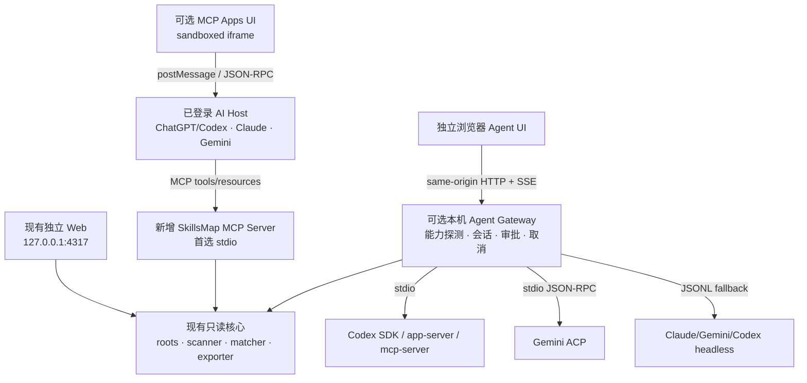

# SkillsMap 当前启用方式与本机 AI 接入调研

> 研究截止：2026-08-03。范围：优先 MCP，其次由现有网页调用本机 CLI AI Agent；项目本身不要求配置外部 LLM API key。

## 结论

**建议采用“同一核心、两种交付、三层渐进”的架构。** 第一层保留现有独立网页；第二层把现有只读扫描、搜索、匹配和导出暴露成 stdio MCP Server；第三层只有在独立网页确实需要自由对话时，才加入受控的本机 Agent Gateway。MCP Apps 可作为 Host 内嵌网页增强，但不能替代无兼容 Host 时的普通 Web。

这条路线满足“无需项目配置 LLM API key”，因为模型、登录和对话由用户已经登录的 AI Host 或本机 CLI 负责。它**不等于**无需账号、免费、离线，也不代表可以把任何供应商的个人订阅凭证用于对外产品。

优先级如下：

1. **P0：只读 stdio MCP Server。** 最贴合当前代码和信任边界，先不让 SkillsMap 自己负责模型推理。
2. **P1：MCP Apps 渐进增强。** 在支持的 Host 中嵌入交互视图；无 UI Host 仍返回结构化文本。
3. **P2：独立网页的本机 Agent Gateway。** Codex SDK/app-server 或 `codex mcp-server` 优先，Gemini ACP 次之；JSONL/headless 只作 fallback。
4. **P3：本地模型。** 只有明确要求真正离线时再引入 Ollama/LM Studio；当前机器未安装这两者。

## 当前项目究竟如何启用

当前 Capability Atlas 0.2 是一个无第三方 npm 依赖的本机 Node.js 应用，不包含 MCP、模型调用、AI CLI 子进程、API key 或鉴权。`plan` 是把有界扫描结果匹配到人工维护工作流的确定性规则，不是模型推理。

| 使用方式 | 命令/入口 | 实际行为 |
|---|---|---|
| macOS 双击 | `prototype/启动能力测绘台.command` | 检查 Node 20，打开 `127.0.0.1:4317`，运行 `node server.mjs` |
| 网页服务 | `cd prototype && npm start` | 静态网页 + `/api/health`、`scan`、`plan`、`export` |
| CLI 启动服务 | `node cli.mjs serve` | 调用同一个 `startServer()` |
| CLI 扫描 | `npm run scan [-- --full]` | 只读扫描 `SKILL.md`，输出摘要或公开 inventory |
| CLI 地图 | `npm run plan -- "目标" [--json]` | 确定性匹配，输出 Markdown/JSON |

代码证据集中在 [`prototype/server.mjs`](../prototype/server.mjs)、[`prototype/cli.mjs`](../prototype/cli.mjs)、[`prototype/lib/scanner.mjs`](../prototype/lib/scanner.mjs)、[`prototype/lib/matcher.mjs`](../prototype/lib/matcher.mjs) 和 [`prototype/public/app.js`](../prototype/public/app.js)。

## 推荐目标架构

这里必须分清三个角色：MCP Server 提供工具和上下文；AI Host/本机 Agent 负责模型与对话；纯浏览器不能直接启动 stdio 进程。MCP 核心协议本身不会自动给项目增加 LLM。

## 方案比较

| 方案 | 项目需 LLM API key | 网页 | 会话/审批 | 与当前仓库匹配 | 判断 |
|---|---:|---|---|---:|---|
| SkillsMap 作为 stdio MCP Server | 否 | Host 原生 UI；工具结果 | 由 Host 负责 | **最高** | 首选 |
| stdio MCP + MCP Apps | 否 | Host 内嵌 iframe | 由 Host 负责 | 高 | 第二步；保留文本降级 |
| 网关作为 MCP Client 调 `codex mcp-server` | 否，复用 Codex 登录 | 独立 Web | Codex thread/reply；网关补 UI | 中高 | 严格 MCP 路径可做 spike |
| Codex SDK / app-server | 否，复用 ChatGPT 登录 | 独立 Web | thread/turn/审批/流式最完整 | 高 | 独立网页 AI 的首选 Provider |
| Gemini ACP | 否，可复用缓存 Google 登录 | 独立 Web | session/prompt/cancel/FS proxy | 高 | 第二 Provider |
| Codex/Gemini/Claude headless JSONL | 通常否，取决于缓存登录 | 独立 Web | 需要自建归一层 | 中 | 兼容 fallback |
| Claude 订阅 OAuth 作为分发产品后端 | 技术上可本机复用 | 独立 Web | JSONL/SDK | 低 | **不作为产品承诺** |
| Ollama/LM Studio 本地模型 | 否 | 独立 Web | 自建 | 中 | 真正离线的可选项 |

## MCP 实施要点

截至研究日，MCP `2026-07-28` 已将核心改为无状态：每个请求携带协议版本和能力，`server/discover` 用于能力发现；Streamable HTTP 移除了独立 GET stream 和协议级 session。MCP Apps 与 Tasks 是正式扩展。Sampling、Roots 和协议 Logging 已进入弃用期，因此新实现不应依赖 Sampling 来“向 Host 借模型”。

首版工具建议：

- `atlas_status`：版本、根摘要、扫描统计，不返回全部 Skill。
- `search_skills`：query/provider/scope/cursor/limit，强制分页。
- `get_skill`：按稳定内容 ID 获取公开元数据；默认无正文。
- `build_map`：目标 + 人工 override，返回摘要和分页阶段。
- `export_map`：返回 Markdown resource 或有上限文本。

优先 stdio；只有出现多个客户端共享常驻服务的真实需求时，才增加 Streamable HTTP。不要手写协议栈：使用并锁定官方 SDK，同时保留 2025-era 客户端 fixture，验证实际 Host 的协议 revision 与 Apps/Tasks 能力。

## 本机 AI Provider 结论

| Provider | 官方控制面 | 零项目 Key 路径 | 本机状态 | 主要限制 |
|---|---|---|---|---|
| Codex | SDK；app-server；`mcp-server`；`exec --json` | ChatGPT 登录/订阅 | PATH 中 npm Codex 损坏；ChatGPT.app 内置 Codex 可运行 | 必须做候选路径健康探针；app-server 的网络传输成熟度需版本核对 |
| Gemini CLI | `gemini --acp`；headless `stream-json` | 缓存 Google 登录 | `0.46.0` 可运行 | ACP 与事件 schema 要锁版本；组织账号可能要求 Cloud project |
| Claude Code | `claude -p --output-format stream-json` | 非 bare 模式读取现有订阅登录 | `2.1.142` 可运行 | `--bare` 不读取 OAuth、会要求 API key；订阅 OAuth 不可作为第三方产品代用户路由 |
| Ollama / LM Studio | 本地模型 HTTP/runtime | 无外部账号 | 均未发现 | 需另装模型并做质量/资源基准 |

Codex 当前探针尤其说明：`command -v` 成功不等于 CLI 可用。Provider discovery 应依次验证显式配置、PATH、macOS 应用内置二进制和 SDK 自带 runtime，并实际执行 `--version`/协议能力探针；不得读取或展示用户账号信息。

## “无需外部 LLM API key”的准确边界

- **可承诺：** SkillsMap 不要求用户粘贴 API key，不保存 API key，调用用户已经登录的本机 Host/CLI。
- **不可承诺：** 无需登录、永久免费、完全离线、无数据出站、任意个人订阅都允许被第三方产品复用。
- **只有本地模型才是离线：** Codex/Claude/Gemini 的订阅登录路径通常仍把选择的提示和上下文发送到供应商服务。
- **Claude 特别限制：** Anthropic 官方要求为他人构建产品或服务时使用 Console API key 或受支持云提供商，不允许代用户路由 Free/Pro/Max 凭证。因此 Claude 无 Key 桥接只能作为用户自用/受控实验，不应写入可分发产品卖点。

## 安全门槛

当前 REST 服务没有 Origin、Host、CSRF/nonce 或用户鉴权，这在只读原型里风险有限；一旦它能启动 Agent 子进程，就必须先改变安全模型：

1. Agent 功能默认关闭，仅 `CAPABILITY_ATLAS_ENABLE_LOCAL_AGENT=1` 显式开启；开启时无条件拒绝非回环监听。
2. 对有副作用 API 精确校验 `Host`、`Origin`、`Sec-Fetch-Site`、JSON content-type 和一次性会话 nonce；不启用宽松 CORS。
3. Provider、可执行文件、argv、cwd、环境变量全部由服务端 allowlist 决定；使用 `spawn(executable, args, {shell:false})`，prompt 走 stdin，浏览器不能提交命令字符串。
4. 默认只读/plan 沙箱；写文件和外部命令必须由支持审批事件的协议映射到明确 UI 确认。永不传递跳过沙箱/跳过审批参数。
5. 限制 prompt、stdout/stderr、并发、运行时间和进程树；实现 AbortSignal、取消、SIGTERM 后升级终止和服务退出清理。
6. 继续默认不把 `searchText`、完整 SKILL.md 正文或全部路径交给云端 Agent；Skill 正文视为非信任输入，不得当系统指令。
7. 统一 Provider 事件为 `start/delta/tool/approval/error/done`，未知事件只记录并安全降级；日志不包含凭证、完整 prompt 或私有正文。

## 最小代码落点

| 文件 | 改动 | 阶段 |
|---|---|---|
| `prototype/lib/catalog-service.mjs` | 从 `server.mjs` 抽出 roots、cache、scan/search/plan/export 公共服务 | MCP 前置 |
| `prototype/mcp-server.mjs` | 官方 SDK + stdio，暴露只读 tools/resources | P0 |
| `prototype/package.json` | `mcp`、`inspect:mcp`、`test:mcp`；锁定 SDK | P0 |
| `prototype/public/transport-*.js` | REST 与 MCP Apps bridge 的传输适配 | P1 |
| `prototype/lib/agents/*` | Provider capability、Codex/Gemini/Claude adapters、事件归一 | P2 |
| `prototype/server.mjs` | gated agent health/session/event/cancel API，安全校验 | P2 |
| `prototype/public/app.js` / `index.html` | Provider 状态、对话流、审批、取消 | P2 |
| `prototype/test/mcp.test.mjs` / `local-agent.test.mjs` | 协议、假 CLI、安全、取消、隐私回归 | 各阶段 |

## 推荐实施顺序

1. **1–2 天：公共服务层。** 不改行为地抽取 inventory/plan/export，保持现有 14 个测试通过。
2. **2–3 天：stdio MCP 垂直切片。** `status/search/build_map/export`，Inspector + Codex/Claude/Gemini 至少两个 Host 实测。
3. **2 天：MCP Apps spike。** 只迁移一个地图/搜索视图；无 UI Host 验证文本降级。
4. **3–5 天：单 Provider Web Gateway。** 首选 Codex SDK/app-server；必须先完成 Origin/nonce/allowlist/取消/只读沙箱。
5. **后续：Gemini ACP 与 JSONL fallback。** 用协议 fixture 扩展，不先追求统一所有事件。
6. **Claude 与本地模型。** Claude 仅个人实验；本地模型在真正离线需求和质量基准成立后加入。

## 验收标准

- 未配置任何 LLM API key 时，已登录 Host 可调用 SkillsMap MCP 工具。
- 1,000+ Skill inventory 始终分页，默认响应没有 `searchText`、完整正文或测试 sentinel。
- 不支持 MCP Apps 的 Host 仍能完成同一工具工作流。
- Agent 功能默认关闭，非回环、错误 Origin、无 nonce、任意 executable/argv 请求全部失败。
- 假 CLI 覆盖登录过期、协议未知事件、超时、取消、非零退出、超大输出和进程树清理。
- 原有双击、`npm start`、scan、plan、export 和测试保持不变。

## 证据边界

本报告汇总 3 个结构化研究项和 24 个去重官方来源。仓库结论来自当前工作区代码、测试与本机只读版本探针；技术结论优先使用协议、供应商官方文档和官方 SDK 说明。没有读取本机账号身份或凭据，也没有实际发起付费模型调用。

仍需实测的部分：目标 Host 对 MCP `2026-07-28`、MCP Apps/Tasks 的实际支持；Codex/Gemini/Claude 在锁定版本下的事件 schema；本地模型质量和资源占用；任何对外分发前的供应商条款复核。

# 分项研究明细

## 1. 当前项目启用链路与 MCP 优先方案

- 分类：`架构`
- 结构化结果：`results/current_project_and_mcp_enablement.json`
- 证据强度：强：仓库结论来自逐行代码审计与现有测试；协议结论来自 MCP 当前规范、Final SEP 和官方 Host 文档。

### 对象与范围

**调研对象名称**

当前项目启用链路与 MCP 优先方案

**架构、集成或决策分类**

架构

**该对象覆盖的问题和明确不覆盖的边界**

覆盖当前仓库的真实启动链路、数据流、MCP 角色选择、传输和 MCP Apps UI；不把 MCP 误当成模型或通用 Agent 会话协议，也不在本项实现代码。

**截至 2026-08-03 的实现或官方能力状态**

截至 2026-08-03，Capability Atlas 0.2 是无第三方 npm 依赖的本机只读 Node.js 工具；MCP 2026-07-28 已转为无状态核心并包含 MCP Apps/Tasks 扩展，但目标 Host 与官方 SDK 的版本支持仍须契约测试。

### 当前实现证据

**当前 Finder、npm、CLI、HTTP 与网页启动入口**

- **方式**: macOS Finder 双击 | **入口**: prototype/启动能力测绘台.command | **行为**: 检查 Node.js 20，后台打开 http://127.0.0.1:4317，前台 exec node server.mjs
- **方式**: npm 网页服务 | **入口**: cd prototype && npm start | **行为**: package.json 将 start 映射为 node server.mjs
- **方式**: CLI 网页服务 | **入口**: node cli.mjs serve | **行为**: 调用 startServer()
- **方式**: CLI 只读扫描 | **入口**: npm run scan [-- --full] | **行为**: 输出扫描摘要或完整公开 inventory JSON
- **方式**: CLI 生成地图 | **入口**: npm run plan -- "目标" [--json] | **行为**: 执行确定性匹配并输出 Markdown 或 JSON，不调用模型

**扫描、匹配、导出和前端持久化的数据流**

- **服务端**: server.mjs 同源提供静态文件和 /api/health、/api/scan、/api/plan、/api/export；inventory 仅存在进程内缓存。
- **扫描**: roots.mjs 解析默认/环境变量/用户根，scanner.mjs 有界只读发现 SKILL.md、解析元数据、哈希去重；publicInventory 在返回浏览器前删除 searchText。
- **匹配**: matcher.mjs 读取人工维护的 web-product-workflow.json，用名称/description/正文的确定性权重打分；目标文本主要用于命名与边界提示。
- **浏览器**: app.js 先 scan 再 plan；workspace.js 将多地图和人工判断保存到 localStorage；JSON 备份在浏览器生成，Markdown 由服务端重建后下载。
- **信任边界**: 当前只读取 Skill，不安装、修改或执行 Skill；默认监听 127.0.0.1。

**现有 MCP、模型、AI CLI、鉴权或子进程能力**

- **MCP**: 无
- **模型调用**: 无
- **AI_CLI_子进程**: 无
- **API_key或Authorization**: 无
- **当前plan语义**: 确定性规则匹配，不是 AI 规划

**关键代码文件、行号、测试或本机运行探针**

- /Users/mz/dev/skillsmap/prototype/package.json:7-15：start/scan/plan/test 与 Node >=20
- /Users/mz/dev/skillsmap/prototype/启动能力测绘台.command:7-17：Node 检查、打开浏览器、启动 server.mjs
- /Users/mz/dev/skillsmap/prototype/cli.mjs:20-33：scan、plan、serve 分支
- /Users/mz/dev/skillsmap/prototype/server.mjs:90-180：HTTP 路由、回环默认值和只读日志
- /Users/mz/dev/skillsmap/prototype/lib/scanner.mjs:203-268：有界扫描与 publicInventory 去正文
- /Users/mz/dev/skillsmap/prototype/lib/matcher.mjs:164-298：人工模板的确定性匹配
- /Users/mz/dev/skillsmap/prototype/public/app.js:766-834：网页 scan/plan/export 请求
- /Users/mz/dev/skillsmap/prototype/README.md:81-89：当前明确不是通用 Agent 编排器

### 架构与协议

**项目、AI Host、MCP Client/Server、网页与 CLI Agent 的角色**

- **推荐拓扑A**: SkillsMap 作为本地 MCP Server；ChatGPT/Codex、Claude 或 Gemini 等现有 AI Host 负责模型、对话、审批和登录，SkillsMap 仅暴露小而清晰的只读 tools/resources。
- **推荐拓扑B**: 需要 Host 内嵌界面时，MCP Server 同时提供 ui:// MCP Apps 资源；Host 在沙箱 iframe 中渲染，UI 经 postMessage/JSON-RPC 通过 Host 调用工具。
- **独立网页拓扑**: 现有 Node 服务仍是同源 Web Server；若后续调用 AI CLI，它还要成为受信任的 Agent Gateway/MCP Client，此职责不属于纯浏览器。
- **不推荐拓扑**: 让 MCP Server 依赖 Sampling 向 Host 借模型；Sampling 自 2026-07-28 起已弃用，新架构不应依赖它。
- **推理所有者**: 拓扑A/B 中是外部 AI Host；现有独立网页无推理；只有第二阶段 Agent Gateway 才由本机 CLI Agent 持有推理和会话。

**会话恢复、事件流、审批、取消和错误恢复能力**

- **当前MCP工具**: scan、search、plan、export 应尽量是短请求和显式参数，不需要模型会话。
- **协议状态**: MCP 2026-07-28 的协议核心无状态，但业务仍可通过显式 mapId/taskId 维护状态；AI 对话状态属于 Host。
- **进度**: 短扫描可用请求相关 progress 通知；长任务仅在 Host/Server 均支持 Tasks 扩展时返回 task handle。
- **取消**: stdio 使用协议取消；新 Streamable HTTP 以关闭该请求的 SSE 响应流作为取消信号。
- **审批**: 只读 MCP tools 不应申请执行权限；人工确认/排除仍作为显式工具参数或 UI 操作。

**分页、过滤、正文暴露和模型上下文控制**

- **问题**: 当前本机可有 1,400+ 逻辑路径；一次返回完整 inventory 会占满模型上下文，也可能暴露过多本机路径。
- **工具设计**:
  - atlas_status：版本、根摘要和统计
  - search_skills：query/provider/scope/cursor/limit，默认仅返回名称、描述、来源标签和内容哈希
  - get_skill：按稳定 ID 获取单项公开元数据，正文默认不返回
  - build_map：目标、人工 overrides、明确 custom roots，返回摘要与分页阶段
  - export_map：返回 Markdown resource 或受限文本
- **边界**: 继续复用 publicInventory；除非用户显式选择，不把 searchText、完整 SKILL.md 正文或全部绝对路径发送给云端模型。

### 零外部 API Key 与本机 Agent

**无需项目配置 API key 的准确含义与限制**

MCP 优先方案中，SkillsMap 不持有模型凭据；AI Host 使用用户已经登录的本机客户端或其自身订阅。它表示项目无需配置 LLM API key，不表示免登录、免费、离线或不向供应商云发送所选上下文。

**本机 CLI 路径、版本、健康状态和发现陷阱**

- **Node**: 项目声明 Node.js >=20；当前实现无需 npm 第三方依赖。
- **MCP实现**: 尚不存在，需新增官方 SDK 依赖或独立可选子包。
- **Host配置**: Codex、Claude Code、Gemini CLI 官方均支持本地 stdio MCP；实际连接应在实现后用各自当前版本验证。

**订阅/OAuth 凭证用于个人工具、内部工具或分发产品的限制**

SkillsMap 作为工具 MCP Server 时不转售或代理任何模型凭据，许可风险最低；Host 的订阅、额度、数据政策和使用条款仍由用户与对应供应商关系决定。

**完全离线本地模型作为可选后端的条件**

MCP Server 本身完全本地；是否离线取决于 Host。若 Host 使用本地模型则可离线，否则请求仍可能出站。

### 安全与运维

**从只读目录工具变为 Agent 执行入口后的信任边界变化**

纯只读 MCP tools 基本保持现有边界，但 Host 会把工具结果放入模型上下文；若新增写操作、Sampling 或 Agent CLI 执行，边界会显著扩大，必须独立显式启用。

**Host/Origin/CSRF/DNS rebinding、回环监听与本地网络访问风险**

stdio MCP 没有浏览器网络面。若启用本地 Streamable HTTP，规范要求验证 Origin、仅监听 127.0.0.1 并实施认证；现有 REST API 因只读尚未做这些校验，不能原样承载有副作用工具。

**命令白名单、shell=false、环境变量、cwd、沙箱、超时、并发和终止**

MCP stdio 入口应是固定 node 脚本和固定参数；stdout 只写协议，stderr 写日志；限制 custom roots、每页条数、请求体、并发、运行时和输出大小。

**Skill 正文、登录凭证、Agent 输出与提示注入的处理**

Skill 正文是非信任输入，可能含提示注入。默认 MCP 结果仅给公开元数据和短证据，不把正文当指令；所有来源路径和正文访问需最小化并清楚标记。

**健康探针、事件日志、协议测试、假 CLI 与浏览器验收**

- 协议契约：initialize/server-discover 兼容层、tools/list、tools/call、错误码、取消、stdout 纯净
- 工具契约：分页稳定、输入 schema、custom roots 拒绝、缓存一致性、Markdown 导出
- 隐私回归：PRIVATE_BODY_SENTINEL 不进入默认 MCP 响应或 UI resource data
- Host 矩阵：ChatGPT/Codex、Claude Code、Gemini CLI 的当前 stdio 连接和 MCP Apps 降级
- 版本锁定：记录 SDK、协议 revision 和 Host 版本；对 2025-era 与 2026-07-28 消息做 fixture 测试

### 决策与实施

**各方案的优点、缺点、复杂度、成熟度和适配度**

- **方案**: SkillsMap stdio MCP Server | **复杂度**: 低到中 | **成熟度**: 高（核心 MCP），但需处理 2026 revision 兼容 | **优点**: 最贴合当前无模型、只读核心；不需要项目 API key；多个 AI Host 可复用 | **缺点**: 需要安装配置；Host UI 和协议版本支持不同 | **推荐度**: 第一优先
- **方案**: MCP Server + MCP Apps | **复杂度**: 中 | **成熟度**: 官方扩展，Host 支持不齐 | **优点**: 同时满足 MCP 与网页交互，保留对话上下文 | **缺点**: 现有前端需 transport 解耦和单页打包；不是独立浏览器 | **推荐度**: 第二步渐进增强
- **方案**: Streamable HTTP MCP | **复杂度**: 中到高 | **成熟度**: 核心传输，但 2026-07-28 有破坏性变化 | **优点**: 常驻、多客户端、可复用现有 Node 服务 | **缺点**: 增加本地网络和认证攻击面 | **推荐度**: 没有多客户端需求时暂缓
- **方案**: MCP Sampling 获取 Host LLM | **复杂度**: 高 | **成熟度**: 已弃用 | **优点**: 理论上让 Server 借用 Host 模型 | **缺点**: 采用率低、权限复杂、未来会移除 | **推荐度**: 不采用

**与当前仓库最匹配的目标架构及选择理由**

先新增一个只读 stdio MCP Server，直接复用 scanner/matcher/exporter，并保留现有独立网页；再为少数高价值工具添加 MCP Apps UI。由用户现有 AI Host 负责模型和登录，SkillsMap 不实现 LLM。只有在必须从现有独立网页发起 Agent 会话时，才进入第二项研究的本机 CLI Gateway。

**建议新增或修改的文件与职责**

- **文件**: prototype/lib/catalog-service.mjs（新增，可选） | **职责**: 从 server.mjs 抽出 roots 合并、inventory cache、scan/search/plan/export 公共服务，供 REST 与 MCP 共用
- **文件**: prototype/mcp-server.mjs（新增） | **职责**: 官方 SDK、stdio transport、只读 tools/resources、分页与错误映射
- **文件**: prototype/package.json | **职责**: 增加 mcp/inspect/test:mcp 脚本和锁定 SDK；若坚持零依赖，把 MCP 作为独立可选子包
- **文件**: prototype/public/transport-rest.js 与 transport-mcp-app.js（后续新增） | **职责**: 让现有视图逻辑不直接绑定 fetch，支持独立 Web 与 MCP Apps bridge
- **文件**: prototype/test/mcp.test.mjs（新增） | **职责**: 协议、schema、分页、隐私与 stdout 契约
- **文件**: prototype/README.md | **职责**: 分别说明网页启动、MCP Host 配置、零 Key 的准确含义和支持矩阵

**最小可行阶段、启用开关、回退和后续扩展**

- 阶段0：保持 0.2 行为不变，锁定公共服务函数和隐私测试。
- 阶段1：只读 stdio MCP，工具先做 status/search/build_map/export；用 Inspector 与至少两个本机 Host 验证。
- 阶段2：为 build_map/search 结果增加 MCP Apps UI，同时保留文本结果与现有独立网页。
- 阶段3：只有出现共享常驻服务需求时增加 Streamable HTTP 和本地认证。
- 阶段4：只有独立网页确实需要自由对话/Agent 执行时，增加受控 CLI Gateway；不把它混入只读 MCP 默认模式。

**功能、安全、隐私与兼容性验收标准**

- 未配置任何 LLM API key 时，已登录 AI Host 能调用 SkillsMap MCP tools。
- MCP 默认响应不包含 searchText、完整 Skill 正文或测试 sentinel。
- 1,000+ Skill inventory 必须分页/过滤，单次结果有确定上限。
- 不支持 MCP Apps 的 Host 仍可完成相同工具工作流。
- MCP stdio stdout 只有合法协议消息；日志和诊断走 stderr。
- 现有 npm start、双击启动、scan、plan、14 个测试保持兼容。
- 若实现 HTTP MCP，跨 Origin 请求被拒、只允许回环、具备认证与取消测试。

**最终建议与优先级**

GO：将 SkillsMap 作为只读 stdio MCP Server 是最匹配、风险最低、最能兑现‘无需项目 API key’的第一步；MCP Apps 是网页显示的优先增强。不要依赖已弃用 Sampling，也不要在首版把 MCP Server、MCP Host 与本地 Agent Gateway 混成同一个不可审计进程。

**结论置信度和仍需实测的假设**

高。当前实现由本地代码直接证明；MCP 角色和安全规则有官方规范支持。主要不确定性是各 Host 对 2026-07-28 与 MCP Apps/Tasks 的实际版本支持。

### 来源与不确定性

**官方资料和代码证据链接**

- [modelcontextprotocol.io/specification/2026-07-28/architecture](https://modelcontextprotocol.io/specification/2026-07-28/architecture)
- [modelcontextprotocol.io/specification/2026-07-28/basic/transports/streamable-http](https://modelcontextprotocol.io/specification/2026-07-28/basic/transports/streamable-http)
- [blog.modelcontextprotocol.io/posts/2026-07-28-release-candidate](https://blog.modelcontextprotocol.io/posts/2026-07-28-release-candidate/)
- [modelcontextprotocol.io/seps/2577-deprecate-roots-sampling-and-logging](https://modelcontextprotocol.io/seps/2577-deprecate-roots-sampling-and-logging)
- [modelcontextprotocol.io/extensions/apps/overview](https://modelcontextprotocol.io/extensions/apps/overview)
- [modelcontextprotocol.io/extensions/tasks/overview](https://modelcontextprotocol.io/extensions/tasks/overview)
- [apps.extensions.modelcontextprotocol.io](https://apps.extensions.modelcontextprotocol.io/)
- [ts.sdk.modelcontextprotocol.io](https://ts.sdk.modelcontextprotocol.io/)
- [learn.chatgpt.com/docs/extend/mcp](https://learn.chatgpt.com/docs/extend/mcp?surface=cli)
- [developers.openai.com/plugins/build/chatgpt-ui](https://developers.openai.com/plugins/build/chatgpt-ui)
- [code.claude.com/docs/en/mcp](https://code.claude.com/docs/en/mcp)
- [geminicli.com/docs/tools/mcp-server](https://geminicli.com/docs/tools/mcp-server/)

**强、中、弱及理由**

强：仓库结论来自逐行代码审计与现有测试；协议结论来自 MCP 当前规范、Final SEP 和官方 Host 文档。

### 保留不确定性

- provider_matrix：各 Host 对 MCP 2026-07-28、MCP Apps 与 Tasks 的确切版本支持需实测
- protocol_options：官方 TypeScript SDK 在本项目实现时的稳定版本与向后兼容 API 需锁定后验证
- ui_strategy：现有多文件静态前端迁移成 MCP App 单资源的工作量需做小型 spike

## 2. 网页调用本机 AI Agent 的零 Key 桥接方案

- 分类：`integration`
- 结构化结果：`results/web_local_ai_agent_bridge.json`
- 证据强度：强：当前仓库边界与本机 CLI 路径/版本来自只读代码审计和实际 --version/健康探针；MCP、Codex、Gemini、Claude 与 Node 子进程结论来自官方规范或官方文档。中：未读取真实登录状态、未发起模型调用，Host 支持矩阵和锁定版本事件需在实施 spike 中验证。

### 对象与范围

**调研对象名称**

网页调用本机 AI Agent 的零 Key 桥接方案

**架构、集成或决策分类**

integration

**该对象覆盖的问题和明确不覆盖的边界**

比较 Codex、Gemini CLI、Claude Code 与可选本地模型作为现有 localhost 网页的本机 Agent 后端；覆盖官方嵌入面、登录态复用、会话、流式、审批、取消、分发条款和本机健康探针。不读取账号身份或凭据，不发起真实模型调用，也不把无需项目配置 API key 等同于离线。

**截至 2026-08-03 的实现或官方能力状态**

> 截至 2026-08-03，现有网页没有 Agent 桥接。官方可用面包括 Codex SDK、app-server、mcp-server 与 exec JSONL；Gemini CLI ACP 与 headless stream-json；Claude Code headless。MCP Apps 可提供 Host 内嵌网页，但独立浏览器仍需要本机 Node 网关。

### 当前实现证据

**当前 Finder、npm、CLI、HTTP 与网页启动入口**

- Finder 双击 prototype/启动能力测绘台.command 后启动 127.0.0.1:4317。
- npm start 或 node cli.mjs serve 启动同一 server.mjs。
- 浏览器只通过同源 REST API 调用 scan、plan、export；当前没有 chat、session、stream、approval 或 cancel 入口。

**扫描、匹配、导出和前端持久化的数据流**

- 网页向 server.mjs 请求公开 inventory；scanner.mjs 在服务端读取有界 SKILL.md 元数据，publicInventory 默认剥离 searchText。
- matcher.mjs 使用确定性权重和人工维护工作流生成地图，不调用模型。
- 若加入独立网页 Agent，应由 Node 网关选择最小上下文，经 stdin/协议发送给已登录 CLI，再把供应商事件归一后以 SSE 或分块响应返回浏览器。

**现有 MCP、模型、AI CLI、鉴权或子进程能力**

仓库中不存在 MCP Client/Server、Agent SDK、child_process、模型请求、API key、OAuth、会话或审批逻辑；package.json 无第三方依赖。所谓 plan 目前是确定性匹配，不是 AI 推理。

**关键代码文件、行号、测试或本机运行探针**

- prototype/package.json：Node >=20，无 dependencies；只有 start、scan、plan、test 脚本。
- prototype/server.mjs：内置 HTTP 静态服务和 scan/plan/export API，无进程启动或流式 Agent 路由。
- prototype/public/app.js：fetch + localStorage，无 WebSocket/SSE 或 Agent 状态机。
- 本机只读探针：/Applications/ChatGPT.app/Contents/Resources/codex 可运行，版本 codex-cli 0.146.0-alpha.9.2；PATH 中 /opt/homebrew/bin/codex 包装器因缺失 native binary 报 ENOENT。
- 本机只读探针：claude 2.1.142、gemini 0.46.0 可运行；opencode、ollama、lmstudio 未发现。

### 架构与协议

**项目、AI Host、MCP Client/Server、网页与 CLI Agent 的角色**

- SkillsMap 作为 MCP Server：只暴露扫描、搜索、地图和导出；用户已登录的 AI Host 持有模型、账号与对话，这是优先方案。
- SkillsMap 作为独立 Web + Agent Gateway：浏览器只连接同源 Node；Node 作为 MCP/ACP/JSONL Client 管理本机 CLI，Agent CLI 持有模型会话。
- MCP Apps：SkillsMap 提供 ui:// 资源，由兼容 Host 在沙箱 iframe 中显示；这是 Host 内嵌 UI，不是任意浏览器页面。
- 本地模型：网关连接 Ollama/LM Studio 等 runtime，推理完全在本机，但需要额外安装和模型质量评测。

**stdio、Streamable HTTP、MCP Apps、JSON-RPC、ACP 或流式 JSON 选项**

- Codex mcp-server：严格 MCP 路径，可通过 codex 与 codex-reply 工具启动或延续 Codex 会话；适合作为网关的 MCP Client spike。
- Codex app-server：stdio JSONL JSON-RPC，提供 thread/turn、审批、流式事件、认证和历史等更完整集成面；适合深度网页集成，但应锁定版本并做契约测试。
- Codex SDK：官方 Node/Python 嵌入面，适合服务端应用；Node SDK 在服务端启动和控制 Codex，不能直接放进浏览器。
- Codex exec --json：稳定的非交互 JSONL fallback，适合一次性只读任务，不宜冒充完整会话协议。
- Gemini --acp：stdio JSON-RPC Agent Client Protocol，覆盖 session、prompt、cancel、文件系统代理，并可连接客户端提供的 MCP Server；优先于解析人类 CLI 输出。
- Gemini/Claude/Codex headless JSONL：作为兼容 fallback；每个适配器必须独立解析版本化事件。
- 纯浏览器不能直接可靠启动 stdio 子进程；必须经过兼容 MCP Host 或本机伴随进程。

**独立网页、MCP Apps 以及不支持 UI 的 Host 的降级方式**

- 优先保留现有独立 Web 作为无 Host 的稳定入口。
- 对支持 MCP Apps 的 Host，把核心搜索/地图视图包装成 ui:// 沙箱资源；工具必须在无 UI Host 中仍返回可用结构化文本。
- 独立网页需要聊天时增加 Provider 状态、会话、流式增量、审批、取消和错误恢复 UI；浏览器永远不接收 executable、任意 argv 或凭据。
- Host 对 Apps/Tasks 支持可能不同，运行时能力协商失败时降级为普通 MCP tools 或现有 REST 页面。

**会话恢复、事件流、审批、取消和错误恢复能力**

- Codex app-server/SDK 适合映射 thread、turn、item 与审批通知；mcp-server 通过 codex/codex-reply 维持会话；exec JSONL 主要是单次运行。
- Gemini ACP 提供 session/new、session/prompt、session/cancel 和客户端文件系统代理；headless stream-json 提供逐行事件和退出码。
- Claude headless -p 支持 json/stream-json、会话元数据和恢复参数，但其事件、权限与登录行为必须按已安装版本验证。
- 网关统一为 start、delta、tool、approval、error、done，并用 AbortSignal、超时和进程树清理实现取消；不认识的事件安全降级而不是静默执行。
- 长任务若走 MCP 可评估 Tasks 扩展；独立 Web 则用服务端 task id + SSE/轮询，断线后只恢复状态而不重复副作用。

**分页、过滤、正文暴露和模型上下文控制**

- 默认只发送目标、用户明确选中的 Skill 公共元数据和有上限的地图摘要，不发送完整 inventory、searchText 或全部 SKILL.md 正文。
- 所有列表分页，prompt、单事件、累计 stdout/stderr、最终回答、工具调用次数和会话时长均设硬上限。
- 正文按需、按项读取，并标注为不可信数据；不得拼入系统指令或开发者指令区。
- Provider 上下文能力不同，网关只定义共同最小包络，Provider-specific 扩展用能力位而非猜测版本。

### 零外部 API Key 与本机 Agent

**无需项目配置 API key 的准确含义与限制**

- 项目无需配置 API key：SkillsMap 不要求用户粘贴、保存或转发 LLM API key。
- 复用本机登录：由 Codex/Claude/Gemini 官方 CLI 或 AI Host 使用其已有登录缓存和订阅/账号权限。
- 这不代表无需账号、免费、没有额度、无数据出站或完全离线；云 Agent 仍可能上传所选提示与上下文。
- 真正离线只由本地模型后端提供，并需要另行安装、存储、硬件与质量基准。

**Codex、Claude、Gemini 与本地模型的认证、协议、流式和适用性对比**

- **provider**: Codex | **official_surface**: SDK、app-server、mcp-server、exec --json | **zero_project_key**: 可复用 ChatGPT 登录/订阅；认证由 Codex 管理 | **fit**: 首选：官方嵌入面最完整，严格 MCP 与深度集成两条路径兼具 | **caveat**: 本机 PATH 包装器损坏但 ChatGPT.app 内置二进制正常；必须做真实健康探针和版本锁定
- **provider**: Gemini CLI | **official_surface**: ACP、headless stream-json、MCP Client | **zero_project_key**: 可复用缓存 Google 登录；无缓存时官方 headless 文档可能要求 API key/Vertex 配置 | **fit**: 第二 Provider；ACP 比手工解析终端文本更适合 Agent 网关 | **caveat**: 组织账号、Cloud project、ACP 版本和权限需实机验证
- **provider**: Claude Code | **official_surface**: headless -p stream-json；MCP Client/工具服务器 | **zero_project_key**: 个人本机可复用现有订阅登录，但 --bare 会跳过 OAuth/keychain 并要求 API key | **fit**: 仅个人自用或受控内部实验的 fallback | **caveat**: 不得把 Free/Pro/Max OAuth 代用户路由包装成可分发第三方产品；claude mcp serve 不能直接等同于带 Claude 推理的 Agent Server
- **provider**: Ollama/LM Studio | **official_surface**: 本地模型 runtime/API | **zero_project_key**: 是，且可完全离线 | **fit**: 只有离线需求明确后再做 | **caveat**: 当前机器未安装；模型下载、RAM/VRAM、中文质量与工具调用可靠性需基准

**本机 CLI 路径、版本、健康状态和发现陷阱**

- 候选 1：显式配置的绝对路径，仅允许后台生成或管理员配置，不接受浏览器任意路径。
- 候选 2：PATH；但必须实际运行 --version/协议探针，不能只用 command -v。
- 候选 3：macOS 应用内置 binary，例如 /Applications/ChatGPT.app/Contents/Resources/codex。
- 候选 4：SDK 自带 runtime 或官方定位逻辑。
- 每个候选记录 path、version、capabilities、可执行错误和认证是否需要用户操作；不读取、不打印账号、token 或 keychain 内容。
- 当前结果：Homebrew/npm codex 0.129.0 包装器 ENOENT；ChatGPT.app Codex 0.146.0-alpha.9.2 可运行；Claude 2.1.142 与 Gemini 0.46.0 可运行；Ollama/LM Studio 未发现。

**订阅/OAuth 凭证用于个人工具、内部工具或分发产品的限制**

- Codex 官方认证文档支持 Sign in with ChatGPT，SDK/app-server 用于自有或内部应用；实际分发仍应按官方条款和版本复核。
- Gemini CLI 可通过 Google 登录并复用缓存认证；企业组织策略和 Cloud project 要求可能改变可用性。
- Anthropic 官方法律与合规说明明确：为他人构建产品、应用或服务应使用 Console API key 或受支持云提供商，第三方不得代用户提供 Claude.ai 登录或路由 Free/Pro/Max 凭据。
- 因此无 Key 方案应定位为本机用户自带已登录工具，不托管凭据、不代理共享账号、不承诺供应商订阅的产品化许可。

**完全离线本地模型作为可选后端的条件**

若必须完全离线，增加独立 local-model Provider，并要求显式安装 Ollama/LM Studio、模型许可审核、磁盘/RAM/VRAM 检查、中文任务与工具调用基准；它不应阻塞 MCP 首版。

### 安全与运维

**从只读目录工具变为 Agent 执行入口后的信任边界变化**

- 当前服务只读扫描和确定性计算；加入 Agent 后将获得启动进程、访问工作区、可能执行工具和网络出站的能力。
- Node 网关成为本机高信任组件，浏览器页面和被扫描的 Skill 正文均必须视为不可信输入。
- Provider 登录态应由官方 CLI 持有，SkillsMap 只管理进程和协议，不复制认证材料。

**Host/Origin/CSRF/DNS rebinding、回环监听与本地网络访问风险**

- Agent 功能默认关闭；启用后服务只能监听 127.0.0.1/::1，不能把 loopback 当作充分鉴权。
- 对 Agent API 精确校验 Host、Origin、Sec-Fetch-Site、application/json 和每次启动随机 nonce；不启用 * CORS。
- 拒绝 DNS rebinding、跨站表单/脚本和本地网络访问绕过；对静态页设置 CSP，并让事件流保持 same-origin。
- 若以后加入 Streamable HTTP MCP，遵循 MCP 官方 Origin 校验、回环绑定与适当认证要求。

**命令白名单、shell=false、环境变量、cwd、沙箱、超时、并发和终止**

- 固定 provider allowlist 和服务端生成的 executable/argv；使用 spawn(executable, args, {shell:false})，prompt 经 stdin，不调用 exec 拼接命令。
- cwd 固定到经过解析的项目根，环境变量按 allowlist 构建，清除可能改变 CLI 行为的注入变量；不把浏览器值写入命令行。
- 默认只读/plan sandbox 和最低权限；任何写入或外部命令都要求协议可表达且 UI 明确审批，永不传递跳过审批/沙箱开关。
- 限制并发、排队、超时、stdout/stderr、文件访问和进程数；取消时先协作式取消，再 SIGTERM，超时后终止进程树。

**Skill 正文、登录凭证、Agent 输出与提示注入的处理**

- 不向云 Agent 发送凭据、环境变量、完整路径清单、searchText 或未选择 Skill 的正文。
- Skill 文档和 Agent 输出都标记为不可信数据；其中的‘忽略规则’、命令或外链不得改变系统权限。
- 工具调用必须重新通过服务端参数 schema、路径边界和审批检查，不能因为来自模型就可信。
- 日志只记录 provider、版本、事件类型、时长、字节数、退出码和匿名错误；默认不记录完整 prompt/正文/响应。

**健康探针、事件日志、协议测试、假 CLI 与浏览器验收**

- 新增 /api/agent/health 只返回 provider 路径来源、版本、能力和可用状态，不返回身份或 token。
- 每个 Provider 用录制的 JSON-RPC/JSONL fixture 测 start、delta、tool、approval、error、done、未知事件和 schema 变化。
- 使用假 CLI 测试登录过期、非零退出、挂起、超大输出、stderr、取消和孙进程清理，日常测试不调用付费模型。
- 浏览器测试覆盖错误 Origin/Host/nonce、Agent 默认关闭、并发上限、刷新后任务状态、审批拒绝和隐私 sentinel 不出站。

### 决策与实施

**各方案的优点、缺点、复杂度、成熟度和适配度**

- 只读 SkillsMap MCP Server：复杂度最低、最贴合当前项目、模型和会话由 Host 负责；网页仅为 Host UI 或独立降级，优先级最高。
- MCP Apps：同时满足 MCP 与网页显示，但依赖 Host 支持，且 UI 在 Host 沙箱内，不是通用独立 Web。
- Codex SDK/app-server：独立网页 AI 体验最完整，能复用登录；增加本机高信任网关和版本兼容成本。
- codex mcp-server：满足严格 MCP 偏好，协议边界清晰；网页网关仍需做 MCP Client、事件和审批映射。
- Gemini ACP：官方 Agent 协议成熟方向清晰，适合第二 Provider；仍需版本、组织认证与 Host 矩阵实测。
- headless JSONL：实现快、跨供应商，但事件和会话语义不统一，作为 fallback 而非唯一抽象。
- 本地模型：唯一真正离线方案，但安装和质量成本最高。

**与当前仓库最匹配的目标架构及选择理由**

> 采用同一 catalog core、两种交付、三层渐进：P0 抽出公共服务并实现 SkillsMap stdio MCP Server，让已登录 Host 负责模型；P1 可选 MCP Apps 嵌入搜索/地图 UI；P2 只有独立网页确需自由对话时才加入默认关闭的本机 Agent Gateway。P2 首选 Codex SDK/app-server，保留 codex mcp-server 的严格 MCP spike，Gemini ACP 为第二 Provider，headless JSONL 为兼容 fallback。

**建议新增或修改的文件与职责**

- prototype/lib/catalog-service.mjs：抽出 server 与 MCP 共用的 scan/search/plan/export。
- prototype/mcp-server.mjs：官方 MCP SDK + stdio，只读 tools/resources。
- prototype/public/transport-rest.js 与 transport-mcp-app.js：保持 UI 逻辑与传输解耦。
- prototype/lib/agents/capabilities.mjs、codex.mjs、gemini.mjs、claude.mjs、events.mjs：健康探针、Provider 适配和统一事件。
- prototype/server.mjs：在显式开关后增加 agent health/session/events/cancel，并加入同源 nonce 安全层。
- prototype/public/app.js/index.html：Provider 状态、增量文本、审批和取消。
- prototype/test/mcp.test.mjs 与 local-agent.test.mjs：协议 fixture、假 CLI、安全和隐私回归。

**最小可行阶段、启用开关、回退和后续扩展**

- 阶段 0：保持现有行为地抽出 catalog-service，14 个现有测试全部通过。
- 阶段 1：只读 stdio MCP vertical slice，提供 status/search/build_map/export；至少两个目标 Host 实测。
- 阶段 2：做一个 MCP Apps 搜索/地图视图 spike；不支持 Apps 时验证结构化文本降级。
- 阶段 3：在安全地基完成后，以 CAPABILITY_ATLAS_ENABLE_LOCAL_AGENT=1 启用单一 Codex Provider；默认只读并支持取消。
- 阶段 4：加入 Gemini ACP 与版本化 fixture；再评估 JSONL fallback。
- 阶段 5：Claude 仅个人/受控实验；本地模型仅在离线需求和基准成立后加入。
- 任一阶段均可通过关闭 Agent 开关或不配置 MCP Host 回退到现有网页。

**功能、安全、隐私与兼容性验收标准**

- 项目没有 LLM API key 配置项，也不读取或保存供应商 token；已登录 Host/CLI 能完成目标流程。
- MCP Host 可调用只读工具；不支持 Apps 的 Host 仍能完成相同功能。
- 独立 Web Agent 默认关闭；非回环监听、错误 Host/Origin、无 nonce、任意 executable/argv 均被拒绝。
- Provider 探针能识别 PATH 中存在但实际损坏的 codex，并安全回退到已验证候选。
- 取消、超时、登录过期、未知事件、超大输出和进程树清理由假 CLI 自动测试覆盖。
- 默认 Agent payload 不包含 searchText、完整 SKILL.md、未选择路径或隐私 sentinel。
- 原有 Finder 双击、npm start、scan、plan、export 与 14 项测试保持兼容。

**最终建议与优先级**

> 优先实现 SkillsMap 只读 stdio MCP Server；这是当前仓库最小、最稳、真正复用本机 AI Host 登录态的路径。需要网页展示时优先 MCP Apps，并保留现有 standalone Web。只有 standalone Web 必须主动调用 AI 时，才加入本机 Node Agent Gateway，先支持一个 Codex Provider，再扩展 Gemini ACP；不要首发任意 CLI、多 Provider、写权限或订阅 OAuth 代理。

**结论置信度和仍需实测的假设**

架构判断高：仓库证据、MCP/Codex/Gemini/Claude 官方接口与本机版本探针相互印证。中等不确定性集中在目标 Host 对 MCP 2026-07-28、Apps/Tasks 的实际支持、各 CLI 锁定版本的事件 schema、企业认证策略及未来供应商条款。

### 来源与不确定性

**官方资料和代码证据链接**

- [modelcontextprotocol.io/specification/2026-07-28/architecture](https://modelcontextprotocol.io/specification/2026-07-28/architecture)
- [modelcontextprotocol.io/extensions/apps/overview](https://modelcontextprotocol.io/extensions/apps/overview)
- [modelcontextprotocol.io/extensions/tasks/overview](https://modelcontextprotocol.io/extensions/tasks/overview)
- [learn.chatgpt.com/docs/extend/mcp](https://learn.chatgpt.com/docs/extend/mcp?surface=cli)
- [learn.chatgpt.com/docs/auth](https://learn.chatgpt.com/docs/auth)
- [learn.chatgpt.com/docs/codex-sdk](https://learn.chatgpt.com/docs/codex-sdk)
- [learn.chatgpt.com/docs/app-server](https://learn.chatgpt.com/docs/app-server)
- [learn.chatgpt.com/docs/developer-commands](https://learn.chatgpt.com/docs/developer-commands?surface=cli)
- [learn.chatgpt.com/docs/mcp-server](https://learn.chatgpt.com/docs/mcp-server)
- [geminicli.com/docs/cli/acp-mode](https://geminicli.com/docs/cli/acp-mode/)
- [geminicli.com/docs/cli/headless](https://geminicli.com/docs/cli/headless/)
- [geminicli.com/docs/get-started/authentication](https://geminicli.com/docs/get-started/authentication/)
- [geminicli.com/docs/tools/mcp-server](https://geminicli.com/docs/tools/mcp-server/)
- [code.claude.com/docs/en/authentication](https://code.claude.com/docs/en/authentication)
- [code.claude.com/docs/en/headless](https://code.claude.com/docs/en/headless)
- [code.claude.com/docs/en/mcp](https://code.claude.com/docs/en/mcp)
- [code.claude.com/docs/en/legal-and-compliance](https://code.claude.com/docs/en/legal-and-compliance)
- [nodejs.org/api/child_process.html](https://nodejs.org/api/child_process.html)

**强、中、弱及理由**

强：当前仓库边界与本机 CLI 路径/版本来自只读代码审计和实际 --version/健康探针；MCP、Codex、Gemini、Claude 与 Node 子进程结论来自官方规范或官方文档。中：未读取真实登录状态、未发起模型调用，Host 支持矩阵和锁定版本事件需在实施 spike 中验证。

### 保留不确定性

- 目标 MCP Host 对 2026-07-28、MCP Apps 与 Tasks 的实际支持范围
- 已安装 Codex/Claude/Gemini 是否完成可用账号登录及当前额度
- 各 Provider 锁定版本下的完整事件 schema 与审批行为
- 企业 Google/ChatGPT/Claude 账号策略与未来订阅条款
- 本地模型的中文质量、工具调用可靠性和硬件占用

## 3. 安全边界、兼容性与渐进落地路线

- 分类：`决策`
- 结构化结果：`results/security_compatibility_and_rollout.json`
- 证据强度：强：当前边界与缺口来自逐行仓库审计、现有 14 项测试和本机只读 CLI 探针；Origin/回环、stdio、本地 Server、工具审批来自 MCP 官方规范；spawn/execFile 来自 Node 官方文档；Codex/Claude/Gemini 协议与安全边界来自供应商官方文档或官方仓库。中：MCP 2026-07-28 的 Host/SDK 采用、订阅产品化许可和真实登录态必须锁版实测。

### 对象与范围

**调研对象名称**

安全边界、兼容性与渐进落地路线

**架构、集成或决策分类**

决策

**该对象覆盖的问题和明确不覆盖的边界**

> 评估 Capability Atlas 从本机只读目录工具扩展为 MCP Server 及网页调用本机 AI CLI 后的攻击面、兼容性和落地顺序；覆盖回环 HTTP、Origin/CSRF/DNS rebinding、子进程、目录权限、提示注入、日志、并发、审批、取消、回退和验收。不在本项实现代码，也不把“项目不要求 API key”误写成免登录、免费、离线或不向模型供应商传输数据。

### 当前实现证据

**当前 Finder、npm、CLI、HTTP 与网页启动入口**

- Finder：双击 prototype/启动能力测绘台.command；脚本检查 Node.js 20，后台打开 http://127.0.0.1:4317，前台 exec node server.mjs。
- npm 网页：在 prototype 运行 npm start，映射为 node server.mjs。
- CLI 网页：node cli.mjs serve，调用 startServer()。
- CLI 只读任务：npm run scan、npm run plan -- "目标"、可选 --full/--json；均不调用模型。
- HTTP/网页：同源静态页面及 /api/health、/api/scan、/api/plan、/api/export；当前没有 /mcp 或 /api/ai 路由。

**扫描、匹配、导出和前端持久化的数据流**

- roots.mjs 组合已知用户根、项目根、环境变量根和最多 20 个自定义根；当前只拒绝磁盘根与整个主目录。
- scanner.mjs 有界遍历 SKILL.md，单根最多 2,000 份、单文件最多读取 512 KiB，解析 frontmatter，正文前 24,000 字符仅进入进程内 searchText，使用 SHA-256 与 realpath 标注副本、冲突和别名。
- matcher.mjs 用人工维护的 Web 产品流程及确定性文本证据生成地图；exporter.mjs 输出 JSON/Markdown。
- publicInventory 在 HTTP 返回前移除 searchText，因此网页和工作区备份不含 Skill 正文；但名称、描述和绝对路径会进入浏览器。
- app.js 通过同源 fetch 调用 API；workspace.js 把目标、自定义根和人工判断写入 localStorage。服务端 inventory 仅为内存缓存，并以相同根集合合并并发扫描 Promise。

**现有 MCP、模型、AI CLI、鉴权或子进程能力**

> 仓库内不存在 MCP Client/Server、AI SDK、模型配置、Authorization、CSRF token 或 child_process。当前所谓 plan 是确定性匹配。机器上另有可被未来适配器调用的官方 CLI，但它们不是当前项目能力：Claude Code 与 Gemini CLI 可启动，Homebrew Codex 包装器损坏，ChatGPT.app 内置 Codex 二进制可启动。

**关键代码文件、行号、测试或本机运行探针**

- /Users/mz/dev/skillsmap/prototype/server.mjs:20-45：inventory 缓存与同键扫描合并；尚无 Agent 队列。
- /Users/mz/dev/skillsmap/prototype/server.mjs:47-67：JSON no-store 与 1 MB 请求上限。
- /Users/mz/dev/skillsmap/prototype/server.mjs:69-87：静态路径 resolve 后做目录包含检查。
- /Users/mz/dev/skillsmap/prototype/server.mjs:90-163：现有 API 没有 Host、Origin、CSRF nonce、Authorization 或速率校验；异常响应会直接返回 error.message。
- /Users/mz/dev/skillsmap/prototype/server.mjs:166-179：默认 HOST=127.0.0.1、PORT=4317。
- /Users/mz/dev/skillsmap/prototype/lib/roots.mjs:22-41：自定义根最多 20 个，只拒绝文件系统根和整个 home。
- /Users/mz/dev/skillsmap/prototype/lib/scanner.mjs:51-109：遍历会跟随符号链接目录但未强制 realpath 留在配置根内。
- /Users/mz/dev/skillsmap/prototype/lib/scanner.mjs:112-163：有界读取、正文索引与绝对路径记录。
- /Users/mz/dev/skillsmap/prototype/lib/scanner.mjs:203-268：扫描上限及 publicInventory 去除 searchText。
- /Users/mz/dev/skillsmap/prototype/public/app.js:87-99、574-648：动态内容主要经 textContent 创建，未发现 innerHTML 注入点。
- /Users/mz/dev/skillsmap/prototype/public/app.js:766-821：同源 scan/plan/export POST；没有执行型接口。
- /Users/mz/dev/skillsmap/prototype/test/server.test.mjs:9-79：只覆盖健康、过宽根拒绝和正文 sentinel 不外泄；尚无 Origin/CSRF/子进程测试。
- /Users/mz/dev/skillsmap/prototype/VALIDATION.md:30-44：现有 14/14 测试与浏览器验收基线。
- > 本机只读探针：Node 26.3.1、npm 11.16.0；Claude Code /Users/mz/.local/bin/claude 2.1.142；Gemini /opt/homebrew/bin/gemini 0.46.0；/opt/homebrew/bin/codex 对应 npm 包 0.129.0 但 vendor 可执行文件缺失；/Applications/ChatGPT.app/Contents/Resources/codex 为可运行的 0.146.0-alpha.9.2；未发现 ollama。

### 架构与协议

**项目、AI Host、MCP Client/Server、网页与 CLI Agent 的角色**

- 首选：SkillsMap 是只读 stdio MCP Server，现有 Codex/Claude/Gemini 等 AI Host 是 MCP Client、模型所有者、登录与审批所有者；项目只提供 scan/search/map/export 工具，不代理供应商凭据。
- 现有网页继续作为独立本地 UI；它不是 MCP Host。只有第二阶段显式启用本机 Agent Gateway 后，Node 服务才同时承担网页到官方 CLI 协议的受控桥接。
- Codex app-server、Gemini ACP、Claude stream-json/Agent SDK 属于 Agent 控制协议或事件接口，不应伪装成 MCP。MCP 用于向外部 Host 暴露 SkillsMap 能力，Agent 协议用于网页控制一个本机 AI Agent。
- MCP Apps 是可选 UI 资源：支持它的 Host 在沙箱 iframe 中渲染；不支持它的 Host 仍必须用结构化文本完成相同只读工具工作流。
- 执行权限不能从浏览器、MCP Server 或 Skill 内容隐式继承；最终授权者始终是用户，审批必须绑定 requestId、provider、cwd、具体命令或 diff，并能拒绝。

**分页、过滤、正文暴露和模型上下文控制**

- 默认 MCP/Agent 上下文只含目标、人工选择的少量 Skill 元数据和短证据；不自动加入全部 inventory、绝对路径或 SKILL.md 正文。
- search/list 必须 cursor 分页，默认 20、硬上限 100；先按 provider/scope/status 过滤后再返回。
- 正文访问拆成显式 read_skill_excerpt，按稳定 ID、行/字节范围读取，建议单项最多 8 KiB、单 turn 累计最多 64 KiB，并以“不可信数据”边界包裹。
- 浏览器 prompt 建议最多 8 KiB；单 turn 事件/输出设置字节与事件数双上限，例如 8 MiB 或 10,000 事件；stderr 只保留经过脱敏的有界内存尾部。
- 达到上限必须截断并给结构化标记，不能静默丢失，也不能把超长输出再次喂给模型总结而绕过限制。

### 零外部 API Key 与本机 Agent

**无需项目配置 API key 的准确含义与限制**

> 项目不要求用户粘贴、保存或在环境变量配置外部 LLM API key。MCP 优先路径由用户已登录的 AI Host 提供模型；网页桥接由官方本机 CLI 自己读取其既有 Keychain/OAuth/订阅登录态。Node 网关不读取、复制、展示或转发 token。该定义不代表无需供应商账号/订阅、不计额度、完全离线，也不代表所选 prompt、代码或 Skill 摘要不会传到供应商云。

### 安全与运维

**从只读目录工具变为 Agent 执行入口后的信任边界变化**

- 当前边界是“本机目录只读 -> 有界解析/确定性匹配 -> 去正文后给网页”；即使存在恶意 Skill，项目也不执行其指令。
- 加入 stdio MCP 后，结果会进入外部 Host 的模型上下文；风险从本机展示扩大为隐私外发和提示注入，但只读工具仍不需要项目持有模型凭据。
- 加入网页 Agent 后，Node 进程可启动与当前用户同权限的 CLI，模型可建议或执行命令；任何 XSS、CSRF、DNS rebinding、恶意 Skill 正文、污染 PATH 或错误审批都可能升级为本机代码执行与数据外泄。
- 因此 Agent Gateway 必须是独立能力域：默认关闭、固定 provider 模板、最小 cwd/环境、沙箱、逐次审批、强制资源上限和可杀死进程；不能因为服务只监听 localhost 就视为可信。

**Host/Origin/CSRF/DNS rebinding、回环监听与本地网络访问风险**

- 继续硬绑定 127.0.0.1，忽略或拒绝把 Agent 模式配置到 0.0.0.0、局域网地址及任意 HOST；页面始终使用字面量 127.0.0.1，避免 localhost 的 IPv4/IPv6差异。
- 所有请求先验证 Host 为启动时的 127.0.0.1:实际端口，防止 DNS rebinding；所有 /mcp 与 /api/ai 请求精确校验 Origin，只接受同源，非法或 null Origin 返回 403。
- 启动时生成至少 128 位随机 nonce，仅保存在服务内存和同源页面内存；执行型请求必须在自定义 header 携带，nonce 不进入 URL、localStorage、下载备份、命令行参数或日志。跨源简单表单即使能发送 POST，也因缺 nonce/Origin 失败。
- 设置严格 CSP：default-src 'self'、script-src 'self'、connect-src 'self'，禁用 object/base/frame 或使用 frame-ancestors 'none'；保持动态数据使用 textContent。
- 不要设置 Access-Control-Allow-Origin:*，预检只允许同源所需 header/method；对执行路由设置 no-store、nosniff、Referrer-Policy 与适当 Permissions-Policy。
- 浏览器 Local Network Access/Private Network Access 只能视为额外防线，不能替代服务端 Origin、Host、nonce 与认证。MCP 规范也明确要求 Streamable HTTP 验证 Origin、回环绑定和适当认证。

**命令白名单、shell=false、环境变量、cwd、沙箱、超时、并发和终止**

- provider 注册表只接受 codex、claude、gemini 等枚举 ID；每个 ID 在启动时解析、realpath 并健康验证固定可执行文件。HTTP 不能提交 command、可执行路径、任意 argv、shell 片段或环境变量名。
- 使用 child_process.spawn/execFile 的 argv 数组且 shell:false；prompt 通过 stdin/协议帧发送，避免 shell 注入、进程列表泄漏和参数长度问题。Node 官方说明 execFile 默认不启动 shell。
- cwd 必须是服务端批准并 canonicalize 的明确项目目录，不能为 home、/、不存在目录或经符号链接逃逸的目录；Web 第一阶段固定为 SkillsMap 工作区，不允许请求任意 cwd。
- 环境变量采用最小 allowlist，例如 HOME、TMPDIR、LANG/LC_* 与干净 PATH，加上用户明确配置的供应商 config home；绝不默认传递整个 process.env，尤其不传 API_KEY、TOKEN、AWS、GITHUB 等凭据。
- Agent CLI 固定 read-only/plan sandbox、禁网或按域最小放行；写权限是独立功能开关并经协议审批。禁止 YOLO、bypassPermissions、danger-full-access 和自动永久批准。
- 请求设置启动、空闲和总时限；限制 stdin/stdout/stderr/事件数；全局并发默认 1、最大 2，并设有界队列和每 nonce 速率限制。
- 取消与关机终止完整进程树并等待 close，避免孤儿进程；异常退出不自动重放。macOS 首发后再做 Windows 适配，因为 Node 官方指出 .bat/.cmd 不能直接用无 shell 的 execFile，Windows 必须解析到底层 .exe/node 脚本而不是回退 shell:true。

**Skill 正文、登录凭证、Agent 输出与提示注入的处理**

- 把 Skill 名称、description、正文、路径、仓库文件、网页内容和 Agent 输出全部视为不可信数据，不视为系统/开发者指令。
- 保持 publicInventory 去正文；默认 AI 只收到用户明确选择的元数据和短证据。完整 SKILL.md 不自动入模，读取摘录需要单独用户动作、字节上限和醒目的“不可信内容”标记。
- 提示注入不能只靠字符串清洗解决；关键控制是工具最小化、只读 sandbox、网络隔离、用户审批、数据出站预览和拒绝跨边界操作。官方 MCP 规范要求工具调用有人在环，Claude 安全文档也明确建议不要把不可信内容直接管道给 Agent。
- CLI 登录凭据只能由官方 CLI/系统 Keychain管理；Node 不读、不复制、不返回 auth 文件，不在健康接口显示账号身份。
- 默认不持久化 prompt、模型响应、原始 JSONL、stderr、Skill 正文或 token；浏览器会话在内存，用户显式导出前先列出包含内容。日志只记录脱敏元数据。
- Agent 输出渲染必须使用 textContent/受审 Markdown 渲染器，禁用原始 HTML、javascript:/data: URL 和未经允许的外链；避免模型输出形成 XSS 后再窃取 nonce。

**健康探针、事件日志、协议测试、假 CLI 与浏览器验收**

- 健康探针分层：/api/health 只报告服务版本、只读/Agent feature 状态；provider probe 报 absent/present/broken/handshake-ready、路径类别与版本，不报告账号、token 或配置正文，也不自动消费模型额度。
- 结构化审计只记时间、requestId、provider、协议/CLI版本、操作类型、审批结果、排队/耗时、退出码、取消原因、输入/输出字节数；prompt、正文、Authorization、nonce、环境变量和原始 stdout/stderr 默认不落盘。
- MCP 契约测试覆盖 2025-11-25 initialize/session 与 2026-07-28 server/discover/每请求版本 fixture、tools list/call、分页、取消、stdout 纯净和不支持版本错误。
- fake CLI 覆盖正常 JSONL、分块 UTF-8、畸形行、未知事件、超大 stdout/stderr、挂起、忽略 SIGTERM、非零退出、审批、取消与并发饱和；测试禁止调用真实收费模型。
- HTTP 安全测试用恶意跨源页面验证 Host、Origin、null Origin、无/错 nonce、CORS 预检、DNS rebinding Host、表单 CSRF、速率限制和 CSP；所有执行请求必须失败关闭。
- 隐私回归在 MCP、REST、SSE、日志、localStorage 和导出中放置 PRIVATE_BODY_SENTINEL、FAKE_TOKEN、FAKE_PROMPT，默认通道均不得出现。
- 浏览器验收覆盖启动/流式/取消/审批拒绝、刷新后的孤儿清理、Agent disabled UI、无 MCP Apps Host 的文本降级；现有 14/14 测试、桌面/移动布局与确定性地图结果必须保持。

### 决策与实施

**各方案的优点、缺点、复杂度、成熟度和适配度**

- 方案一——只读 stdio MCP：优点是攻击面最小、复用现有 scanner/matcher/exporter、项目零模型 key、Host 自带对话/审批；缺点是需要 Host 配置且 MCP/MCP Apps 版本有差异。复杂度低到中、核心成熟度最高、适配度最高，第一优先。
- 方案二——现有网页 + Codex app-server stdio：优点是保留完整网页体验、官方协议有会话/流式/审批/取消、可复用 ChatGPT managed 登录；缺点是新增高权限子进程、协议仍有实验面且本机有两套 Codex 安装。复杂度中高、适配度高，作为受控第二阶段。
- 方案三——网页 + Claude/Gemini CLI JSONL/ACP：优点是多供应商；缺点是权限/事件/登录/条款差异大，Claude -p 跳过 trust，Gemini 个人零 Key 路径已变化。复杂度高、成熟度不一，仅在 provider adapter 与契约测试后增加。
- 方案四——本地 Streamable HTTP MCP：优点是多客户端共享；缺点是增加 localhost、认证、Origin 与版本双栈复杂度。当前没有共享常驻需求，不作为首发。
- 方案五——MCP Apps：优点是在支持的 Host 内提供沙箱网页和对话上下文；缺点是 Host 支持不齐且现有多文件前端需要 transport 解耦/打包。作为 stdio MCP 的渐进增强，不替代独立网页。
- 方案六——本地模型：优点是真正离线、无供应商账号；缺点是当前未安装、能力和硬件未验证。后续可选，不作为 MVP 阻塞项。

**与当前仓库最匹配的目标架构及选择理由**

> 采用“双入口、单核心、执行隔离”：先把 scanner/matcher/exporter 抽为纯本地 catalog service；入口 A 是只读 stdio MCP Server，供已登录 AI Host 调用；入口 B 保留现有同源网页。网页若确需自由 AI，再通过默认关闭的 /api/ai Gateway 调用独立 ProviderAdapter/ProcessManager，首个适配器使用 ChatGPT.app 内置 Codex app-server stdio，固定 read-only sandbox、固定 cwd、内存会话、审批与取消。MCP Apps 只复用视图/工具作为可选增强。REST、MCP 与 Agent 适配器共享业务函数，但 HTTP Server 不直接持有任意命令执行能力。

**建议新增或修改的文件与职责**

- prototype/package.json：增加 mcp、test:mcp、test:security、test:agent 脚本并锁定官方 SDK；不改变 npm start 默认行为。
- prototype/lib/catalog-service.mjs（新增）：承接 resolvedRoots、inventory cache、分页 search、buildPlan/export，供 REST 与 MCP 共用。
- prototype/mcp-server.mjs（新增）：固定 stdio transport、只读 tools/resources、协议版本适配、stdout 纯净。
- prototype/lib/http-guard.mjs（新增）：Host/Origin 校验、启动期 nonce、请求速率/大小、统一安全响应头与稳定错误码。
- prototype/lib/agent/provider-registry.mjs（新增）：provider 枚举、固定 absolute/realpath 可执行文件、版本/握手健康检查和 argv/env 模板。
- prototype/lib/agent/process-manager.mjs（新增）：队列、并发、超时、输出上限、进程树取消、资源清理和脱敏事件。
- prototype/lib/agent/codex-app-server.mjs（阶段二新增）：实现 initialize、thread/turn、事件规范化、审批和 interrupt；后续再加 claude-stream-json.mjs 与 gemini-acp.mjs。
- prototype/server.mjs：只在 CAPABILITY_ATLAS_LOCAL_AI=1 时安装 /api/ai/features、sessions/turns/events/cancel 路由；默认无路由；先对所有 API 加 Host/Origin/nonce 边界，再连接 ProcessManager。
- prototype/lib/roots.mjs 与 lib/scanner.mjs：canonicalize 自定义根并禁止符号链接逃逸；给正文摘录单独显式服务，不扩大 publicInventory。
- prototype/public/app.js、index.html、styles.css：增加 feature-gated Agent 面板、流式状态、审批/取消和数据出站预览；nonce 仅内存；继续用 textContent。
- prototype/test/http-security.test.mjs、mcp.test.mjs、agent-bridge.test.mjs 与 test/fixtures/fake-agent.mjs（新增）：协议、安全、隐私、并发与进程生命周期回归。
- prototype/README.md、VALIDATION.md、启动能力测绘台.command：分别记录网页/MCP/Agent 启用方式、准确零 Key 含义、支持矩阵、风险、回退和 Finder 启动后的实际健康等待。

**功能、安全、隐私与兼容性验收标准**

- 默认启动时进程树中没有 AI CLI，/api/features 报 Agent 关闭，/api/ai/* 不可调用；现有只读网页行为与 14/14 测试全通过。
- MCP stdio stdout 100% 为合法协议帧；默认响应不含 searchText、完整 Skill 正文、PRIVATE_BODY_SENTINEL 或未选择绝对路径；1,000+ 项必须分页。
- 跨源、Origin:null、错误 Host、无/错 nonce、CORS 简单/预检和 DNS rebinding 测试对所有执行路由均返回 403，且 fake CLI 启动次数为 0。
- HTTP 只能提交 provider ID 与结构化参数；任何 command/path/argv/env 注入被 schema 拒绝。实际 spawn 断言 shell=false、固定 realpath binary、固定 cwd、最小 env。
- Agent 默认 read-only/plan；未经网页逐次批准，不能写工作区、执行副作用命令、访问额外目录或开放网络。禁止危险绕过标志。
- 取消、总超时、空闲超时、浏览器断开和服务退出后，规定宽限时间内子进程/孙进程归零；重复取消幂等，无孤儿、僵尸、悬挂 SSE。
- 全局并发 1、硬上限 2、队列有界；饱和返回 429/可重试提示，不突破进程数；输出超限能终止并给明确截断/错误状态。
- 日志、health、SSE、localStorage 和下载备份不含 FAKE_TOKEN、FAKE_PROMPT、Skill 正文或完整环境变量；默认磁盘上不新增对话记录。
- Codex adapter 至少通过版本握手、首 token、完成、拒绝审批、取消、崩溃与恢复契约；真实模型 smoke test 需用户主动触发且记录版本，不在自动测试消费额度。
- MCP 兼容覆盖 2025-11-25 与 2026-07-28 fixture；不支持的版本稳定失败而非误解析。MCP Apps 缺失时文本工具功能等价。
- 自定义根 realpath 与每个发现文件保持在批准范围，符号链接逃逸测试被拒；AI 正文摘录必须用户显式选择并遵守单项/总量上限。
- macOS 首发明确标注；Node 20/22/24/26 至少做单元/契约矩阵。Windows 不得以 shell:true 作为兼容捷径，未完成原生 launcher 测试前标为不支持 Agent bridge。

**最终建议与优先级**

> GO，但严格分层：P0 先交付只读 stdio MCP，并让用户现有 AI Host 提供模型；P1 补齐现有 localhost 的 Host/Origin/nonce/CSP 安全地基；P2 才以默认关闭、只读、固定 Codex app-server 的方式做网页 Agent。不要首发 Streamable HTTP MCP、任意 CLI 命令、写权限、多 provider 或 OAuth 代理。2026-07-28 以兼容 fixture 跟进而非立即抛弃 2025-11-25。任何无法可靠承接审批/取消的 provider 只能做只读一次性问答，不能执行工具。

### 来源与不确定性

**官方资料和代码证据链接**

- MCP 2025-11-25 传输与 Origin/回环/认证要求：https://modelcontextprotocol.io/specification/2025-11-25/basic/transports
- MCP 2026-07-28 发布过程与无状态变化：https://blog.modelcontextprotocol.io/posts/2026-07-28-release-candidate/
- MCP 本地 Server、stdio、沙箱与 HTTP token 安全指南：https://modelcontextprotocol.io/docs/2026-07-28/tutorials/security/security_best_practices
- MCP 工具的人在环与分页要求：https://modelcontextprotocol.io/specification/draft/server/tools
- MCP Apps 官方概览、沙箱与 Host 支持差异：https://modelcontextprotocol.io/extensions/apps/overview
- MCP Apps 官方规范与文本降级：https://github.com/modelcontextprotocol/ext-apps/blob/main/specification/2026-01-26/apps.mdx
- Node.js child_process 的 execFile、shell、timeout、maxBuffer 与 AbortSignal：https://nodejs.org/download/release/v22.17.0/docs/api/child_process.html
- 浏览器本地网络访问与 CSRF 风险：https://developer.mozilla.org/en-US/docs/Web/Security/Defenses/Local_network_access
- 浏览器同源策略与 CSRF token：https://developer.mozilla.org/en-US/docs/Web/Security/Defenses/Same-origin_policy
- OpenAI Codex app-server stdio、JSONL、审批、取消、认证和过载行为：https://github.com/openai/codex/blob/main/codex-rs/app-server/README.md
- OpenAI Codex MCP Server 实验状态：https://github.com/openai/codex/blob/main/codex-rs/docs/codex_mcp_interface.md
- Anthropic Claude Code CLI JSON/stream-json 与权限参数：https://docs.anthropic.com/en/docs/claude-code/cli-usage
- Anthropic Claude Code 安全、工作目录、提示注入与非交互 trust 边界：https://code.claude.com/docs/en/security
- Anthropic Claude Code 订阅登录说明：https://docs.anthropic.com/en/docs/claude-code/getting-started
- Gemini CLI ACP 的 stdio JSON-RPC、会话、取消和文件代理：https://github.com/google-gemini/gemini-cli/blob/main/docs/cli/acp-mode.md
- Gemini CLI sandbox 与目录边界：https://geminicli.com/docs/cli/sandbox/
- Gemini CLI 关于第三方搭便车 OAuth 的官方 FAQ：https://github.com/google-gemini/gemini-cli/blob/main/docs/resources/faq.md
- Gemini CLI 个人账号服务变化的官方仓库公告：https://github.com/google-gemini/gemini-cli/discussions/28017
- 仓库代码证据：/Users/mz/dev/skillsmap/prototype/server.mjs、lib/roots.mjs、lib/scanner.mjs、public/app.js、test/server.test.mjs 与 VALIDATION.md
- 本机只读探针：2026-08-03 执行 command -v、--version、--help 及 Codex vendor 文件存在性检查；未读取登录账号或凭据。

**强、中、弱及理由**

> 强：当前边界与缺口来自逐行仓库审计、现有 14 项测试和本机只读 CLI 探针；Origin/回环、stdio、本地 Server、工具审批来自 MCP 官方规范；spawn/execFile 来自 Node 官方文档；Codex/Claude/Gemini 协议与安全边界来自供应商官方文档或官方仓库。中：MCP 2026-07-28 的 Host/SDK 采用、订阅产品化许可和真实登录态必须锁版实测。

### 保留不确定性

- status_as_of
- protocol_options
- ui_strategy
- session_and_streaming
- provider_matrix
- local_runtime_probe
- licensing_and_terms
- offline_option
- rollout_plan
- confidence

# 官方来源

1. [apps.extensions.modelcontextprotocol.io](https://apps.extensions.modelcontextprotocol.io/)
2. [blog.modelcontextprotocol.io/posts/2026-07-28-release-candidate](https://blog.modelcontextprotocol.io/posts/2026-07-28-release-candidate/)
3. [code.claude.com/docs/en/authentication](https://code.claude.com/docs/en/authentication)
4. [code.claude.com/docs/en/headless](https://code.claude.com/docs/en/headless)
5. [code.claude.com/docs/en/legal-and-compliance](https://code.claude.com/docs/en/legal-and-compliance)
6. [code.claude.com/docs/en/mcp](https://code.claude.com/docs/en/mcp)
7. [developers.openai.com/plugins/build/chatgpt-ui](https://developers.openai.com/plugins/build/chatgpt-ui)
8. [geminicli.com/docs/cli/acp-mode](https://geminicli.com/docs/cli/acp-mode/)
9. [geminicli.com/docs/cli/headless](https://geminicli.com/docs/cli/headless/)
10. [geminicli.com/docs/get-started/authentication](https://geminicli.com/docs/get-started/authentication/)
11. [geminicli.com/docs/tools/mcp-server](https://geminicli.com/docs/tools/mcp-server/)
12. [learn.chatgpt.com/docs/app-server](https://learn.chatgpt.com/docs/app-server)
13. [learn.chatgpt.com/docs/auth](https://learn.chatgpt.com/docs/auth)
14. [learn.chatgpt.com/docs/codex-sdk](https://learn.chatgpt.com/docs/codex-sdk)
15. [learn.chatgpt.com/docs/developer-commands](https://learn.chatgpt.com/docs/developer-commands?surface=cli)
16. [learn.chatgpt.com/docs/extend/mcp](https://learn.chatgpt.com/docs/extend/mcp?surface=cli)
17. [learn.chatgpt.com/docs/mcp-server](https://learn.chatgpt.com/docs/mcp-server)
18. [modelcontextprotocol.io/extensions/apps/overview](https://modelcontextprotocol.io/extensions/apps/overview)
19. [modelcontextprotocol.io/extensions/tasks/overview](https://modelcontextprotocol.io/extensions/tasks/overview)
20. [modelcontextprotocol.io/seps/2577-deprecate-roots-sampling-and-logging](https://modelcontextprotocol.io/seps/2577-deprecate-roots-sampling-and-logging)
21. [modelcontextprotocol.io/specification/2026-07-28/architecture](https://modelcontextprotocol.io/specification/2026-07-28/architecture)
22. [modelcontextprotocol.io/specification/2026-07-28/basic/transports/streamable-http](https://modelcontextprotocol.io/specification/2026-07-28/basic/transports/streamable-http)
23. [nodejs.org/api/child_process.html](https://nodejs.org/api/child_process.html)
24. [ts.sdk.modelcontextprotocol.io](https://ts.sdk.modelcontextprotocol.io/)
